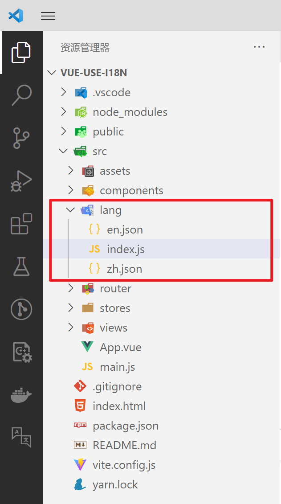

# vue-i18n使用记录

[toc]

说明文档：[vue-i18n](https://vue-i18n.intlify.dev/)

> 版本说明：
>
> vue: 3.0.0+
>
> vue-i18n: 9.x版

## 安装

```bash
npm install vue-i18n@9
// 或者
yarn add vue-i18n@9
```

## 创建实例

1. `src` 目录下新建目录 `lang`，存放`i18n`的配置。

   > 新建目录名称：`lang`(语言)、`locales`(语系设定)、`i18n`，这些名称都可被VSCode图标插件（`vscode-icons`）检测到并美化。

2. `lang`目录下，新建`index.js`文件，引入`vue-i18n`。

3. 语言的配置信息放在另外的文件中。

   例如，设置`英文`和`中文`两种语言类型：新建存放中文配置的文件`zh.json`和存放英文的文件`en.json`； 然后在`index.js`中引入。
   
   

`vue-i18n`使用`createI18n`创建实例，下面代码新建了一个`i18n`实例：

> 文件位置：`src/lang/index.js`

```js
import { createI18n } from "vue-i18n";
import EN from "./en";
import ZH from "./zh";

const messages = {
  zh: {
    ...ZH,
  },
  en: {
    ...EN,
  },
};

const i18n = createI18n({
  locale: "zh", // 设置当前语言类型
  legacy: false, // 如果要支持compositionAPI，此项必须设置为false;
  globalInjection: true, // 全局注册$t方法
  messages,
});

export default i18n;
```

> 语言配置文件

```json
// zh.json
{
  "hello": "你好"
}


// en.json
{
  "hello": "hello"
}
```

## 全局注册

`i18n`实例在项目中使用前，需要在入口文件中注册一下。

进入`main.js`文件，引入并注册`i18n`：

```js
import { createApp } from 'vue'

import App from './App.vue'
import i18n from './lang'

const app = createApp(App)

app.use(i18n)

app.mount('#app')
```

## 使用

### 模板中使用

在`template`模板中使用，这个比较简单，直接使用全局方法`$t`：

```html
<template>
  {{ $t('hello') }}
</template>
```

> 页面中正常显示：`你好`


切换英文：`src/lang/index.js`

```js
const i18n = createI18n({
  locale: "en", // 设置当前语言类型
  legacy: false, // 如果要支持compositionAPI，此项必须设置为false;
  globalInjection: true, // 全局注册$t方法
  messages,
});
```

> 页面中正常显示：`hello`

### JS中使用

```html
<template>
  {{ $t('hello') }}
</template>
<script>
import { getCurrentInstance } from "vue";
import i18n from '@/lang'; // 引入i8n实例
import { useI18n } from 'vue-i18n';
export default {
  setup() {
    // 第一种方法：获取i18n实例对象 t 的方法1
    const { proxy } = getCurrentInstance();
    const t1 = proxy.$t('hello');
    console.log(t1);

    // 第二种方法：获取i18n实例对象 t 的方法1
    const t2 = i18n.global.t('hello');
    console.log(t2);


    // 第三种方法：获取i18n实例对象 t 的方法3
    const { t } = useI18n() // 解构出t方法
    const t3 = t('hello');
    console.log(t3);
    return {};
  },
  mounted() {
    // 第四种方法：获取i18n实例对象 t 的方法4
    const t4 = this.$t('hello');
    console.log(t4);
  },
};
</script>
```

## 语言切换

### 效果


### 代码

```html
<template>
  <label for="lang-select">Change language:</label>
  <select name="lang" id="lang-select" @change="changeLang">
    <option value="en">English</option>
    <option value="zh" selected>简体中文</option>
  </select>
  <table border="1" cellspacing="0" cellpadding="0">
    <tr>
      <td>模板中使用</td>
      <td> {{ $t('hello') }}</td>
    </tr>
    <tr>
      <td>JS中响应式切换语言</td>
      <td> {{ hel }}</td>
    </tr>
    <tr>
      <td>当前语言类型</td>
      <td> {{ currentLang }}</td>
    </tr>
  </table>
</template>
<script setup>
import { computed } from 'vue'
import { useI18n } from 'vue-i18n'
const { locale, t } = useI18n();
const changeLang = parameter => {
  const lang = parameter.target.value;
  locale.value = lang; // 切换语言
  localStorage.setItem('LANG', lang); // 本地存储当前语言类型
}
// 获取当前语言类型
const currentLang = computed(() => locale.value);
// JS中响应式切换中英文（写入computed中即可）
const hel = computed(() => t('hello'));
</script>
<style scoped>
table {
  margin-top: 50px;
}

table tr td {
  padding: 2px 5px;
}
</style>
```

## 消除警告

在控制台会有如下警告：

`You are running the esm-bundler build of vue-i18n. It is recommended to configure your bundler to explicitly replace feature flag globals with boolean literals to get proper tree-shaking in the final bundle.`

### 报警告的原因

报警告的原因是你使用的是`vue-i18n`的`esm-bundler`构建版本。这个构建版本在实现特性时使用了全局的特性标记变量而没有将其直接替换为布尔值。

特性标记是在代码中使用的全局变量，用于决定是否包含特定的功能代码。在树摇（Tree-shaking）优化过程中，打包工具可以根据特性标记的值来判断是否需要保留或移除某些代码块，以达到减小最终打包体积的目的。

报警告建议你配置打包工具（如Webpack或Rollup）来替换特性标记的全局变量，并将其替换为布尔值来实现更好的树摇优化。通过直接将特性标记替换为布尔值，打包工具可以更准确地判断代码块是否被使用，从而减小最终生成的包的大小。

通过进行正确的配置和替换，你可以消除这个报警信息，并实现更好的树摇优化效果，生成更小的包体积。


### 解决方法

在`vite.config.js`加入以下代码：

```json
resolve: {     
      alias: {
         'vue-i18n': 'vue-i18n/dist/vue-i18n.cjs.js'
      }
}
```

> 在 Vite 配置文件（`vite.config.js`）中，`alias` 字段的配置的意思是为模块创建一个别名。
>
> 具体来说，你的配置设置了一个别名 `vue-i18n`，将其映射到了 `vue-i18n` 模块在 `vue-i18n/dist/vue-i18n.cjs.js` 路径下的文件。
>
> 这个别名配置的目的是让你在项目代码中可以使用 `vue-i18n` 别名来引入模块，而不需要使用它的实际路径。
>
> 这个配置的意义在于，当你在项目的代码中引入`vue-i18n`模块时，可以使用别名`vue-i18n`代替实际路径，即`vue-i18n/dist/vue-i18n.cjs.js`。这样一来，无论你在代码中使用何种路径导入`vue-i18n`模块，Vite都会将其替换为配置中指定的别名路径。
>
> 使用别名的好处在于，在后续的代码维护中，如果`vue-i18n`模块的实际路径发生变化，你只需要通过更新配置中的别名路径一次，而不必在整个项目中逐个修改引入路径。
>
> 总之，这个配置的目的是在Vite打包过程中，将对`vue-i18n`模块的实际路径的引用替换为你指定的别名路径，在代码中更方便地引用和维护`vue-i18n`模块。

```js
import { defineConfig } from 'vite';
import vue from '@vitejs/plugin-vue';

export default defineConfig({
  server: {
    proxy: {
      '/api': {
        target: 'http://127.0.0.1:8000/api',
        changeOrigin: true,
        rewrite: (path) => path.replace(/^\/api/, ''),
      },
    },
  },
  alias: {
    'vue-i18n': 'vue-i18n/dist/vue-i18n.cjs.js',
  },
  plugins: [vue()],
});
```

