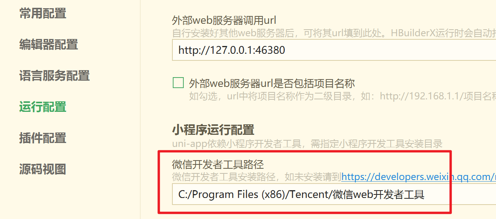
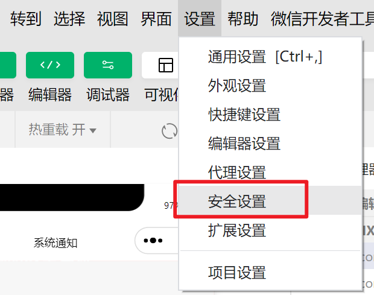
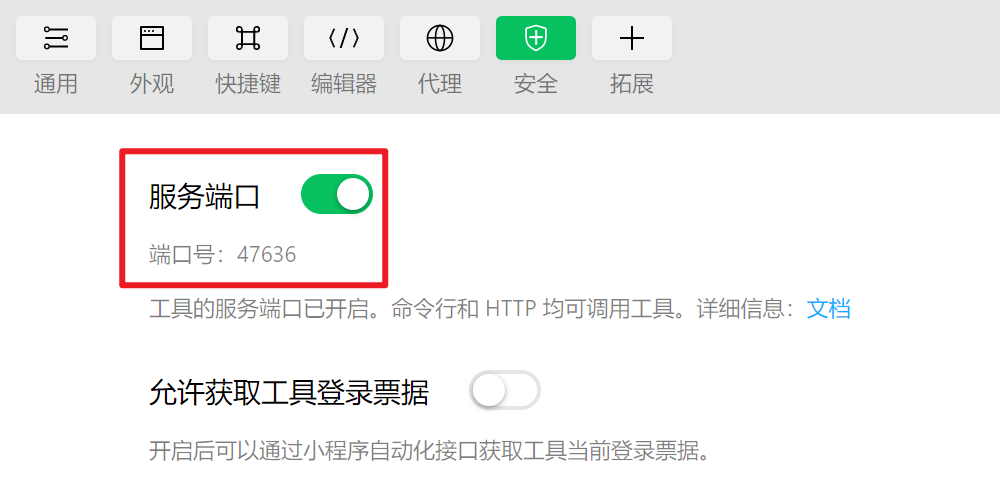
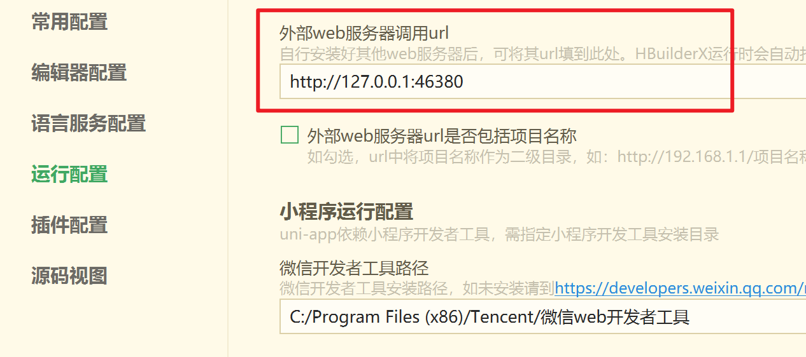
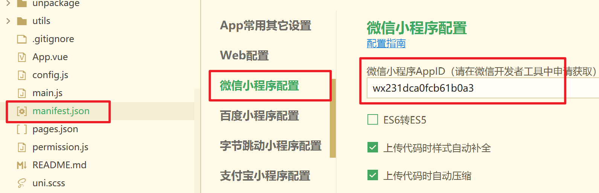

# uni-app运行到微信小程序

## Hbuilder

运行——运行到小程序——运行设置

写入自己的微信开发者路径

## 微信小程序开发工具

选择 设置——安全设置

开启服务端口

这一步不确定需不需要

Hbuilder工具-》设置-》运行配置“外部web服务器调用url”设置为`http://127.0.0.1:47636` (与小程序服务端口保持一致）

这时，微信小程序上的预览和真机调试为灰色按钮

需要找到，Hbuilder中的manifest.json文件——微信小程序配置

填入自己的微信小程序App ID 

这样就可以预览了！

