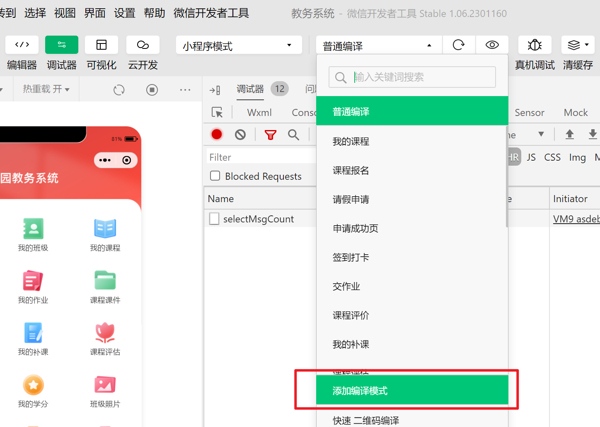

快捷输入`console.log();`：`clog`.

## 每次修改uni-app后，微信开发者工具都会重新编译

uniapp每次修改保存，微信开发者工具会重新编译，回到首次打开页面。
可通过**添加编译模式**，使编译后打开某个指定页面。



## uni-app 设置单个页面背景色

> 对于微信小程序开发，有写页面整体背景色的设置，可通过`page`标签来设置，`uni-app`同样适用。
>
> scoped只对本组件的元素生效，page元素不在组件内

```html
<style>
    page {
        background-Color: #ffffff;
    }
/* 全局样式 */
</style>

<style scoped>
/* 本地样式 */
</style>
```


## 双向绑定

默认变量不能放到 data 中声明，给data中数组的某一项赋值页面不能对结果双向绑定。

如：`this.list[0] = {}` 重新赋值后页面展示无变化

正确修改局部数据方法：`this.$set(this.form, 'scheduleTime', this.years + '-' + this.month)`（`this.$set(data中的数据, '局部数据', 替换值)`）

[官网介绍](https://uniapp.dcloud.net.cn/tutorial/vue-api.html#%E5%AE%9E%E4%BE%8B%E6%96%B9%E6%B3%95)


```js
export default {
	data() {
		return {
			form: {
				pageNum: 1,
				pageSize: 10,
				scheduleTime: `${new Date().getFullYear()}-${new Date().getMonth() + 1}` // 默认获取当前年月的课表
			},

			years: new Date().getFullYear() || '2023',
			month: new Date().getMonth() + 1,
		};
	},
	methods: {
		// 选择年份
		choseYear({ value }) {
			this.years = new Date(value).getFullYear();
			this.$set(this.form, 'scheduleTime', this.years + '-' + this.month);
		},
		// 选择月份
		selectMonth({ value }) {
			this.month = value;
			this.$set(this.form, 'scheduleTime', this.years + '-' + this.month);
		},
	}
};

```

## 表单校验

[validateFunction 自定义校验规则使用说明](https://uniapp.dcloud.net.cn/component/uniui/uni-forms.html#%E6%A0%A1%E9%AA%8C%E8%A7%84%E5%88%99%E8%AF%B4%E6%98%8E)

> 注意：
>
> - 需要注意，如果需要使用 `validateFunction` 自定义校验规则,则不能采用 `uni-forms` 的 `rules` 属性来配置校验规则，这时候需要通过`ref`，在`onReady`生命周期调用组件的`setRules`方法绑定验证规则
> - 无法通过props传递变量，是因为微信小程序会过滤掉对象中的方法，导致自定义验证规则无效。
> - 如果使用了 `validateFunction` 且 `required` 为 `false`的情况，表现为不填写内容不校验，有内容才校验，所以内容为空时 `validateFunction` 不会执行

```js
	onReady() {
		// 需要在onReady中设置规则
		this.$refs.form.setRules(this.rules)
	},
```


`validate-trigger` 属性，有俩个属性值 `bind/submit`，默认`submit`，表示只有在点击提交按钮后，才会进行校验；`bind` 是边输入边校验，只有在输入正确的格式后才会关掉错误提示


```html
<uni-easyinput type="password" placeholder="请输入登录密码" v-model="signUpFormData.password" /> 
```

输入框 `type` 类型为 `password` 时表示密码输入，密码会被隐藏掉，右侧出现眼睛按钮


## 图片预览

[官网介绍](https://uniapp.dcloud.net.cn/api/media/image.html#unipreviewimageobject)

## 网络请求

> GET 为 params POST 为 data

```js
// 我的补课列表
export function makeList(params) {
  return request({
    url: `edu/jwRepairSchedule/selectPageByStu`,
    method: 'GET',
	params
  })
}

// 发起作业
export function submitJob(data) {
  return request({
    url: `edu/detail/insert`,
    method: 'POST',
	data
  })
}
// 根据id获取排课计划
export function getSchedule(params) {
  return request({
    url: `edu/schedule/selectById/${params.scheduleId}`,
    method: 'GET',
  })
}
// 打卡
export function signInsert(data) {
  return request({
    url: `edu/attendance/signInsert`,
    method: 'POST',
    data
  })
}
```

## 文件上传

Android手机有文件夹，iOS手机没有文件夹，所以解决策略是在微信聊天记录中选择文件


## 保存本地文件

[`uni.saveFile(OBJECT)`](https://uniapp.dcloud.net.cn/api/file/file.html#savefile)，保存文件到本地。

> 平台差异说明: H5 x
>
> H5中没有这个功能

**注意：saveFile 会把临时文件移动，因此调用成功后传入的 tempFilePath 将不可用**

> *微信小程序已停止维护[wx.saveFile(Object object)](https://developers.weixin.qq.com/miniprogram/dev/api/file/wx.saveFile.html)接口，建议使用[FileSystemManager](https://uniapp.dcloud.io/api/file/getFileSystemManager.html)对象中的方法。*

[`uni.openDocument(OBJECT)`](https://uniapp.dcloud.net.cn/api/file/file.html#opendocument)，新开页面打开文档，支持格式：doc, xls, ppt, pdf, docx, xlsx, pptx。

[`uni.downloadFile(OBJECT)`](https://uniapp.dcloud.net.cn/api/request/network-file.html#downloadfile)，下载文件资源到本地，客户端直接发起一个 HTTP GET 请求，返回文件的本地临时路径。

[` uni.saveImageToPhotosAlbum(OBJECT)`](https://uniapp.dcloud.net.cn/api/media/image.html#saveimagetophotosalbum)，保存图片到系统相册。

> **uni-app下载文件永久保存uni.downloadFile和uni.saveFile**
>
> 1. `uni.downloadFile` 下载
>
>    ```js
>    xiazai() {
>            const downloadTask = uni.downloadFile({
>                url: 'http://img.netbian.com/file/2019/0414/7bee7eef5fc44417a0b02a46576e7e16.jpg', //仅为示例，并非真实的资源
>                    success: (res) => {
>                        if (res.statusCode === 200) {
>                            console.log('下载成功');
>                        }
>                        this.dd = res.tempFilePath;
>                        console.log(this.dd);
>                }
>            });
>    
>            downloadTask.onProgressUpdate((res) => {
>                console.log('下载进度' + res.progress);
>                console.log('已经下载的数据长度' + res.totalBytesWritten);
>                console.log('预期需要下载的数据总长度' + res.totalBytesExpectedToWrite);
>            });
>        }
>    ```
>
> 2. uni.saveFile永久保存
>
>    当uni.downloadFile 回调成功后tempFilePath参数临时保存文件的路径，在使用uni.saveFile存到本地即可，整体代码如下
>
>    ```js
>    xiazai() {
>            const downloadTask = uni.downloadFile({
>                url: 'http://img.netbian.com/file/2019/0414/7bee7eef5fc44417a0b02a46576e7e16.jpg', //仅为示例，并非真实的资源
>                success: (res) => {
>                    if (res.statusCode === 200) {
>                        console.log('下载成功');
>                    }
>                    let that = this;
>                    uni.saveFile({
>                        tempFilePath: res.tempFilePath,
>                            success: function(red) {
>                                that.luj = red.savedFilePath
>                                console.log(red)
>                            }
>                        });
>                    }
>                });
>    
>                downloadTask.onProgressUpdate((res) => {
>                    console.log('下载进度' + res.progress);
>                    console.log('已经下载的数据长度' + res.totalBytesWritten);
>                    console.log('预期需要下载的数据总长度' + res.totalBytesExpectedToWrite);
>            });
>        }
>    ```
>
> 3. 保存位置
>
>    它保存的位置比奇葩在:
>
>    ```bash
>    “内部存储\Android\data\io.dcloud.HBuilder\apps\HBuilder\doc\uniapp_save”
>    ```
>
> 4. 保存后打开
>
>    ```js
>         //文件保存到本地
>                    uni.saveFile({
>                        tempFilePath: data.tempFilePath, //临时路径
>                        success: function(res) {
>                            uni.showToast({
>                                icon: 'none',
>                                mask: true,
>                                title: '文件已保存：' + res.savedFilePath, //保存路径
>                                duration: 3000,
>                            });
>                            setTimeout(() => {
>                                //打开文档查看
>                                uni.openDocument({
>                                    filePath: res.savedFilePath,
>                                    success: function(res) {
>                                        // console.log('打开文档成功');
>                                    }
>                                });
>                            }, 3000)
>                        }
>                    });
>    ```
>
> 5. 图片保存到本地相册
>
>    ```js
>     uni.downloadFile({
>    	url: imgUrl[0],
>    	success: (res) => {
>    		if (res.statusCode === 200) {
>    			//保存图片到系统相册
>    			uni.saveImageToPhotosAlbum({
>    				filePath: res.tempFilePath,
>    				success: function() {
>    					uni.showToast({
>    						title: "保存成功",
>    						icon: "none"
>    					});
>    					return
>    				},
>    				fail: function() {
>    					uni.showToast({
>    						title: "保存失败，请稍后重试",
>    						icon: "none"
>    					});
>    					return
>    				}
>    			});
>    		}
>    	}
>     })
>    ```
>
>    

## [条件编译](https://uniapp.dcloud.net.cn/tutorial/platform.html#preprocessor)

## [自定义导航栏注意](https://uniapp.dcloud.net.cn/collocation/pages.html#customnav)

当navigationStyle设为custom或titleNView设为false时，原生导航栏不显示

- 非H5端，手机顶部状态栏区域会被页面内容覆盖。这是因为窗体是沉浸式的原因，即全屏可写内容。uni-app提供了状态栏高度的css变量[--status-bar-height](https://uniapp.dcloud.net.cn/tutorial/syntax-css.html#css-变量)，如果需要把状态栏的位置从前景部分让出来，可写一个占位div，高度设为css变量。

  > 目前试着没成功

  ```vue
  <template>
      <view>
          <view class="status_bar">
              <!-- 这里是状态栏 -->
          </view>
          <view> 状态栏下的文字 </view>
      </view>
  </template>
  <style>
      .status_bar {
          height: var(--status-bar-height);
          width: 100%;
      }
  </style>
  ```

  

  
