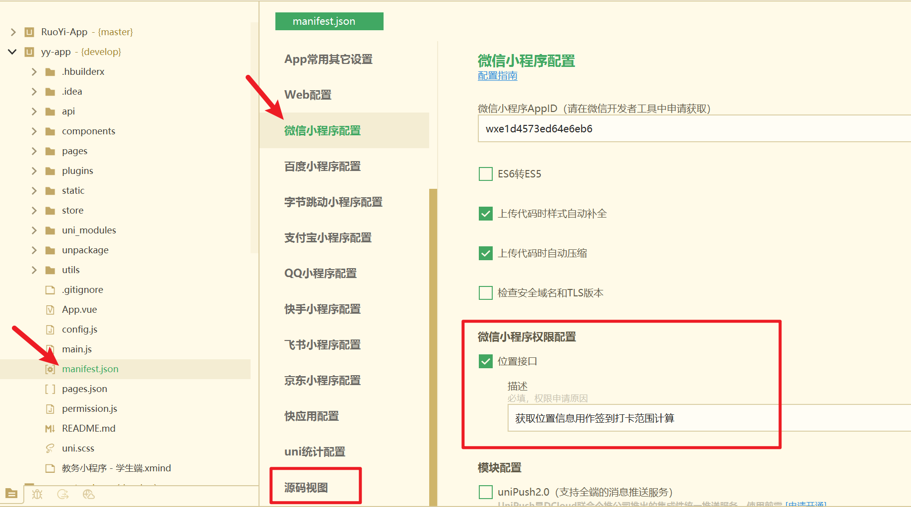
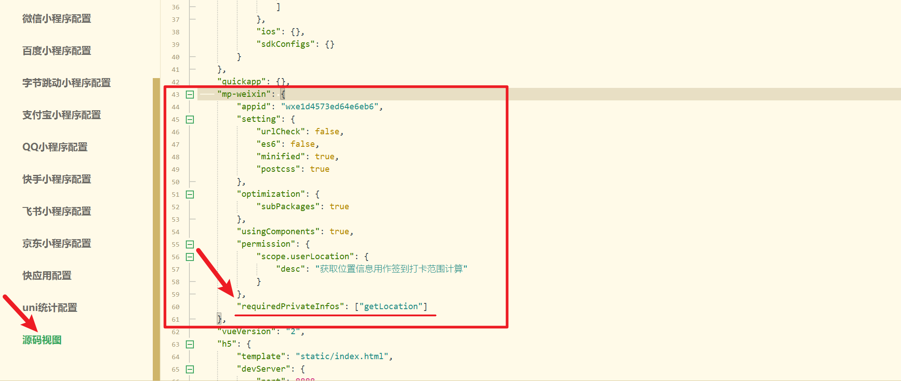

## 微信小程序获取地理位置

### uni-app中调用 [`uni.getLocation`](https://uniapp.dcloud.net.cn/api/location/location.html)。

```js
uni.getLocation({
	type: 'wgs84',
	success: function (res) {
		console.log('当前位置的经度：' + res.longitude);
		console.log('当前位置的纬度：' + res.latitude);
	}
});
```

`uni.getLocation` 获取当前的地理位置、速度。仅在uni-app项目的配置文件`manifest.json`的**微信小程序配置**中勾选位置接口是不够的，在小程序端使用该API，还需要到**源码视图**中添加如下代码：


```json
"requiredPrivateInfos": ["getLocation"]
```






## 参考

[微信开发文档：wx.getLocation](https://developers.weixin.qq.com/miniprogram/dev/api/location/wx.getLocation.html)；

[开发文档通知公告：地理位置接口新增与相关流程调整](https://developers.weixin.qq.com/community/develop/doc/000a02f2c5026891650e7f40351c01)；

