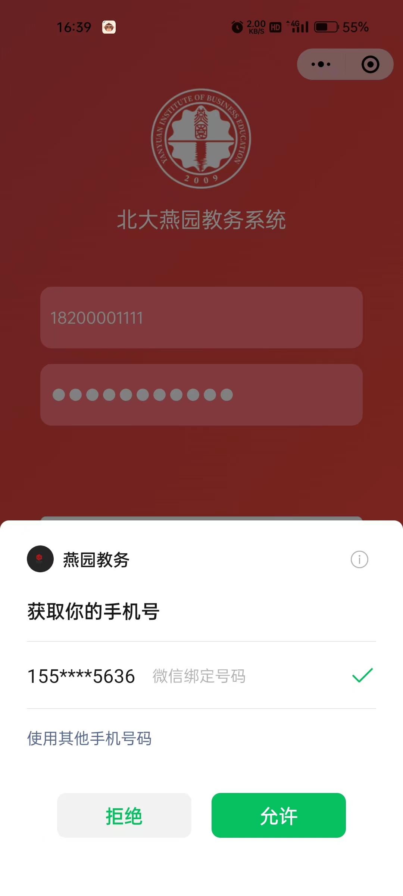
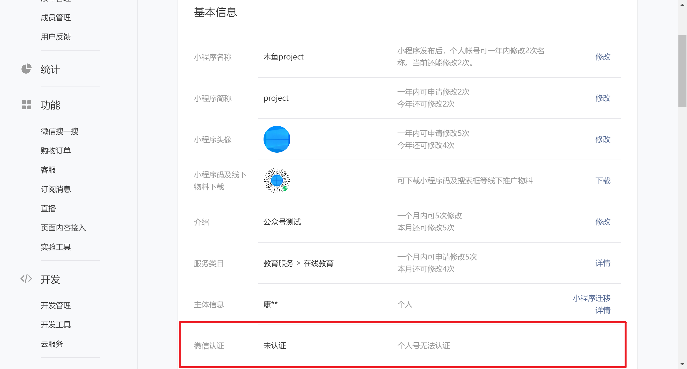
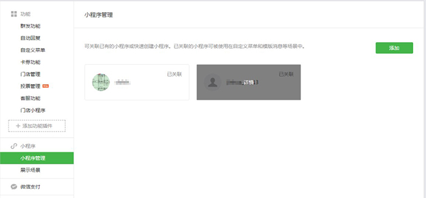
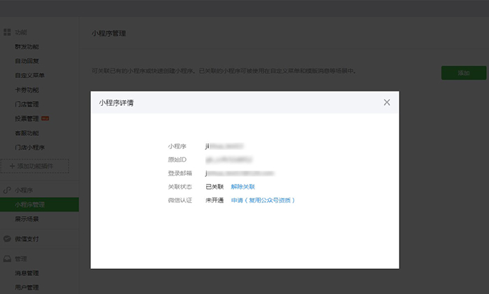
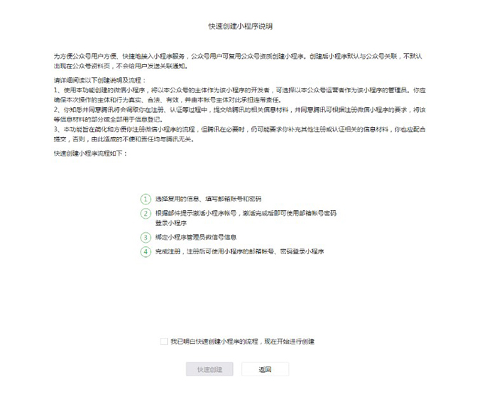
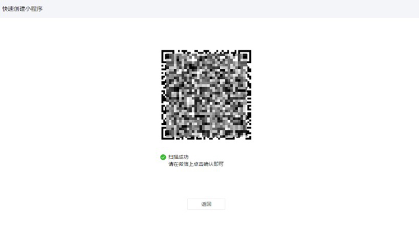
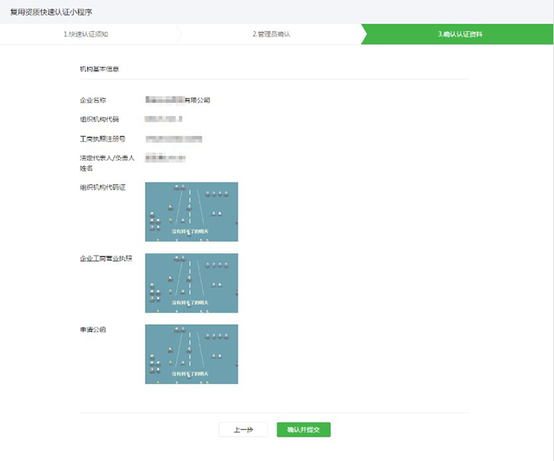

# [微信公众平台](https://mp.weixin.qq.com/)认证

## 使用场景

小程序开发过程中，项目中有**获取手机号**的需求，[官方文档](https://developers.weixin.qq.com/miniprogram/dev/framework/open-ability/getPhoneNumber.html)提到，**目前该接口针对非个人开发者，且完成了认证的小程序开放（不包含海外主体）**。所以正式发布的小程序想要获取用户手机号，就必须进行**小程序微信认证**。

认证后可实现如下效果：

```html
<button open-type="getPhoneNumber" bindgetphonenumber="getPhoneNumber"></button>
```

```js
Page({
  getPhoneNumber (e) {
    console.log(e.detail.code)
  }
})
```




## 认证方法

1. 小程序单独认证

   直接用小程序登录微信公众平台，进行认证即可。认证一次300元，认证失败不退款。

2. 小程序复用公众号认证

   - **通过公众号新注册小程序**。登录认证的公众号，点击【广告与服务】->【小程序】->【小程序管理】->【添加】->【快速注册并认证小程序】，在第4步中勾选“快速创建小程序的资质”，已认证媒体、政府、其他组织公众号复用认证小程序，必须勾选复用认证资质，认证有效期是与公众号一致的。

     > 当前只能复用认证公众号信息注册小程序，不能复用认证小程序来注册认证公众号；需已认证成功的组织类公众号，且与小程序主体相同，个人类型公众号不支持复用哦；复用注册成功后，小程序是认证状态，无需再支付认证300元费用也无需审核。

   - **已经注册了小程序，关联公众号**。电脑登录公众号，点击【广告与服务】->【小程序管理】->【添加】，公众号管理员扫码确认后，输入小程序AppID，进行发送邀请。

     > 公众号可关联同一主体的10个小程序，不同主体的3个小程序；1个小程序可关联最多500个公众号，1个月可以新增关联500次。
     >
     > 公众号关联小程序不要求已发布，但未发布的小程序不可设置展示在公众号资料页、图文消息、自定义菜单等场景。


## 消费情况

小程序单独认证，认证一次300元，不需要年审，永久有效；复用公众号的话，不需要额外付费，公众号需要年审，300元/次，一年一审，小程序微信认证有效期与公众号一致。

## [小程序复用公众号资质快速认证](https://kf.qq.com/faq/170705yyUb2A170705MjeIRr.html)

小程序已创建成功但未开通微信认证，但已跟公众号关联，可以复用公众号微信认证资质。快速认证不需要重新提交认证资质，不需要支付300元支付费用，即时生效。

**条件：**
1.可快速认证的小程序：企业、媒体、政府和其他组织类型的小程序；
2.要求公众号必须先完成微信认证；
3.公众号与小程序关联，且主体相同。

**申请入口：**
登录公众号-小程序-小程序管理-已关联小程序-详情-申请

**创建流程：**
登录公众号-小程序-小程序管理-已关联小程序-详情-申请




第一步：同意协议



第二步：管理员扫码验证



第三步：确认认证资料



> 温馨提示：
> 认证资料不支持修改
> 复用微信认证资质不需要再次支付认证审核服务费，也不需要审核
