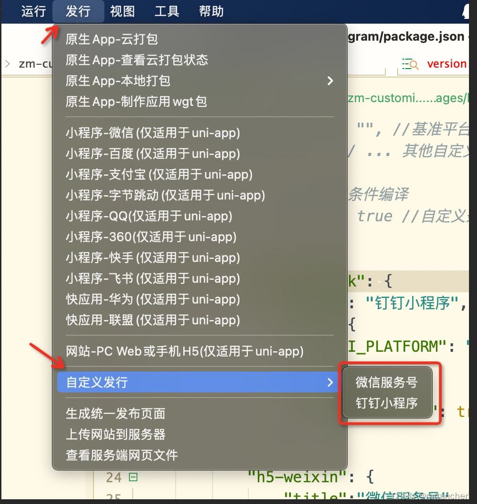

# [uniapp开发小程序配置文件解析](https://blog.csdn.net/weixin_38633659/article/details/121628860).

## 前言

小程序配置文件主要有如下几个，这里按重要性分必须和非必须两部分。如下：
必须：
main.js、App.vue、pages.json、manifest.json、

非必须：
uni.scss、env、package.json、vue.config.js

通过对HBuilderX开发小程序的配置文件，全部解析一遍，有益于立足全局的开发思维模式，提高对项目开发的把控力度。


# 1、main.js 入口文件

是uni-app的入口文件，主要作用是初始化vue实例、使用需要的插件如vuex。
a、引入Vue库和App.vue，创建vue实例，并且挂载vue实例。
b、使用Vue.use引用插件，使用Vue.prototype添加全局变量。

```js
// ============ 引入Vue库和App.vue ===============
import Vue from 'vue'
import App from './App'
App.mpType = 'app'

// ============ 全局变量添加 ===============
//  false :阻止 vue 在启动时生成生产的提示 
Vue.config.productionTip = false
import {
	report,
	sign_pv_report,
	sign_ev_report
} from '@/track/report.js'
Vue.prototype.$report = report
Vue.prototype.$pvSignReport = sign_pv_report
Vue.prototype.$evSignReport = sign_ev_report


// ============ 插件引用 ===============
// 添加uView
import uView from 'uview-ui'
Vue.use(uView);

// ============  创建vue实例 ===============
const app = new Vue({
    ...App
})

// ============ 使用Vue.use引用插件 ===============
// http拦截器，将此部分放在new Vue()和app.$mount()之间，才能App.vue中正常使用
import httpInterceptor from '@/api/http.interceptor.js';
Vue.use(httpInterceptor, app);

//挂载Vue实例
app.$mount() 
```

# 2、App.vue 页面入口文件

1、**定义**：是uni-app的主组件，所有页面都是在App.vue下进行切换的，**是页面入口文件**。但App.vue本身不是页面，这里不能编写视图元素。
2、**作用**：调用应用生命周期函数、配置全局样式、配置全局的存储globalData

## 2.1、应用生命周期

uni-app 支持 onLaunch、onShow、onHide 等应用生命周期函数。
**注意事项：**
1、应用生命周期仅可在App.vue中监听，在页面监听无效。
2、App.vue 不能写模板。

简单应用关注以下三个生命周期函数就够：

```vue
<script>
	export default {
		onLaunch: function() {
			console.log('App Launch，app启动')  
		},
		onShow: function() {
			console.log('App Show，app展现在前台') 
		},
		onHide: function() {
			console.log('App Hide，app不再展现在前台')  
		},
	}
</script>
```

其他生命周期函数：

```vue
<script>
	export default {
		onError: function(options) {
			console.log('onError:当uni-app报错时触发')
			console.log(options)
		},
		onUniNViewMessage: function(options) {
			console.log('onUniNViewMessage:对 nvue 页面发送的数据进行监听')
			console.log(options)
		},
		onUnhandledRejection: function(options) {
			console.log('onUnhandledRejection:对未处理的 Promise 拒绝事件监听函数（2.8.1+）')
			console.log(options)
		},
		onPageNotFound: function(options) {
			console.log('onPageNotFound:页面不存在监听函数')
			console.log(options)
		},
		onThemeChange: function(options) {
			console.log(':onThemeChange监听系统主题变化')
			console.log(options)
		},
	}
</script>
```

## 2.2、globalData

小程序有globalData，是一种简单的全局变量机制。
这套机制在uni-app里也可以使用，并且全端通用。

以下是 App.vue 中定义globalData的相关配置：

```vue
<script>
	export default {
		globalData: {  
        	text: 'text'  
     	}，
        
		methods: {
			
		}
	}
</script>
```

注意点：
1、通常js中操作globalData的方式如下： `getApp().globalData.text = 'test'`。
2、不要在定义 App() 的函数中，或调用 App 前调用 getApp() ，可以通过 `this.$scope` 获取对应的app实例。
3、通过 getApp() 获取实例之后，不要私自调用生命周期函数。
4、当在首页nvue中使用getApp()不一定可以获取真正的App对象。对此提供了 `const app = getApp({allowDefault: true})` 用来获取原始的App对象，可以用来在首页对globalData等初始化。
5、如果需要把globalData的数据绑定到页面上，可在页面的onShow页面生命周期里进行变量重赋值（如：获取定位信息，监听网络状态）。

## 2.3、全局样式

在App.vue中，可以定义一些全局通用样式，例如需要加一个通用的背景色，首屏页面渲染的动画等都可以写在App.vue中。
**注意**：如果工程下同时有vue和nvue文件，此时需要把nvue不支持的css写在单独的条件编译里。如：

```vue
<style lang="scss">
	/* #ifndef APP-PLUS-NVUE */
   @import './common/uni.css';
   /* #endif*/
</style>
```

# 3、pages.json 全局配置

用来对 uni-app 进行全局配置，决定页面文件的路径、窗口样式、原生的导航栏、底部的原生tabbar 等。
它类似微信小程序中app.json的页面管理部分。但注意的是：定位权限申请等原属于app.json的内容，在uni-app中是在manifest中配置实现。

这里取几个主要的配置进行说明：

## 3.1、pages 页面路由配置

这是唯一一个 **必须配置的项**。

uni-app 通过 pages 节点配置应用由哪些页面组成，pages 节点接收一个数组，数组每个项都是一个对象。

```json
{
    "pages": [
        {
         	"path": "pages/index/index",
         	"style": {
         		// 导航栏标题文字内容
         		"navigationBarTitleText": "custom"
         	}
        }, {
           "path": "pages/login/auth",
         	"style": {
         		"navigationBarTitleText": "custom"
         	}
        }
    ]
}
```

注意：
1、pages节点的**第一项为应用入口页**（即首页）。
2、**应用中新增/减少页面**，都需要对 pages 数组进行修改。
3、**文件名不需要写后缀**，框架会自动寻找路径下的页面资源。

## 3.2、globalStyle 应用统一样式配置

设置默认页面的窗口表现

```json
"globalStyle": {
		// 导航栏标题颜色及状态栏前景颜色，仅支持 black/white
		"navigationBarTextStyle": "black",
		// 导航栏背景颜色（同状态栏背景色）
		"navigationBarBackgroundColor": "#FFFFFF",
		// 下拉显示出来的窗口的背景色
		"backgroundColor": "#f5f5f5",
		// default/custom。custom即取消默认的原生导航栏
		"navigationStyle": "custom", 
		"mp-alipay": {
			// 导航栏透明设置。支持 always 一直透明 / auto 滑动自适应 / none 不透明
			"transparentTitle": "always",
			// 导航栏点击穿透
			"titlePenetrate": "YES"
		}
},
```

## 3.3、easycom 组件快捷配置

传统vue组件，需要安装、引用、注册，三个步骤后才能使用组件。easycom将其精简为一步。 只要组件安装在项目的components目录下，并符合components/组件名称/组件名称.vue目录结构。就可以不用引用、注册，直接在页面中使用。

```json
	"easycom": { // 组件自动引入
		"autoscan": true, // 是否开启自动扫描,默认开启
		"custom": { // 以正则方式自定义组件匹配规则。
			"^u-(.*)": "@/uview-ui/components/u-$1/u-$1.vue",
		}
	},
```

**说明：**

- easycom方式引入的组件无需在页面内import，也不需要在components内声明，即可在任意页面使用。
- easycom方式引入组件不是全局引入，而是局部引入。例如在H5端只有加载相应页面才会加载使用的组件。
- 在组件名完全一致的情况下，easycom引入的优先级低于手动引入（区分连字符形式与驼峰形式）。
- 考虑到编译速度，直接在pages.json内修改easycom不会触发重新编译，需要改动页面内容触发。
- easycom只处理vue组件，不处理小程序专用组件（如微信的wxml格式组件）。不处理后缀为.nvue的组件。但vue组件也可以全端运行，包括小程序和app-nvue。可以参考uni ui，使用vue后缀，同时兼容nvue页面。
- nvue页面里引用.vue后缀的组件，会按照nvue方式使用原生渲染，其中不支持的css会被忽略掉。这种情况同样支持easycom

## 3.4、tabBar 底部标签栏

参见：https://uniapp.dcloud.io/collocation/pages?id=tabbar
官方代码示例：

```json
"tabBar": {
    "color": "#7A7E83",
    "selectedColor": "#3cc51f",
    "borderStyle": "black",
    "backgroundColor": "#ffffff",
    "list": [{
        "pagePath": "pages/component/index",
        "iconPath": "static/image/icon_component.png",
        "selectedIconPath": "static/image/icon_component_HL.png",
        "text": "组件"
    }, {
        "pagePath": "pages/API/index",
        "iconPath": "static/image/icon_API.png",
        "selectedIconPath": "static/image/icon_API_HL.png",
        "text": "接口"
    }]
}
```

注意：页面路径，必须在 pages 中先定义。

## 3.5、subPackages 分包加载配置

分包加载配置，此配置为小程序的分包加载机制。
具体内容查阅：【https://uniapp.dcloud.io/collocation/pages?id=subpackages】。

代码格式：

```json
"subPackages": [{
		// 我的板块
		"root": "pages/mine",
		"pages": [{
				"path": "setting",
				"style": {
					"navigationStyle": "custom"
				}
			},
			{
				"path": "card",
				"style": {
					"navigationStyle": "custom"
				}
			}
		]
}],
```

## 3.6、preloadRule 分包预载配置

分包预载配置。
参见：https://uniapp.dcloud.io/collocation/pages?id=preloadrule

示例：

```json
// 作用：提升后续分包页面时的启动速度
"preloadRule": {
        "pagesA/list/list": {//想要实现预加载的页面名称
            "network": "all",// 在指定网络下预下载，可选值为：all（不限网络）、wifi（仅wifi下预下载）
            "packages": ["__APP__"] //分包的 root 或 name	__APP__ 表示主包。
        },
        "pagesB/detail/detail": {
            "network": "wifi",
            "packages": ["pagesA"]
        }
}
```

## 3.7、condition 启动模式配置

启动模式配置，仅开发期间生效，用于模拟直达页面的场景，如：小程序转发后，用户点击所打开的页面。

参见：https://uniapp.dcloud.io/collocation/pages?id=condition
官方代码示例：

```json
"condition": { //模式配置，仅开发期间生效
    "current": 0, //当前激活的模式（list 的索引项）
    "list": [{
            "name": "swiper", //模式名称
            "path": "pages/component/swiper/swiper", //启动页面，必选
            "query": "interval=4000&autoplay=false" //启动参数，在页面的onLoad函数里面得到。
        },
        {
            "name": "test",
            "path": "pages/component/switch/switch"
        }
    ]
}
```

这是一个很赞的调试配置。

# 4、manifest.json 应用配置

应用的配置文件，用于指定应用的名称、图标、权限等。HBuilderX 创建的工程此文件在根目录，CLI 创建的工程此文件在 src 目录。微信小程序配置具体查看[mp-weixin](https://uniapp.dcloud.io/collocation/manifest?id=mp-weixin)。

微信小程序面版配置示例：



源码视图（位置见上图），微信小程序配置示例：

```json
{
	"name": "xxxxx-miniprogram", // 应用名称
	"appid": "__UNI__xxxxx", //uni-app的应用标识
	"description": "", // 应用描述
	"versionName": "1.0.0", // 版本名称，例如：1.0.0
	"versionCode": "1", // 版本号，例如：36
	"transformPx": false, // 是否转换项目的px，为true时将px转换为rpx，为false时，px为传统的实际像素


	/* 小程序特有相关 */
	"mp-weixin": {
		"appid": "wx_xxxxx_95809", // 微信小程序的AppID
		"setting": {
			// 微信小程序项目设置
			"urlCheck": true, // 是否检查安全域名和 TLS 版本
			"es6": true, // ES6 转 ES5
			"postcss": true, // 上传代码时样式是否自动补全
			"minified": true // 上传代码时是否自动压缩
		},
		"usingComponents": true, // 是否启用小程序组件配置
		"permission": {
			// 定位授权配置
			"scope.userLocation": {
				"desc": "你的位置信息将用于小程序位置接口的效果展示"
			}
		}
	},
	"quickapp": {},
	// 快应用特有相关
	"mp-alipay": {
		"usingComponents": true
	},
	"mp-baidu": {
		"usingComponents": true
	},
	"mp-toutiao": {
		"usingComponents": true
	},


	"vueVersion": "2", // Vue版本选择
	"uniStatistics": {
		// 是否开启 uni 统计，全局配置
		"enable": false
	}
}
```

# 5、uni.scss文件 全局样式控制

参见：https://uniapp.dcloud.io/collocation/uni-scss

为了方便整体控制应用的风格。比如按钮颜色、边框风格，uni.scss文件里预置了一批scss变量预置。

uni.scss是一个特殊文件，在代码中无需 import 这个文件即可在scss代码中使用这里的样式变量。uni-app的编译器在webpack配置中特殊处理了这个uni.scss，使得每个scss文件都被注入这个uni.scss，达到全局可用的效果。

**注意：**
1、如要使用这些常用变量，需要在 HBuilderX 里面安装 scss 插件；
2、使用时需要在 style 节点上加上【lang=“scss”】。

```vue
<style lang="scss">
</style>
```

3、pages.json不支持scss，原生导航栏和tabbar的动态修改只能使用js api

**思考：**

1、要不要添加小程序全局样式配置？
2、小程序全局样式配置的颗粒度要到什么程度？
3、能否做好、怎么做好与UI的沟通，提前处理UI整体样式的规范？
4、能否站在小程序整体的高度去思考，协调产品、UI尽量统一一些细微差异样式，使全局样式配置得到更多的应用？
待以上几个问题思考清楚了，那么就可以决定要怎么做了。如果连上面几个问题都不去考虑的，那么设计全局配置就没有什么意义了。

**拓展：**

DCloud社区问答：[App.vue和 uni.scss都可以统一页面的样式，那么他们的区别是什么？](https://ask.dcloud.net.cn/question/86722)

> App.vue是页面逻辑加样式，uni.scss是统一样式。分离出app.vue里面的样式。所以App.vue其实更多是处理options里面的数据和全局数据等。
>
> 回头看了下并测试，区别主要是如果你要使用到sass的时候，uni.scss可以预置全局变量，就是说你在uni.scss里面定义后可以全局使用，如果在App.vue里面定义是无法在其他页面使用的。App.vue里面写普通的全局样式是可以，写scss变量则没有全局效果。

# 6、配置环境变量

项目的不同创建方式，环境配置方式有所不同，参照如下：

- 1、HBuilderX创建的项目
  参考文档：[uni-app小程序开发：小程序开发规范与架构设计](https://blog.csdn.net/weixin_38633659/article/details/121616388)
  目录2.2。
- 2、[cli方式创建的项目](https://uniapp.dcloud.io/collocation/env?id=env)

> 1、vue-config.js
> 在 vue.config.js 中可以修改 webpack 配置，包括环境变量，具体参考 [vue-config.js](https://uniapp.dcloud.io/collocation/vue-config)。
>
> 2、package.json
> 在自定义条件编译平台时，可以在 package.json 文件的 env 节点下配置环境变量，具体参考 [package.json](https://uniapp.dcloud.io/collocation/package)
>
> .env
> 3、CLI 创建的项目中可以在根目录中放置 .env 文件来指定环境变量，具体参考：[环境变量](https://cli.vuejs.org/zh/guide/mode-and-env.html#环境变量)。

# 7、package.json 自定义条件编译平台

1、在开发web时，有时需要一套代码编译发布到不同的站点，比如主站和微信h5站。（注意不是一套代码内部自适应不同浏览器，是真的分离部署了。
2、在开发小程序时，经常有扩展小程序平台，比如基于阿里小程序的钉钉小程序、淘宝小程序。

扩展新的平台后，有3点影响：

- 1、新增了对应平台的条件编译，可以为新平台编写专用代码。
- 2、运行时面向新平台编译运行。
- 3、发行时面向新平台编译发行。

**注意**：
1、只能扩展web和小程序平台，不能扩展app打包。
2、扩展小程序平台时只能基于指定的基准平台扩展子平台，不能扩展基准平台。

官方格式示例：

```json
{
	"uni-app": { // 扩展配置
		"scripts": {
// "custom-platform": { //自定义编译平台配置，可通过cli方式调用
// 	"title": "自定义扩展名称", // 在HBuilderX中会显示在 运行/发行 菜单中
// 	"BROWSER": "", //运行到的目标浏览器，仅当UNI_PLATFORM为h5时有效，值：Chrome、Firefox、IE、Edge、Safari、HBuilderX
// 	"env": { //编译环境变量
// 		"UNI_PLATFORM": "", //基准平台，如：h5、mp-weixin、mp-alipay、mp-baidu、mp-toutiao、mp-qq
// 		"MY_TEST": "" // ... 其他自定义环境变量
// 	},
// 	"define": { //自定义条件编译
// 		"CUSTOM-CONST": true //自定义条件编译常量，建议为大写
// 	}
// },
			"mp-dingtalk": {
				"title": "钉钉小程序",
				"env": {
					"UNI_PLATFORM": "mp-alipay"
				},
				"define": {
					"MP-DINGTALK": true
				}
			},
			"h5-weixin": {
				"title":"微信服务号",
				"BROWSER":"Chrome",  
				"env": {
					"UNI_PLATFORM": "h5"  
				},
				"define": {
					"H5-WEIXIN": true 
				}
			}
		}
	}
}
```

对应新增条件编译：

```json
// #ifdef MP
小程序平台通用代码（含钉钉）
// #endif
// #ifdef MP-ALIPAY
支付宝平台通用代码（含钉钉）
// #endif
// #ifdef MP-DINGTALK
钉钉平台特有代码
// #endif


// #ifdef H5
H5平台通用代码（含微信服务号）
// #endif
// #ifdef H5-WEIXIN
微信服务号特有代码
// #endif
```

**Tips**：
1、package.json文件中不允许出现注释，否则扩展配置无效。（目前亲测有效，应该是优化了）
2、vue-cli需更新到最新版，HBuilderX需升级到 2.1.6+ 版本。

结果展示：


# 8、vue.config.js 编译自动加载

1、是一个可选的配置文件，如果项目的根目录中存在这个文件，那么它会被自动加载。
2、一般用于配置 webpack 等编译选项，具体规范参考：[vue.config.js](https://cli.vuejs.org/zh/config/#vue-config-js)

3、这里是用HBuilderX创建的项目，没有 webpack 编译选项，有兴趣的可以到[官方文档](https://uniapp.dcloud.io/collocation/vue-config)了解。

4、尝试了下，目前简单处理的方法有：发布时删除console，感觉挺鸡肋的。**真正的实用性能有待挖掘！！！**

---

参考：
[uni-app配置](https://uniapp.dcloud.io/collocation/pages)
