# uniapp 小程序打包发布

## 1、在项目的manifest.json中

选择小程序,配置AppID

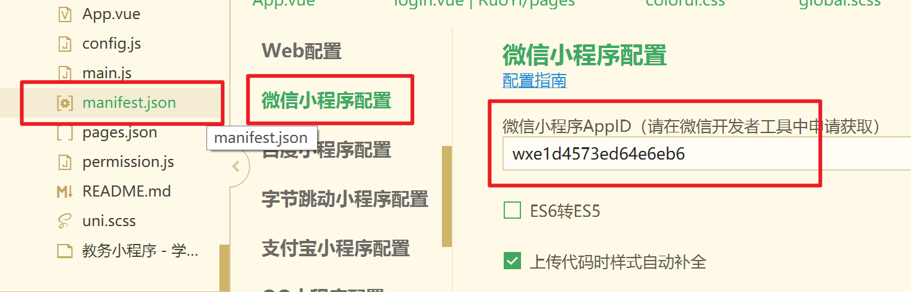

## 2、在微信小程序后台配置线上合法域名

登陆[微信公众平台](https://mp.weixin.qq.com/)–>开发---->开发管理--->开发设置—>服务器域名

添加项目用到的域名

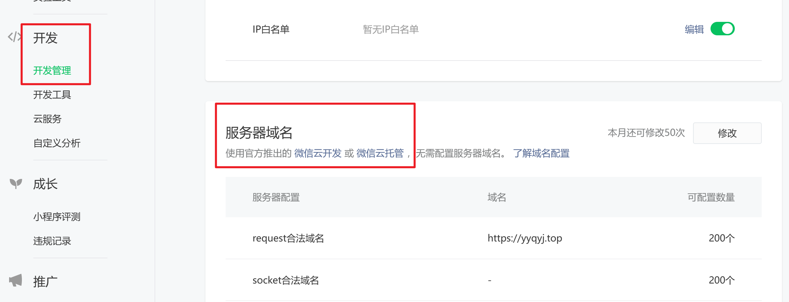

> 服务器域名请在 「小程序后台-开发-开发设置-服务器域名」 中进行配置，配置时需要注意：
>
> - 域名只支持 `https` ([wx.request](https://developers.weixin.qq.com/miniprogram/dev/api/network/request/wx.request.html)、[wx.uploadFile](https://developers.weixin.qq.com/miniprogram/dev/api/network/upload/wx.uploadFile.html)、[wx.downloadFile](https://developers.weixin.qq.com/miniprogram/dev/api/network/download/wx.downloadFile.html)) 和 `wss` ([wx.connectSocket](https://developers.weixin.qq.com/miniprogram/dev/api/network/websocket/wx.connectSocket.html)) 协议；
> - 域名不能使用 IP 地址（小程序的[局域网](https://developers.weixin.qq.com/miniprogram/dev/framework/ability/mDNS.html) IP 除外）或 localhost；
> - 可以配置端口，如 https://myserver.com:8080，但是配置后只能向 https://myserver.com:8080 发起请求。如果向 https://myserver.com、https://myserver.com:9091 等 URL 请求则会失败。
> - 如果不配置端口。如 https://myserver.com，那么请求的 URL 中也不能包含端口，甚至是默认的 443 端口也不可以。如果向 https://myserver.com:443 请求则会失败。
> - 域名必须经过 ICP 备案；
> - **出于安全考虑，`api.weixin.qq.com` 不能被配置为服务器域名，相关API也不能在小程序内调用。** 开发者应将 AppSecret 保存到后台服务器中，通过服务器使用 `getAccessToken` 接口获取 `access_token`，并调用相关 API；
> - 不支持配置父域名，使用子域名。

## 3、打包，HbuilderX 

发行—>小程序

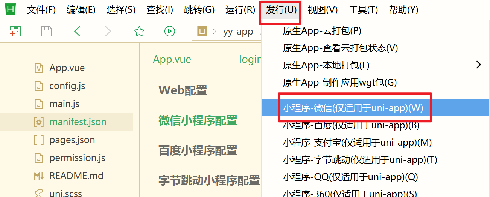

填写小程序名，和APPId，点击发行。(这里的小程序名字是无意义的，但是要有，具体的小程序名字是在微信公众平台配置的。)

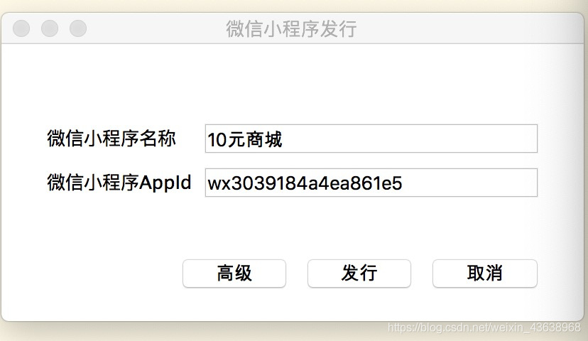

接下来会在项目根目录下生产unpackage—>dist—build—mp-weixin目录

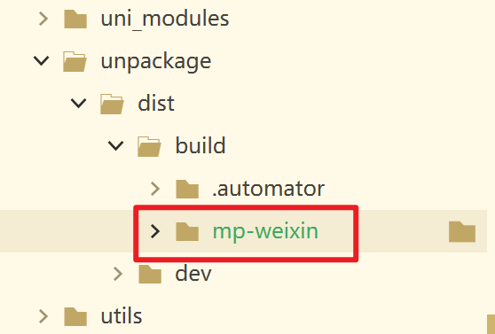

小程序开发者工具会自动启动

点击开发者工具右上角 上传

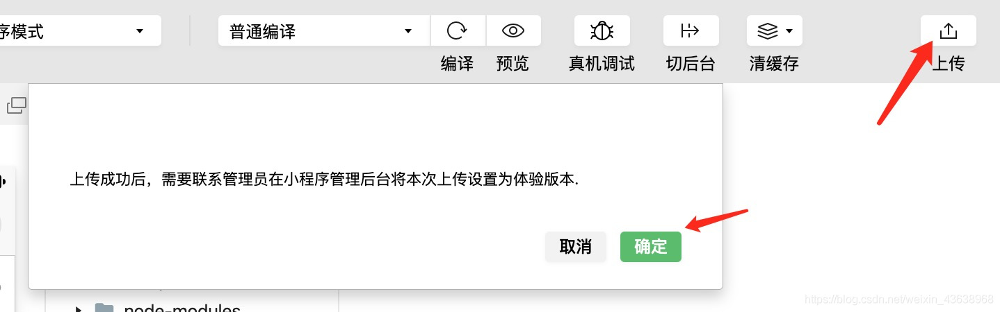

填写版本号，备注，点击上传。

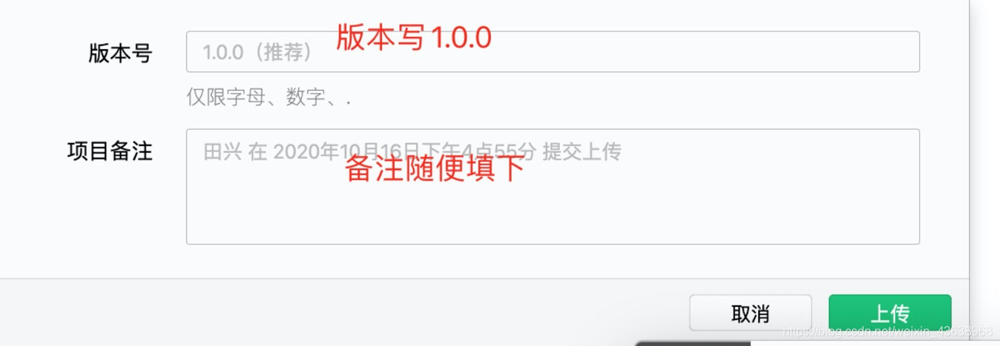

此控制台报错，上传失败

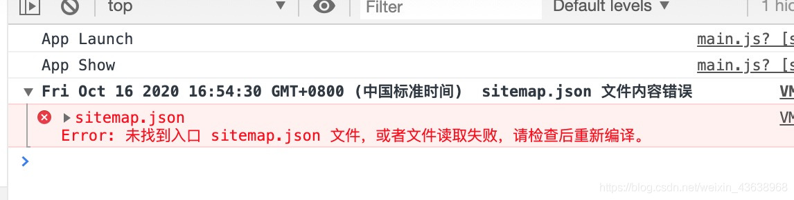

改：

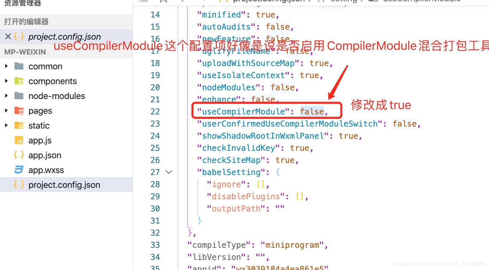

这样每次编译系统自动会生成sitemap.json
然后重新点击上传。提示上传成功(**每个包不能超过2M，整个程序不能超过12M**)

## 4、登陆微信小程序公众平台

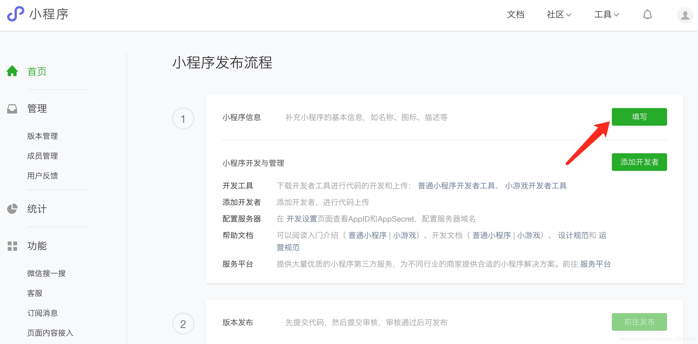

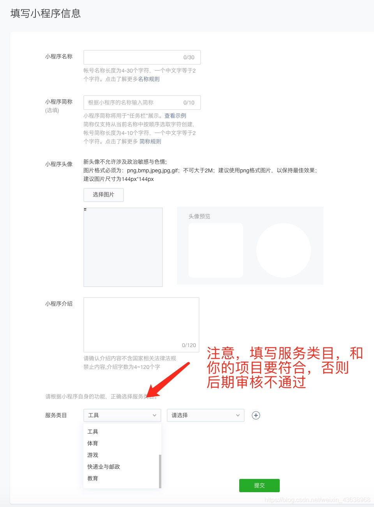

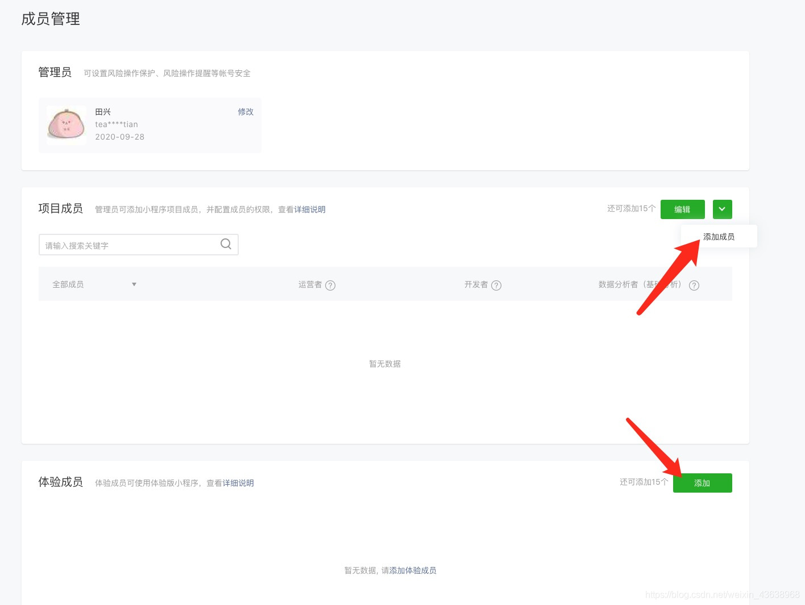

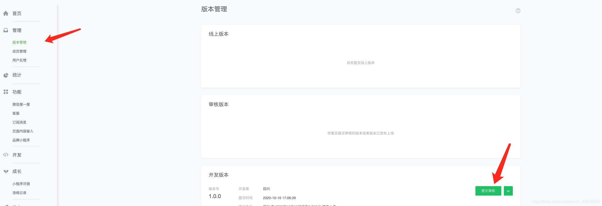

提交审核通过后 ，点击前往发布。

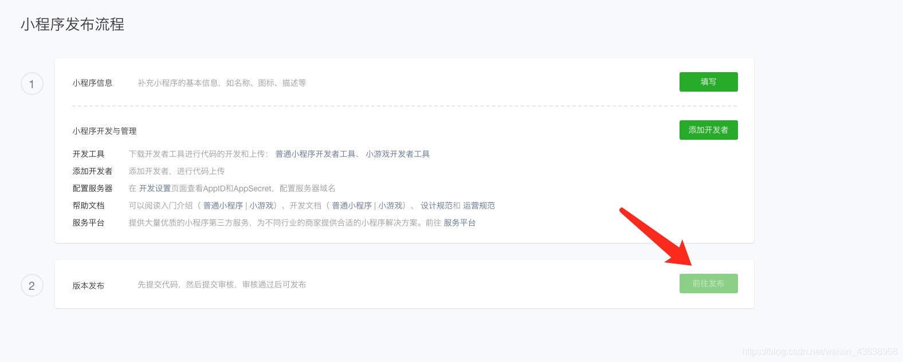

上线完毕
