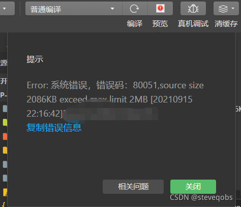
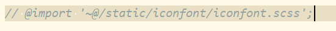

# uniapp下微信小程序超过2MB大小限制的解决方法

## 1压缩静态文件大小

举例，一些icon图标、临时的静态图片加起来可能占用了几百KB
推荐一个压缩图片的网址 [图片压缩](https://tinypng.com/) ，一次限制20张，一次把它们丢进去，压缩好了再打包下载，替换到你的 static 文件夹

## 2缩减大量重复的css代码

view中style重复过多的用class（当然这样也就减少个几KB~几十KB），每个页面都有重复的class就在全局css文件里写样式

## 3注释掉pages.json某些代码

某些页面如果急着手机调试，但是还是超过2MB，可以先在pages.json里面注释掉几个页面再重新编译

## 4程序分包

比如在uniapp中小程序项目的文件夹的页面本来是存在/pages下的，现在要把它们分包成/pagesA和/pagesB
自己去[微信小程序文档](https://developers.weixin.qq.com/miniprogram/dev/framework/subpackages.html)或者[uniapp文档](https://uniapp.dcloud.net.cn/collocation/manifest.html#%E5%85%B3%E4%BA%8E%E5%88%86%E5%8C%85%E4%BC%98%E5%8C%96%E7%9A%84%E8%AF%B4%E6%98%8E)看吧。

## 5不要在uni.scss中引用样式！

如果你在uni.scss中引用了某个样式库，把它注释掉试试
有个项目引用了样式库，但是发现并没有用到它，当我把一些静态文件清理掉的时候，发现突然编译大小减少了600KB，从原来的2081KB编程1469KB，绝了！

**原因：**

uni.scss中引入的样式会同时混入到全局样式文件和单独每一个页面的样式中，造成微信程序包太大，
故uni.scss只建议放scss变量名相关样式，其他的样式可以通过main.js或者App.vue引入