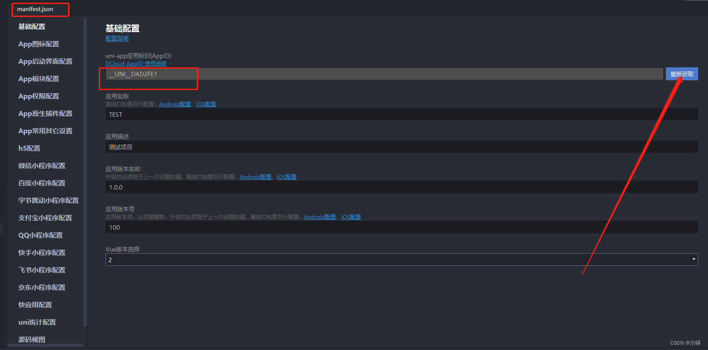

# 打包提示：此应用DCloud appid 为_UNI_DAD3FT8,您不是这个应用的项目成员。

uniapp小程序发布的时候报错，如下：

 1.报错如下：

> 此应用DCloud appid 为_UNI_DAD3FT8,您不是这个应用的项目成员。1、联系这个应用的所有者，请求加入项目成员（https://dev.dcloud.net.cn "项目成员管理"-"添加协作者"）；2、重新在manifest.json中生成自己的APPID；3、联系应用所有者将此 DCloud appid 转让给当前账号。

2.解决办法：

产生这个报错的原因是可能你项目从之前的移植过来的，然后替换了微信小程序的appid，但是HbuliderX里面没有manifest.json的没有重新获取，替换成当前小程序项目的appid之后，重新获取一下就好了。

