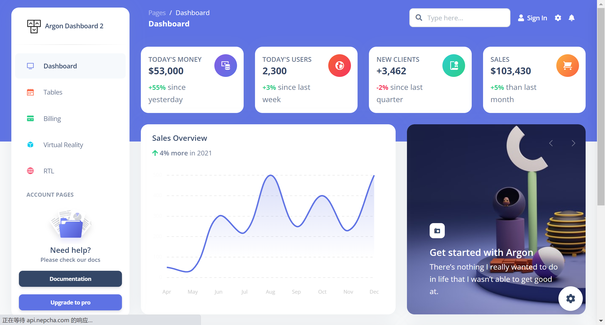

# 中后台管理系统模板

当你写项目的时候，如何快速的完成一个项目的搭建，这个时候就需要借助到一些模板了，前端开发的一个好处就是，各类UI模板都是相当的齐全的，直接拿来用就可以了，脱离了一行又一行垒代码的繁琐的工作。

## Vue Antd Admin

### Vue2

Star：3.4k

GitHub：https://github.com/iczer/vue-antd-admin

Demo体验：https://iczer.gitee.io/vue-antd-admin/#/dashboard/workplace

### Vue3

Star：120

GitHub：https://github.com/stepui/stepin-template

Demo体验：https://stepui.gitee.io/stepin-template/#/login

使用文档：http://stepui.gitee.io/stepin-template-docs/

## 1：vue-element-admin

推荐指数：star:82.4k
Github 地址：https://github.com/PanJiaChen/vue-element-admin
Demo体验：https://panjiachen.github.io/vue-element-admin/#/dashboard

一个基于 vue2.0 和 Eelement 的控制面板 UI 框架，这是使用vue技术栈开发的前端程序员的首选管理系统模板，模板以及非常的成熟了，并且有相关的社区和维护人员，开发时候遇到问题也不要慌。

## 2：AdminLTE

推荐指数：star:42.5k
Github 地址：https://github.com/ColorlibHQ/AdminLTE
Demo体验：https://adminlte.io/themes/AdminLTE/index2.html

非常流行的基于 Bootstrap 3.x 的免费的后台 UI 框架，这是一个非常老牌的后台管理系统模板，每个页面都是单独的html网页，适合前端入门新手来做项目。

## 3：ant-design-pro

推荐指数：star：34.2k
Github 地址：https://github.com/ant-design/ant-design-pro
Demo体验：https://preview.pro.ant.design/dashboard/analysis/

这个就不多说了，选择react技术栈的童鞋们必然离不开这个优秀开箱即用的中台前端/设计解决方案，文档齐全，组件丰富，一键生成模板，更支持开启复制黏贴模式哦。

## 4：layui

推荐指数：star：27.4k
Github 地址：https://github.com/layui/layui
Demo体验：

使用文档：https://layui.dev/

经典模块化前端框架，由职业前端倾情打造，面向全层次的前后端开发者，低门槛开箱即用的前端 UI 解决方案。根据大家的建议，把忘记的这个框架也补充，这个框架有收费和免费的版本，在去年的时候进入过开源中国前端框架最受欢迎的框架前三名，实至名归，确实很好用，支持单页面，PC端和响应式移动端。

## 5：ng2-admin

推荐指数：star：24.5k
Github 地址：https://github.com/akveo/ngx-admin
Demo体验：https://www.akveo.com/ngx-admin/themes

这是基于 Angular 2, Bootstrap 4 和 Webpack 的后台管理面板框架，要说前面已经有了react和vue技术栈的模板，那怎么能少的了ng的？虽然在国外用的比较多，国内较少使用，但丝毫不影响ng作为前端框架三大巨头之一的地位呀。

## 6：Gentelella

推荐指数：star：20.8k
Github 地址：https://github.com/ColorlibHQ/gentelella
Demo体验：https://colorlib.com/polygon/gentelella/index.html

Gentelella 是一个可免费使用的 Bootstrap 管理界面模版，使用群体比较广泛。这个模版使用默认的 Bootstrap 3 的样式，还有一系列功能强大的 jQuery 插件和工具，可快速创建管理界面模版或者后台的 Dashboard。

## 7：iview-admin

推荐指数：star：16.3k
Github 地址：https://github.com/iview/iview-admin
Demo体验：https://admin.iviewui.com/home

iView admin 是基于 iView 的 Vue 2.0 控制面板。搭配使用 iView UI 组件库形成的一套后台集成解决方案 。

## 8：blur-admin

推荐指数：star：11.3k

Github 地址：https://github.com/akveo/blur-admin
Demo体验：https://www.akveo.com/blur-admin-mint/#/dashboard

BlurAdmin 是一款使用 AngularJs + Bootstrap实现的单页管理端模版，视觉冲击极强的管理后台，各种动画效果。

## 9：vue-manage-system

推荐指数：star：16.9k
地址：https://github.com/lin-xin/vue-manage-system
Demo体验：https://lin-xin.gitee.io/example/work/#/dashboard

vue-manage-system，一个基于 Vue.js 和 element-ui 的后台管理系统模板，挺喜欢这个界面的UI，简约清晰不累赘，多功能的后台框架模板，适用于绝大部分的后台管理系统开发。

## 10：material-dashboard

推荐指数：star：10.6k
Github 地址：https://github.com/creativetimofficial/material-dashboard
Demo体验：https://demos.creative-tim.com/

基于 Bootstrap 4 和 Material 风格的控制面板。Material Dashboard 是一个开源的 Material Bootstrap Admin，其设计灵感来自谷歌的 Material Design 。

## 11：d2-admin

推荐指数：star：12.1k
github地址：https://github.com/d2-projects/d2-admin

Demo体验：https://d2-admin.netlify.app/#/index

D2Admin 是一个完全 开源免费 的企业中后台产品前端集成方案，基于 vue.js 和 ElementUI 的管理系统前端解决方案 ，小于 60kb 的本地首屏 js 加载,已经做好大部分项目前期准备工作

## 12：vuestic-admin

推荐指数：star：9.3k

GitHub：https://github.com/epicmaxco/vuestic-admin
Demo体验：https://vuestic.epicmax.co/admin/dashboard

vuestic-admin管理台仪表盘是一个响应式的仪表盘模板，采用Bootstrap 4和Vue.js构建。这个精美的管理台模板提供了自定义元素组件，如地图，聊天，个人资料卡，图标，进度条等，以及用于登录和注册的预建页面。

