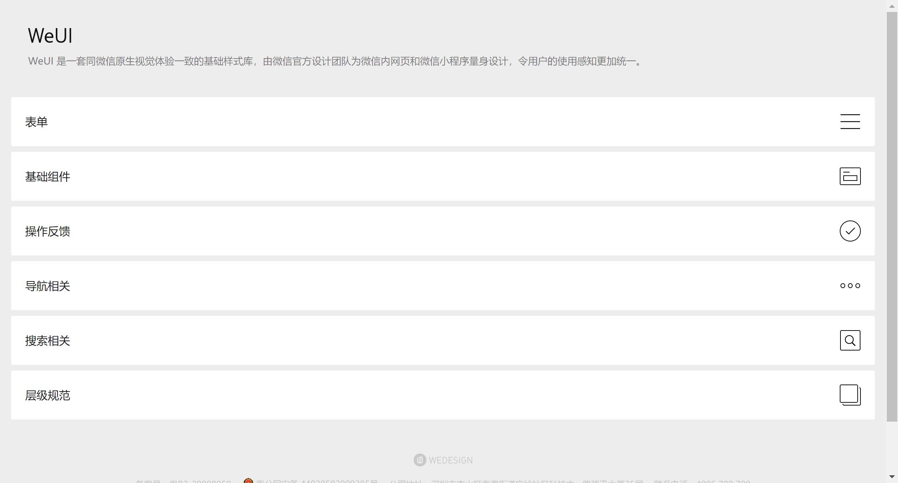
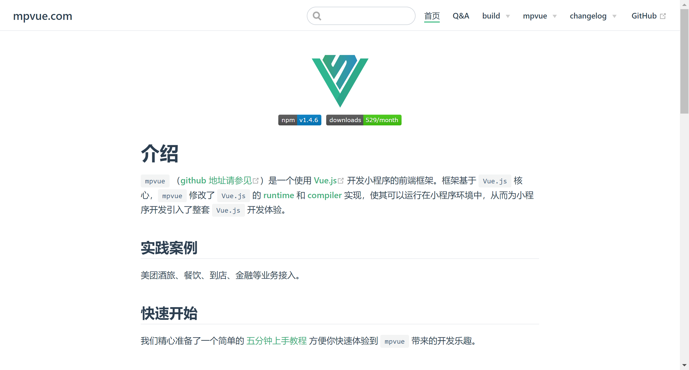
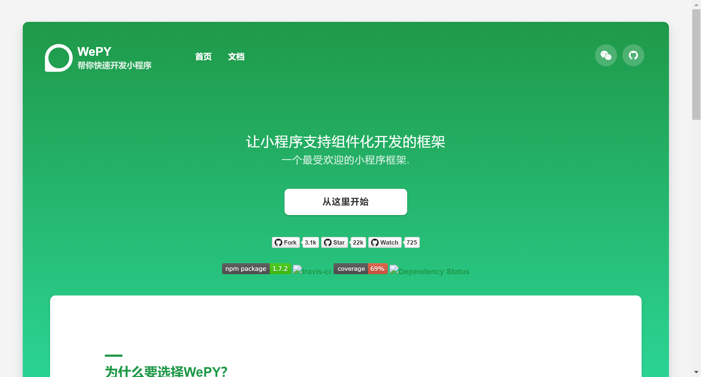
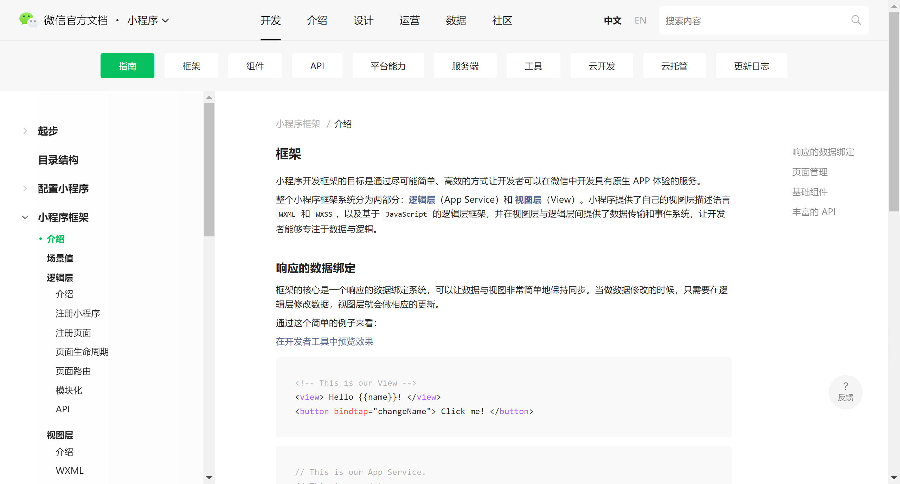

# 小程序框架

想要开发出一套高质量的小程序，运用框架，组件库是省时省力省心必不可少一部分，随着小程序日渐火爆，各种不同类型的小程序也渐渐更新，其中不乏一些优秀好用的框架/组件库。

## 1：WeUI 小程序–使用教程

https://weui.io/

官方介绍：WeUI 是一套同微信原生视觉体验一致的基础样式库，由微信官方设计团队为微信内网页和微信小程序量身设计，令用户的使用感知更加统一。小程序开发中最常用到的一款框架，受广大开发人员的欢迎。

## 2：美团小程序框架mpvue

Github：https://github.com/Meituan-Dianping/mpvue
官网： http://mpvue.com/

官方介绍：mpvue是一个使用 Vue.js开发小程序的前端框架。框架基于 Vue.js核心，mpvue修改了 Vue.js的 runtime和 compiler实现，使其可以运行在小程序环境中，从而为小程序开发引入了整套Vue.js开发体验。

## 3：组件化开发框架wepy

Github地址:
https://github.com/Tencent/wepy
官网地址：
https://wepyjs.github.io/wepy-docs/

官方介绍：组件化开发，完美解决组件隔离，组件嵌套，组件通信等问题,支持使用第三方 npm 资源，自动处理 npm 资源之间的依赖关系，完美兼容所有无平台依赖的 npm 资源包.

## 4：官方框架MINA

https://developers.weixin.qq.com/miniprogram/dev/framework/MINA.html

官方介绍：框架提供了自己的视图层描述语言 WXML 和 WXSS，以及基于 JavaScript 的逻辑层框架，并在视图层与逻辑层间提供了数据传输和事件系统，可以让开发者可以方便的聚焦于数据与逻辑上。

## 5：Tina.js 一款轻巧的渐进式微信小程序框架

> https://github.com/tinajs/tina

官方介绍：是一款轻巧的渐进式微信小程序框架，保留 MINA (微信小程序官方框架) 的大部分 API 设计；无论你有无小程序开发经验，都可以轻松过渡上手。

## 6：前端框架weweb

> 地址: https://github.com/wdfe/weweb

官方介绍：weweb是一个兼容小程序语法的前端框架，你可以用小程序的写法，来写web应用。如果你已经有小程序了，通过它你可以将你的小程序运行在浏览器中。

## 7：微信UI组件库 iView Weapp

> https://weapp.iviewui.com/

介绍：iView Weapp 提供了与 iView 一致的 UI 和尽可能相同的接口名称，大幅度降低了学习成本，是一套一套高质量的微信小程序 UI 组件库。

## 8：ZanUI-WeApp – 一个颜值高、好用、易扩展的微信小程序 UI 库

> https://cnodejs.org/topic/589d625a5c8036f7019e7a4a

官方介绍：ZanUI-WeApp结合了微信的视觉规范，为用户提供更加统一的使用感受。 包含 badge、btn、等共计 17 类组件或元素。

## 9：Taro

> 官网：http://taro.aotu.io/
> GitHub: http://github.com/nervjs/taro

Taro 是由京东 - 凹凸实验室打造的一套遵循 React 语法规范的多端统一开发框架。我要没记错的话，是最近刚刚开源的。

使用 Taro，我们可以只书写一套代码，再通过 Taro 的编译工具，将源代码分别编译出可以在不同端（微信小程序、H5、App 端等）运行的代码。同时 Taro 还提供开箱即用的语法检测和自动补全等功能，有效地提升了开发体验和开发效率。