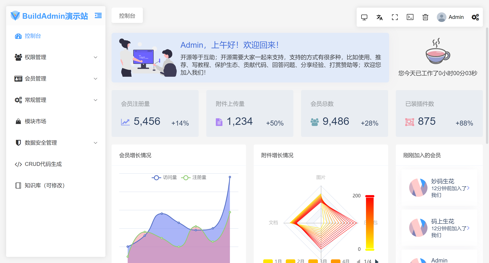
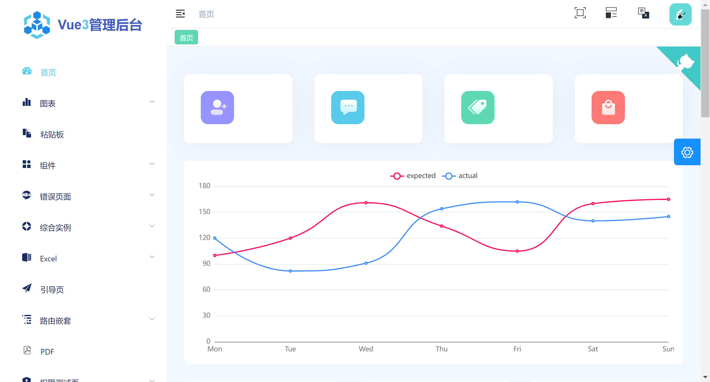
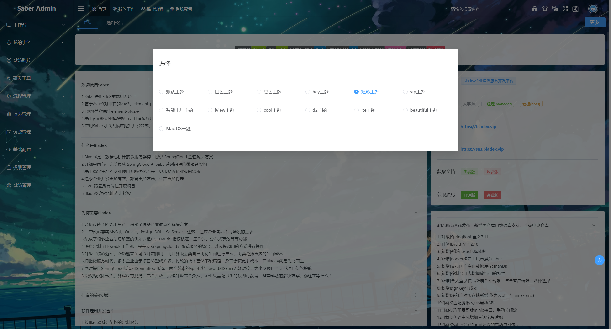

# BuildAdmin

> 简洁，动画流畅，尤其是登录页面，特别丝滑

## 项目介绍

🔥🔥项目是基于[Thinkphp6](https://www.thinkphp.cn/)、[Vue3](https://v3.cn.vuejs.org/)、[TypeScript](https://www.tslang.cn/docs/home.html)、[Vite](https://vitejs.cn/)、[Element Plus](https://element-plus.gitee.io/zh-CN/#/zh-CN)、[Pinia](https://pinia.vuejs.org/)等的后台管理系统，详细介绍请[查看首页](https://wonderful-code.gitee.io/)，数据库使用[Mysql](https://www.mysql.com/)，并支持[国际化i18n](https://vue-i18n.intlify.dev/)。此项目永久免费开源，无需授权即可商业使用。

说明文档：https://wonderful-code.gitee.io/

演示地址：https://demo.buildadmin.com/#/

#  [vue-pure-admin](https://gitee.com/yiming_chang/vue-pure-admin)

> 这套模板配有免费的教学视频，使用文档；插件使用较多，功能很多

## 简介

`vue-pure-admin` 是一款开源免费且开箱即用的中后台管理系统模版。使用了最新的 `Vue3`、`Vite`、`Element-Plus`、`TypeScript`、`Pinia`、`Tailwindcss` 等主流技术开发

## 精简版（实际项目开发请用精简版，提供 `非国际化` 、`国际化` 两个版本选择）

精简版是基于 [vue-pure-admin](https://gitee.com/link?target=https%3A%2F%2Fgithub.com%2Fpure-admin%2Fvue-pure-admin) 提炼出的架子，包含主体功能，更适合实际项目开发，打包后的大小在全局引入 [element-plus](https://gitee.com/link?target=https%3A%2F%2Felement-plus.org) 的情况下仍然低于 `2.3MB`，并且会永久同步完整版的代码。开启 `brotli` 压缩和 `cdn` 替换本地库模式后，打包大小低于 `350kb`

- [点我查看非国际化精简版](https://gitee.com/link?target=https%3A%2F%2Fgithub.com%2Fpure-admin%2Fpure-admin-thin)
- [点我查看国际化精简版](https://gitee.com/link?target=https%3A%2F%2Fgithub.com%2Fpure-admin%2Fpure-admin-thin%2Ftree%2Fi18n)

## 配套视频

- [点我查看快速开发教程](https://gitee.com/link?target=https%3A%2F%2Fwww.bilibili.com%2Fvideo%2FBV1kg411v7QT)
- [点我查看 UI 设计](https://gitee.com/link?target=https%3A%2F%2Fwww.bilibili.com%2Fvideo%2FBV17g411T7rq)

## 配套保姆级文档

- [查看文档](https://yiming_chang.gitee.io/pure-admin-doc)

## `Tauri` 版

- [点我查看 Tauri 版](https://gitee.com/link?target=https%3A%2F%2Fgithub.com%2Fpure-admin%2Ftauri-pure-admin)

## `Electron` 版

- [点我查看 Electron 版](https://gitee.com/link?target=https%3A%2F%2Fgithub.com%2Fpure-admin%2Felectron-pure-admin)

## 预览

- [查看预览](https://yiming_chang.gitee.io/vue-pure-admin)
- PC 端

- 暗黑模式

- 移动端

# [vue3-composition-admin](https://github.com/RainManGO/vue3-composition-admin)

> vue3-composition-admin 是一个管理端模板解决方案，它是基于vue3,ts和element-plus，项目都是以composition api风格编写。

## 简介

项目的基础版本出自于源于花裤衩大佬的 vue-element-admin。

版本：

vue2+js版本：[vue-element-admin](https://github.com/PanJiaChen/vue-element-admin)

vue2+ts版本：[vue-typescript-admin-template](https://github.com/Armour/vue-typescript-admin-template)

vue3 发布之后，性能增强，速度vue2的倍数，打包体积都在减小（treeshaking），composition api 增加了项目可读性。

项目目的：

- 学习vue3+ts
- 保持 composition api 风格

在线demo演示地址：https://admin-tmpl-test.rencaiyoujia.cn/

# BladeX 企业级开发平台

> 这是个收费模板，主题样式很多，可以借鉴
>
> 演示地址：https://saber3.bladex.cn/
>
> 官网地址：https://bladex.cn/#/

