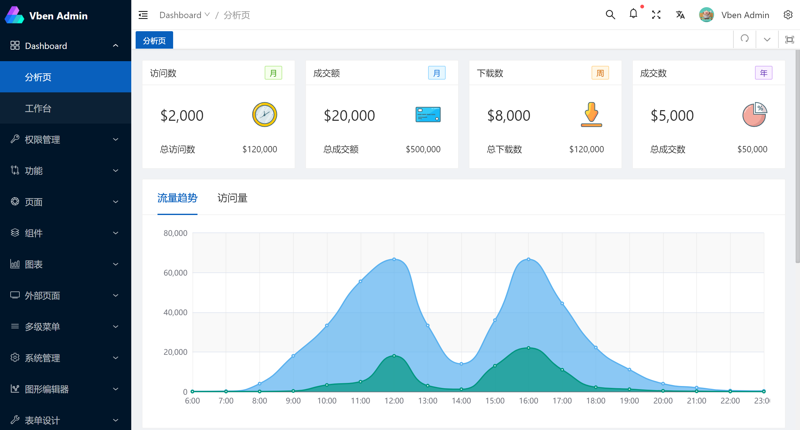
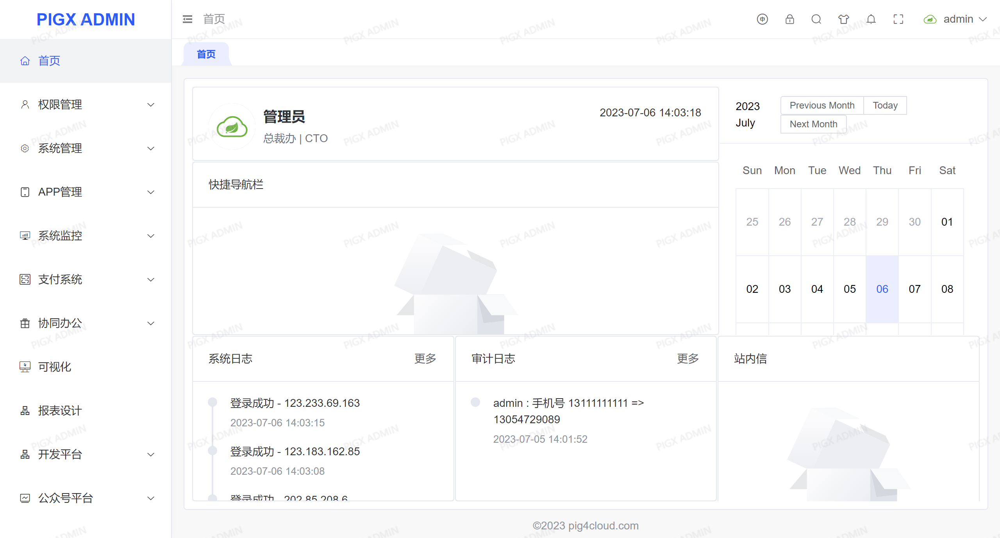
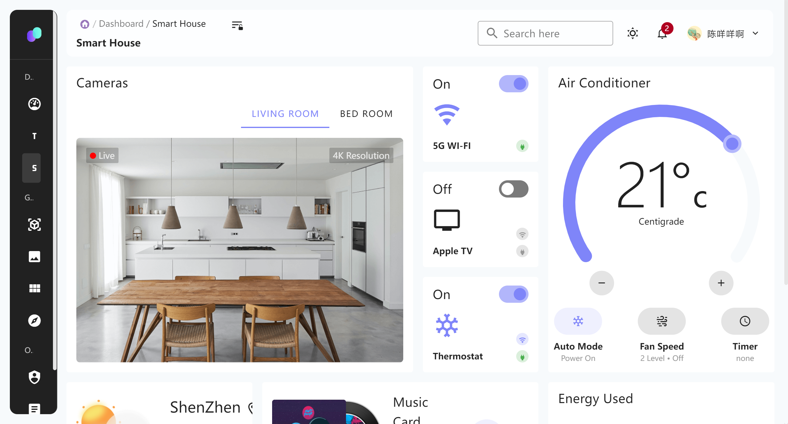

# Vue Vben Admin

## 简介

Vue Vben Admin 是一个免费开源的中后台模版。使用了最新的`vue3`,`vite2`,`TypeScript`等主流技术开发，开箱即用的中后台前端解决方案，也可用于学习参考。

说明文档：https://doc.vvbin.cn/

演示地址：https://vben.vvbin.cn/

源码地址：https://github.com/vbenjs/vue-vben-admin/tree/main

## 特性

- **最新技术栈**：使用 Vue3/vite2 等前端前沿技术开发
- **TypeScript**: 应用程序级 JavaScript 的语言
- **主题**：可配置的主题
- **国际化**：内置完善的国际化方案
- **Mock 数据** 内置 Mock 数据方案
- **权限** 内置完善的动态路由权限生成方案
- **组件** 二次封装了多个常用的组件

# PIGX

> 佩格科技，模板分为开源版、商业版，且有配套视频、文档。

- 官网：https://pigx.pig4cloud.com/
- 文档：https://www.yuque.com/pig4cloud/pig/gg3ndm
- 源码：https://gitee.com/log4j/pig-ui
- 演示：http://pigx.pigx.top

# vue-material-admin

Vue Material Admin 是一个基于 `Vuetify` 免费开源的中后台模版。使用了`Vue3`、`Vite`、`Pinia`、`TypeScript`、`PWA`等技术栈，在 [Material Design](https://gitee.com/link?target=https%3A%2F%2Fm3.material.io%2F) 设计规范和 `Vuetify` 基础组件的基础上，继续向上构建开发，可以用来作为项目的启动模版，也可用于学习参考，该项目持续保持更新。

源码地址：https://gitee.com/chenhuajie/vue-material-admin

预览地址：https://chenhuajie.gitee.io/vue-material-admin/#/dashboard/smart-house

特色：

1. [Three.js 引擎](https://chenhuajie.gitee.io/vue-material-admin/#/graphics/three-js)
   - 动态导入模型
   - 360全景图导入
2. [Babylon.js 引擎](https://chenhuajie.gitee.io/vue-material-admin/#/graphics/babylonjs)
   - 物理引擎
   - 角色控制器（开发中）～不公开源码

