# 项目结构

## 1. 项目的基本组成结构

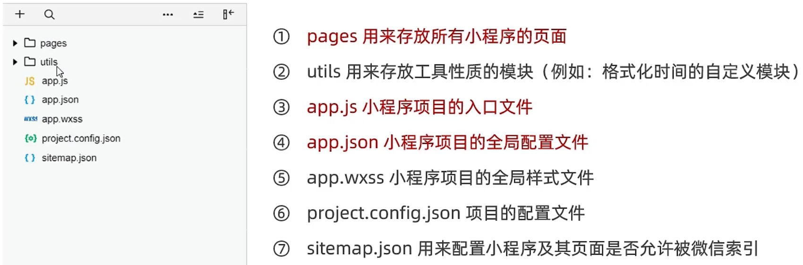

## 2. 小程序页面的组成部分

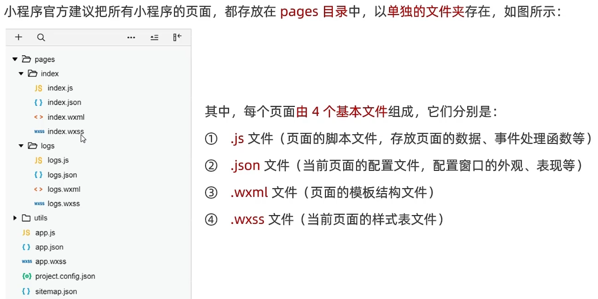

# JSON配置文件

## 1. JSON配置文件的作用

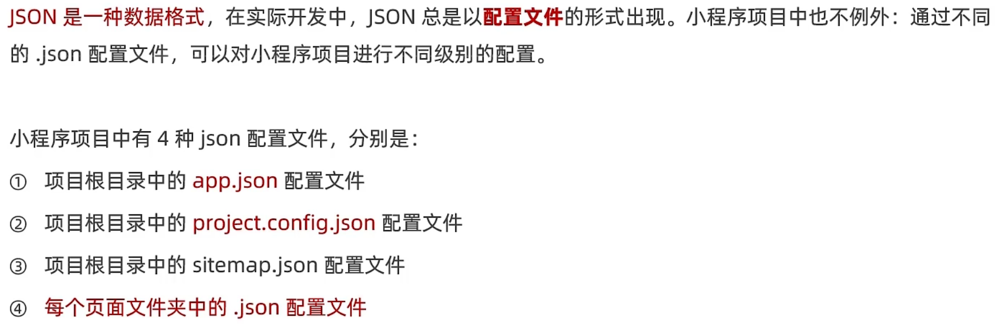

## 2. app.json文件

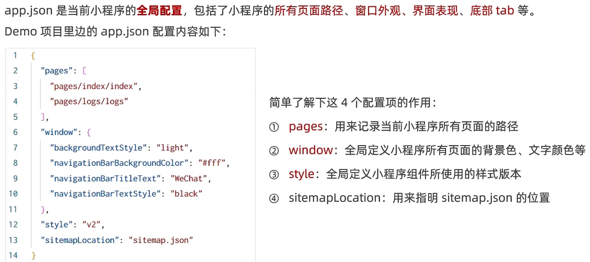

## 3. project.config.json文件

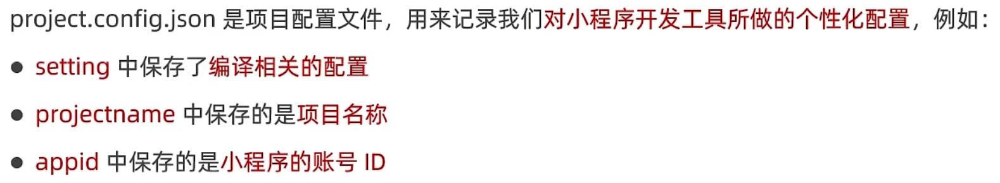

## 4. sitemap.json文件

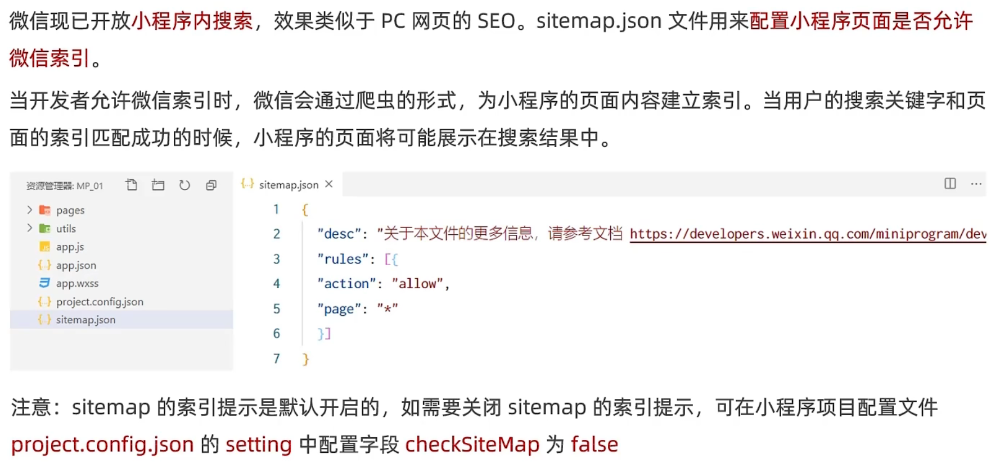

## 5. 页面的`.json`配置文件

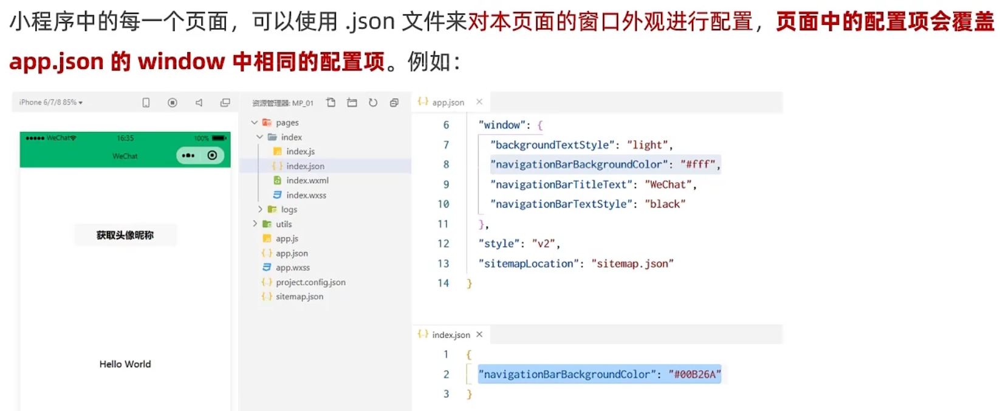

## 6. 新建小程序页面

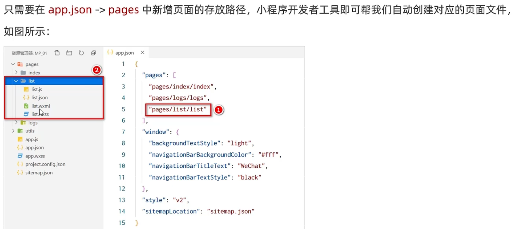

## 7. 修改项目首页

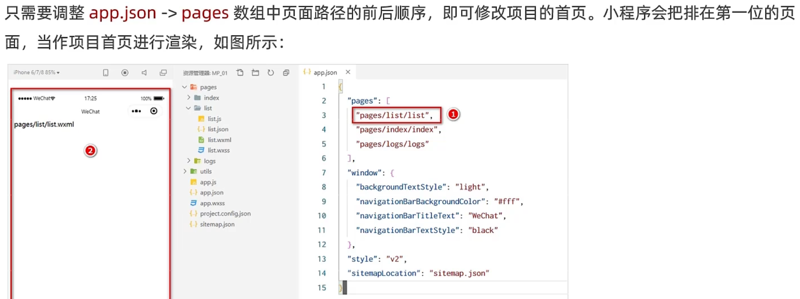

# `WXML`模板

## 1. 什么是`WXML`？

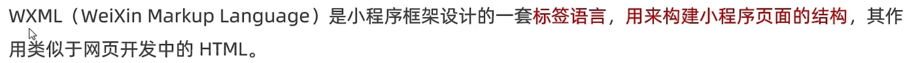

## 2. `WXML`和`HTML`的区别

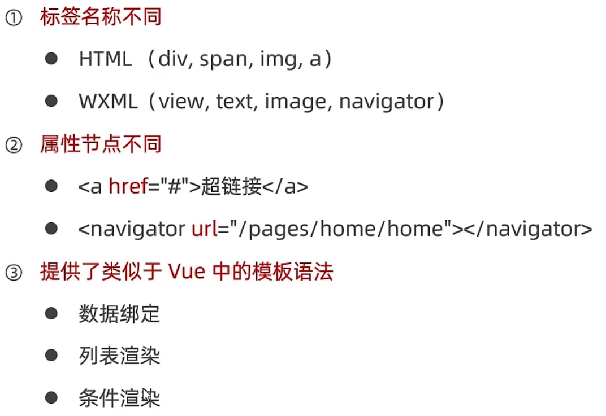

# `WXSS`样式

## 1. 什么是`WXSS`？

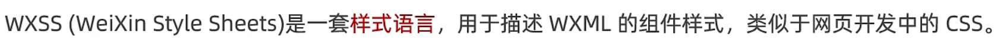

## 2. `WXSS`和`CSS`的区别

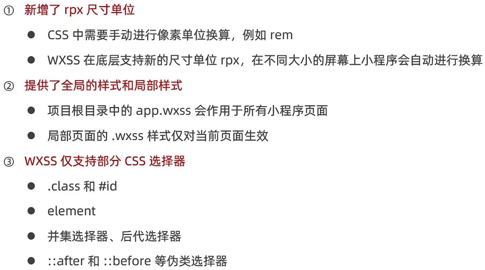

# `JS`逻辑交互

## 1. 小程序中的`.js`文件

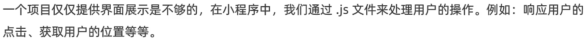

## 2. 小程序中`.js`文件的分类

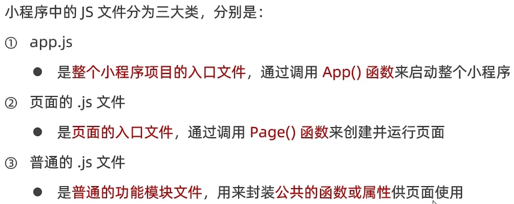

