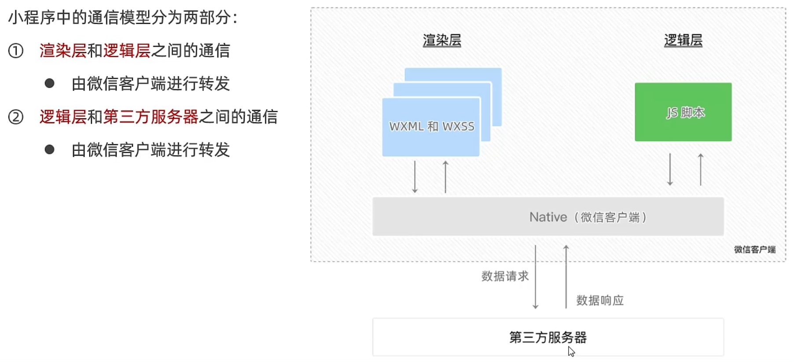

# 宿主环境简介

## 1. 什么是宿主环境

## 2. 小程序的宿主环境

## 3. 小程序宿主环境包含的内容

1. 通信模型
2. 运行机制
3. 组件
4. API

# 通信模型

## 1. 通信的主体

## 2. 小程序的通信模型

# 运行机制

## 1. 小程序启动的过程

## 2. 页面渲染的过程

# 组件

## 1. 小程序中组件的分类

## 2. 常用的视图容器类组件

## 3. `view`组件的基本使用

## 4. `scroll-view`组件的基本使用

## 5. `swiper`和`swiper-item`组件的基本使用

## 6. `swiper`组件的常用属性

## 7. 常用的基础内容组件

## 8. `text `组件的基础使用

## 9. `rich-text`组件的基本使用

## 10. 其他常用组件

## 11. `button`按钮的基本使用

## 12. `image`组件的基本使用

## 13. `image`组件的`mode`属性

# API

## 1. 小程序API概述

## 2. 小程序API的3大分类

