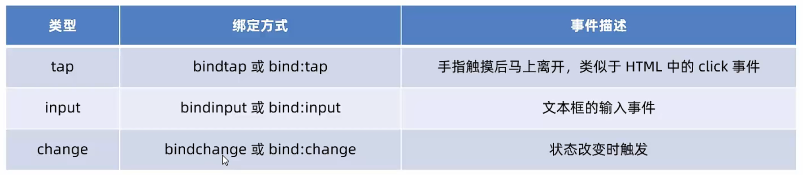

# 数据绑定

## 1. 数据绑定的基本原则

- 在data中定义数据
- 在WXML中使用数据

## 2. 在data中定义页面的数据


## 3. Mustache语法的格式（插值表达式/插值语法）


## 4. Mustache语法的应用场景

Mustache语法的主要应用场景如下：

- 绑定内容
- 绑定属性
- 运算（三元运算、算术运算等）

## 5. 动态绑定内容


## 6. 动态绑定属性


## 7. 三元运算


## 8. 算数运算


# 事件绑定

## 1. 什么是事件


## 2. 小程序中常用的事件



## 3. 事件对象的属性列表


## 4. target和currentTarget的区别


## 5. bindtap的语法格式


## 6. 在事件处理函数中为data中的数据赋值


## 7. 事件传参


---


## 8. bindinput的语法格式


## 9. 实现文本框和data之间的数据同步

实现步骤：

1. 定义数据
2. 渲染结构
3. 美化样式
4. 绑定input事件处理函数

### 定义数据：

```js
Page({
    data: {
        msg: "你好"
    }
})
```

### 渲染结构：

```html
<input value="{{msg}}" bindinput="iptHandler" />
```

### 美化样式：

```css
input {
  border: 1px solid #eee;
  padding: 5px;
  margin: 5px;
  border-radius: 3px;
}
```

### 绑定input事件处理函数：

```js
  iptHandler(e) {
    this.setData({
      // 通过 e.detail.value 获取到文本框最新的值
      msg: e.detail.value
    })
  },
```

# 条件渲染

## 1. wx:if


## 2. 结合`<block>`使用wx:if


## 3. hidden


### 4. wx:if与hidden的对比


# 列表渲染

## 1. wx:for


## 2. 手动指定索引和当前项的变量名*


## 3. wx:key 的使用


