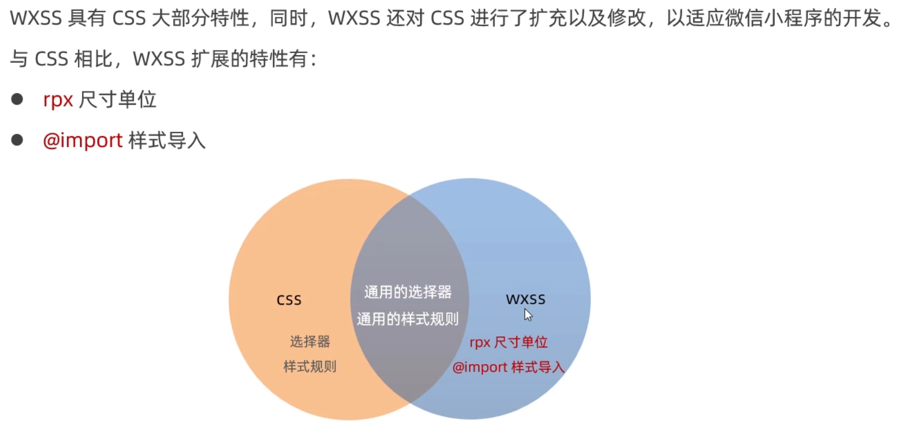
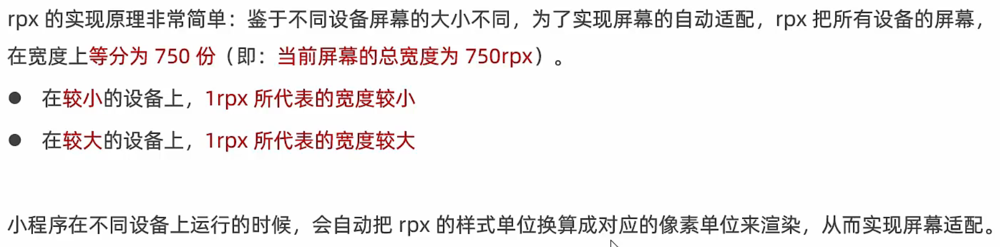
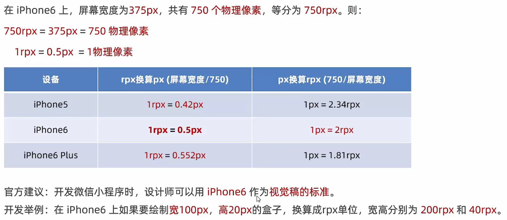
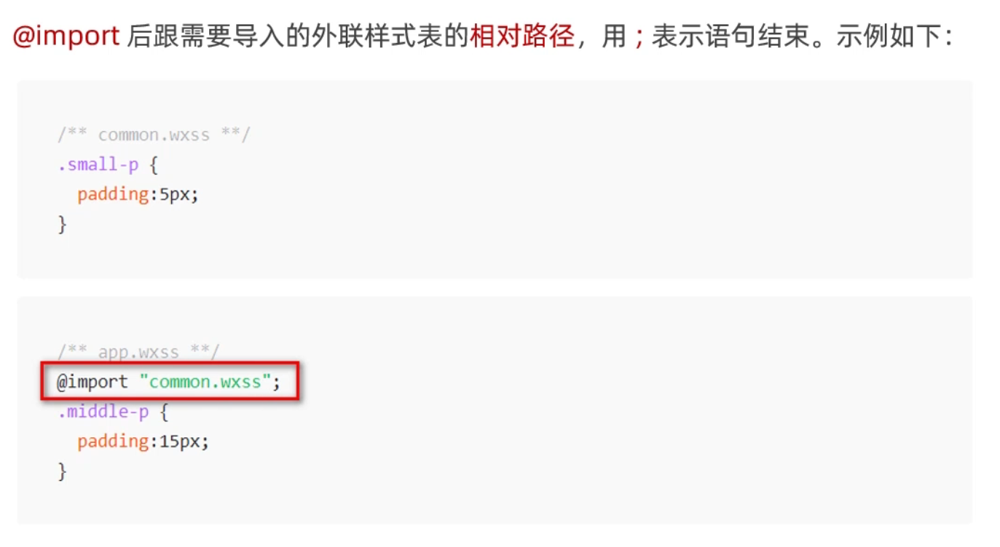

## 1. 什么是WXSS

WXSS（WeiXin Style Sheets）是一套**样式语言**，用于美化WXML的组件样式，类似于网页开发中的CSS。

## 2. WXSS和CSS的关系

# rpx

## 1. 什么是rpx尺寸单位

rpx（responsive pixel）是微信小程序独有的，用来**解决屏幕适配的尺寸单位**。

## 2. rpx的实现原理

## 3. rpx与px之间的单位换算*

# 样式导入

## 1. 什么是样式导入

使用WXSS提供的`@import`语法，可以导入外联的样式表。

## 2. @import的语法格式

# 全局样式和局部样式

## 1. 全局样式

定义在`app.wxss`中的样式为**全局样式**，作用于每一个页面。

## 2. 局部样式

在页面的`.wxss`文件中定义的样式为**局部样式**，只作用于当前页面。

**注意**

1. 当局部样式和全局样式冲突时，根据**就近原则**，局部样式会**覆盖**全局样式
2. 当局部样式的**权重大于或等于**全局样式的权重时，才会覆盖全局的样式

