## 1. 全局配置文件及常用的配置项

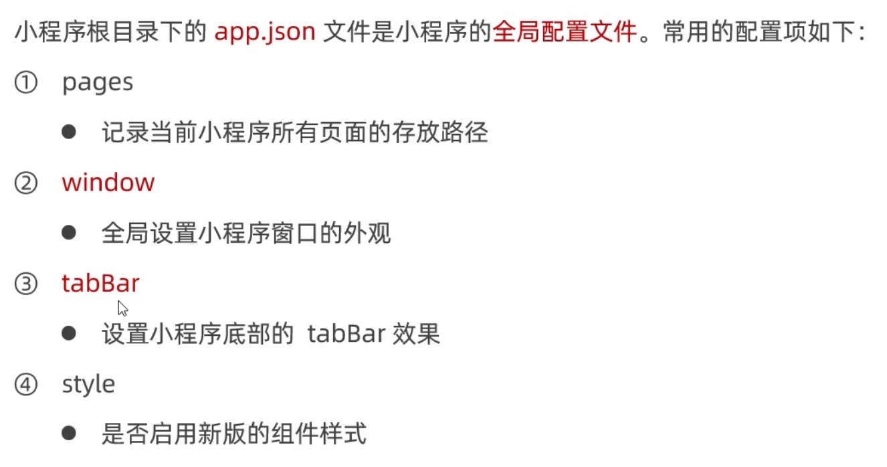

# window

## 1. 小程序窗口的组成部分

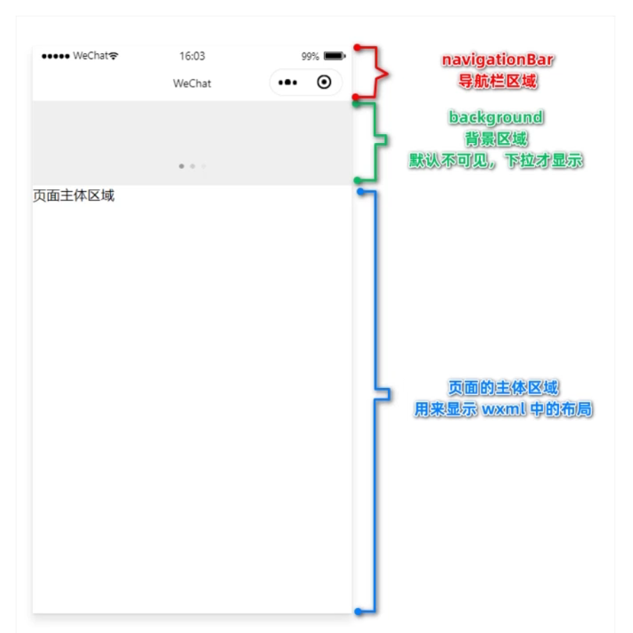

## 2. 了解window节点常用的配置项

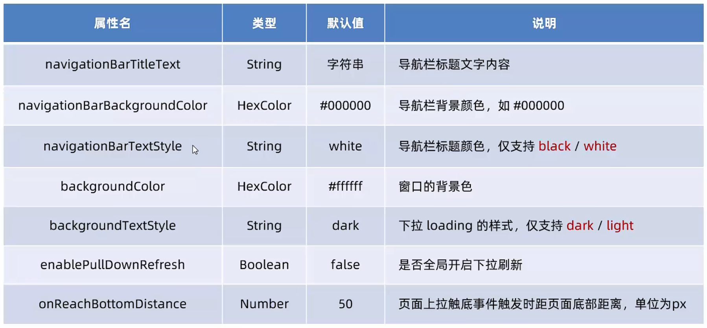

## 3. 设置导航栏的标题

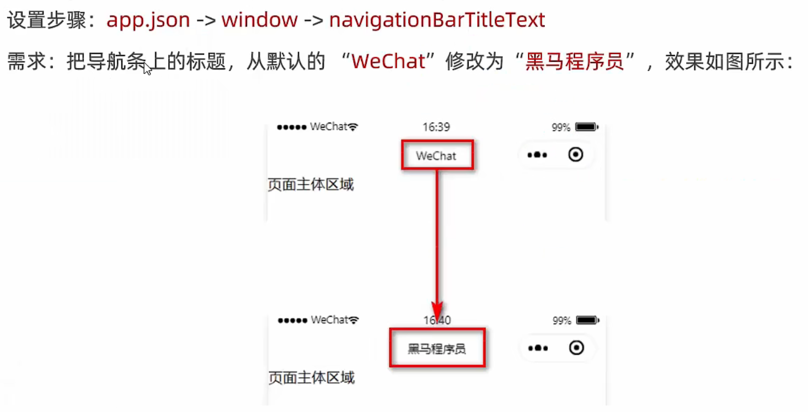

## 4. 设置导航栏的背景色

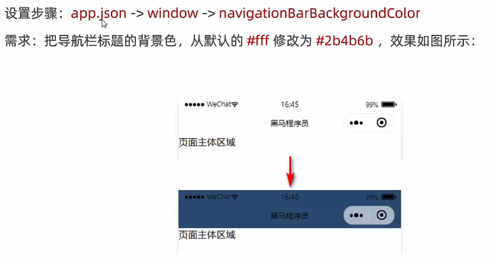

## 5. 设置导航栏的标题颜色

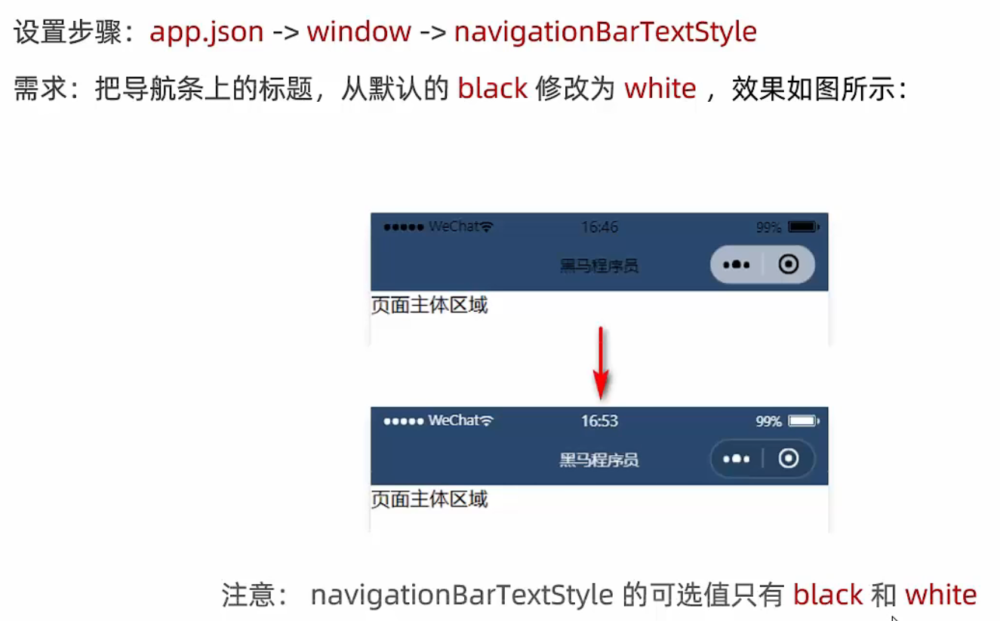

## 6. 全局开启下拉刷新功能

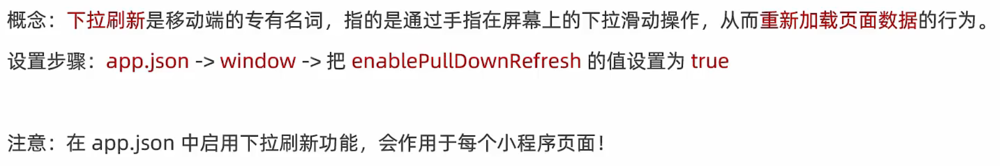

## 7. 设置下拉刷新时窗口的背景色

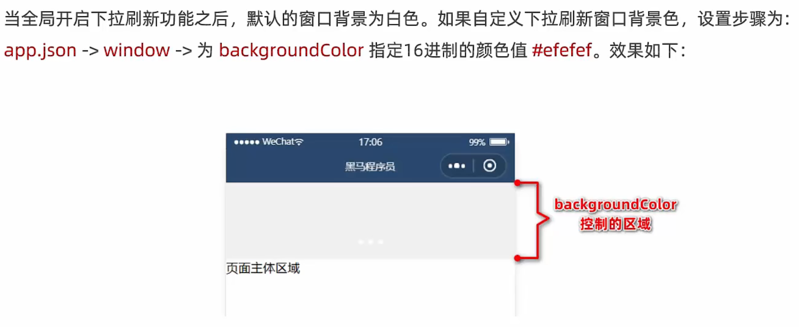

## 8. 设置下拉刷新时loading的样式

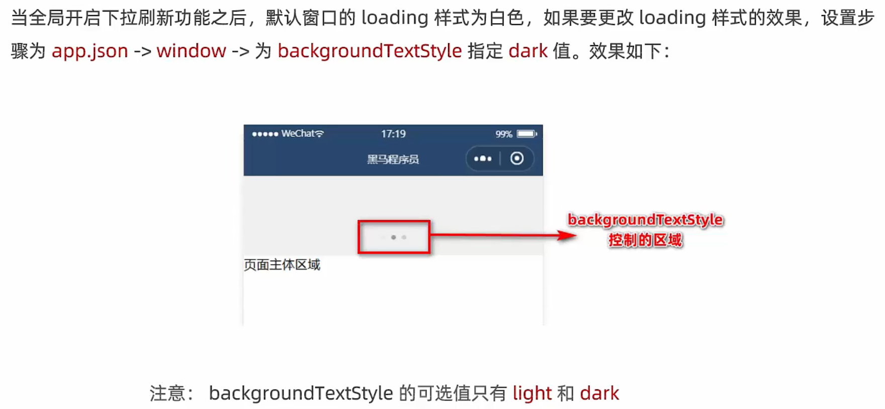

## 9. 设置上拉触底的距离

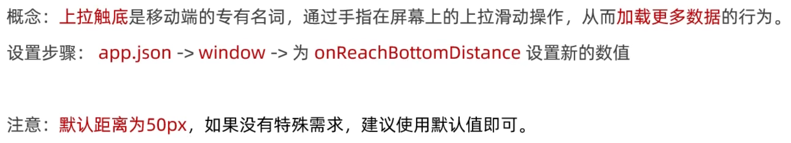

# tabBar

## 1. 什么是tabBar

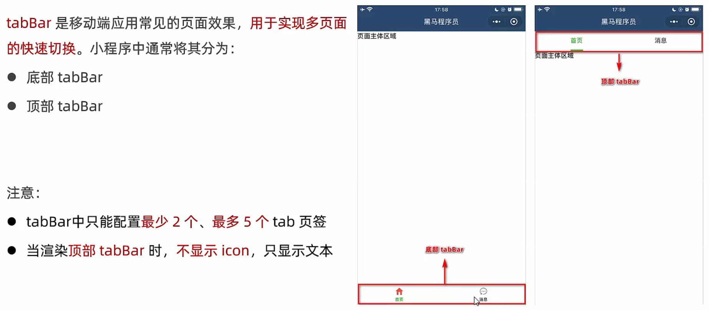

## 2. tabBar的6个组成部分

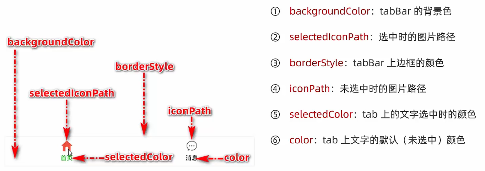

## 3. tabBar节点的配置项

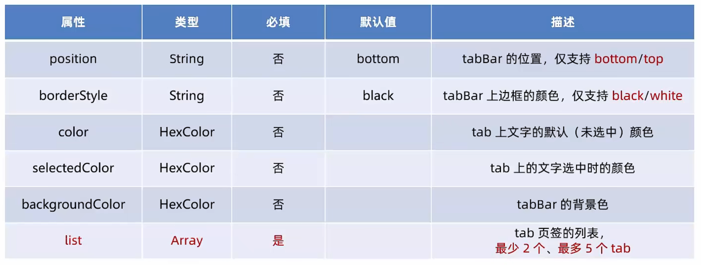

## 4. 每个tab项的配置选项

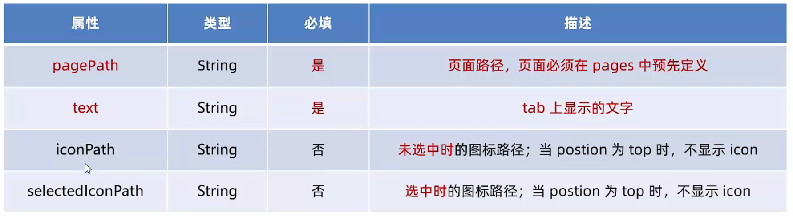

# 案例：配置tabBar

## 1. 需求描述

根据资料中提供的小图标、在小程序中配置如图所示的tabBar效果：

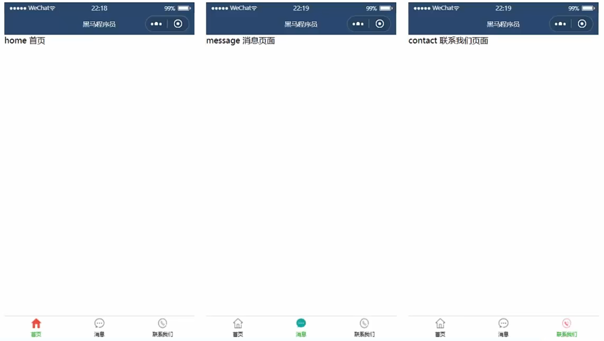

## 2. 实现步骤

1. 拷贝图标资源
2. 新建3个对应的tab页面
3. 配置tabBar选项

## 3. 步骤1-拷贝图标资源

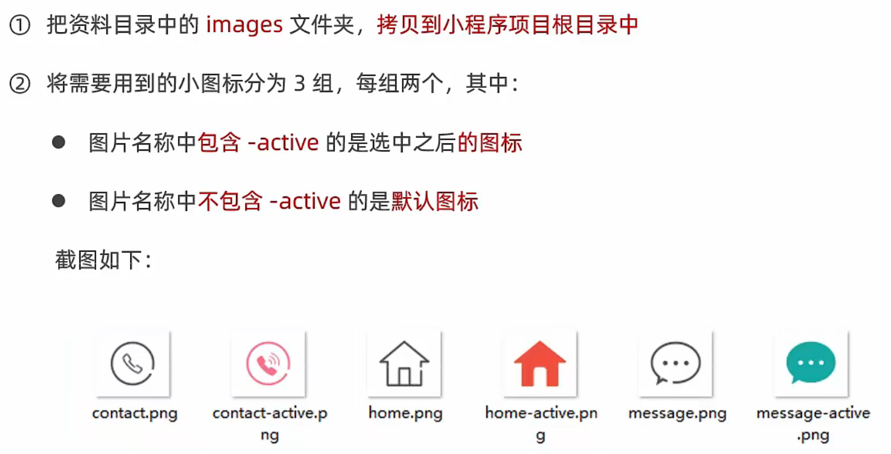

## 3. 步骤2-新建3个对应的tab页面

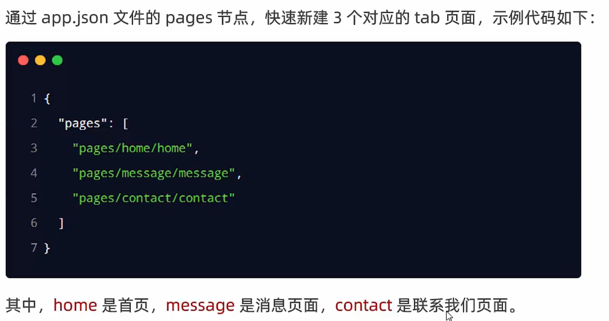

## 3. 步骤3-配置tabBar选项

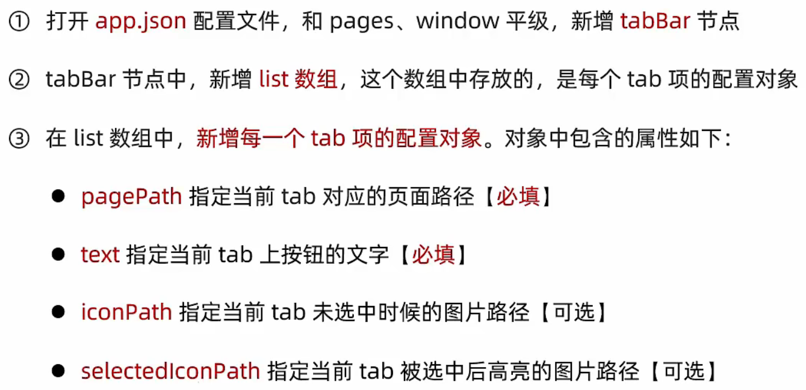

```json
{
  "pages": [
    "pages/home/home",
    "pages/message/message",
    "pages/contact/contact",
  ],
  "tabBar": {
    "list": [{
      "pagePath": "pages/home/home",
      "text": "首页",
      "iconPath": "/images/tabs/home.png",
      "selectedIconPath": "/images/tabs/home-active.png"
    }, {
      "pagePath": "pages/message/message",
      "text": "消息",
      "iconPath": "/images/tabs/message.png",
      "selectedIconPath": "/images/tabs/message-active.png"
    }, {
      "pagePath": "pages/contact/contact",
      "text": "联系我们",
      "iconPath": "/images/tabs/contact.png",
      "selectedIconPath": "/images/tabs/contact-active.png"
    }]
  },
  "window": {
    "backgroundTextStyle": "light",
    "navigationBarBackgroundColor": "#fff",
    "navigationBarTitleText": "Weixin",
    "navigationBarTextStyle": "black"
  },
  "style": "v2",
  "sitemapLocation": "sitemap.json"
}
```

