## 1. 什么是页面导航

页面导航指的是**页面之间的相互跳转**。例如，浏览器中实现页面导航的方式有如下两种：

1. `<a>`链接
2. `location.href`

## 2. 小程序中实现页面导航的两种方式

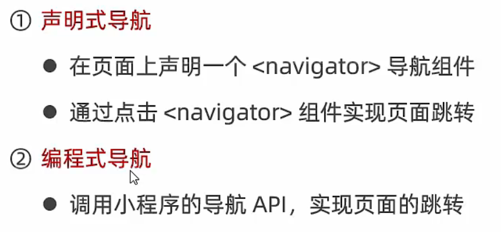

# 声明式导航

## 1. 导航到 tabBar 页面

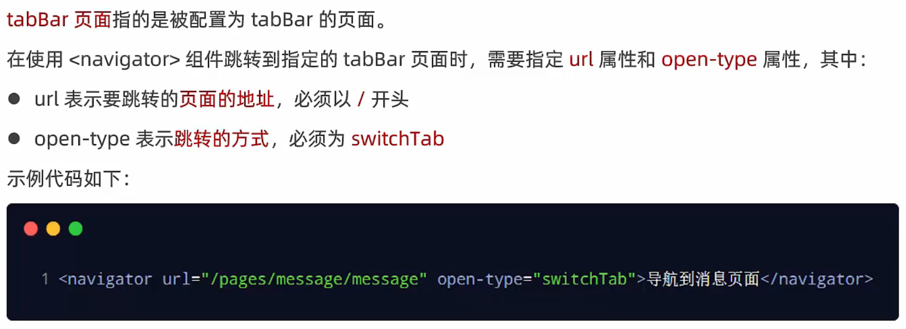

## 2. 导航到非 tabBar 页面

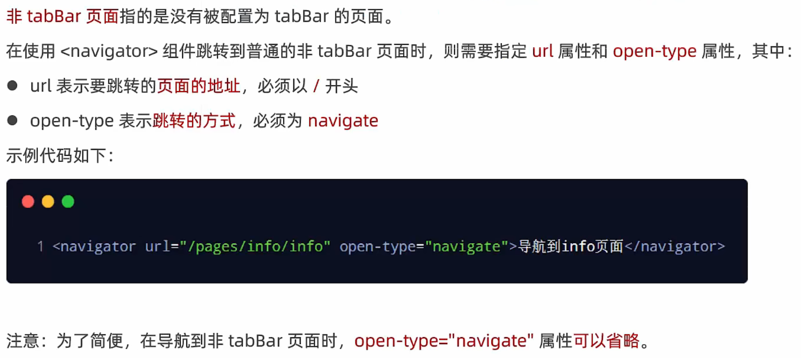

## 3. 后退导航

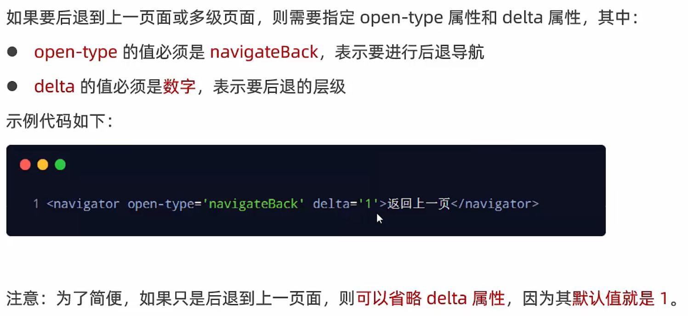

# 编程式导航

## 1. 导航到 tabBar 页面

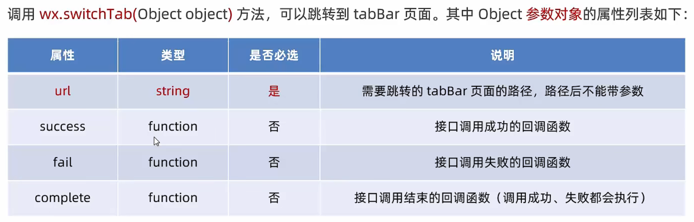

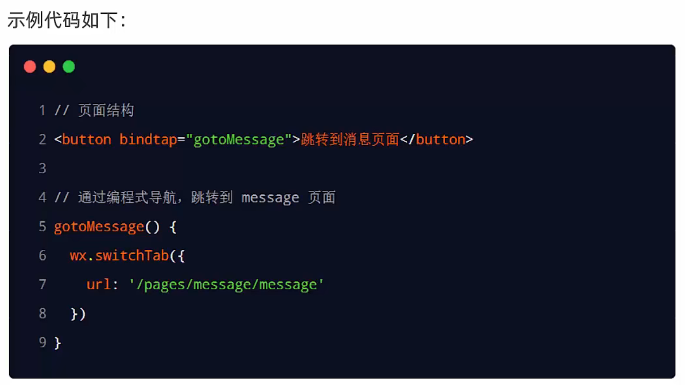

## 2. 导航到非 tabBar 页面

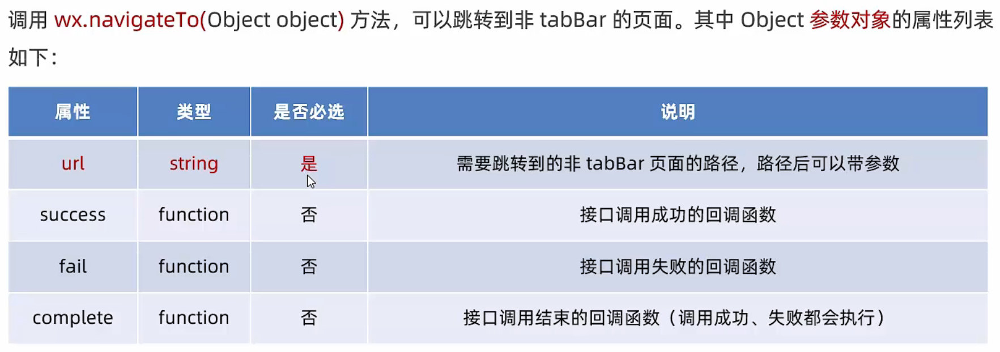

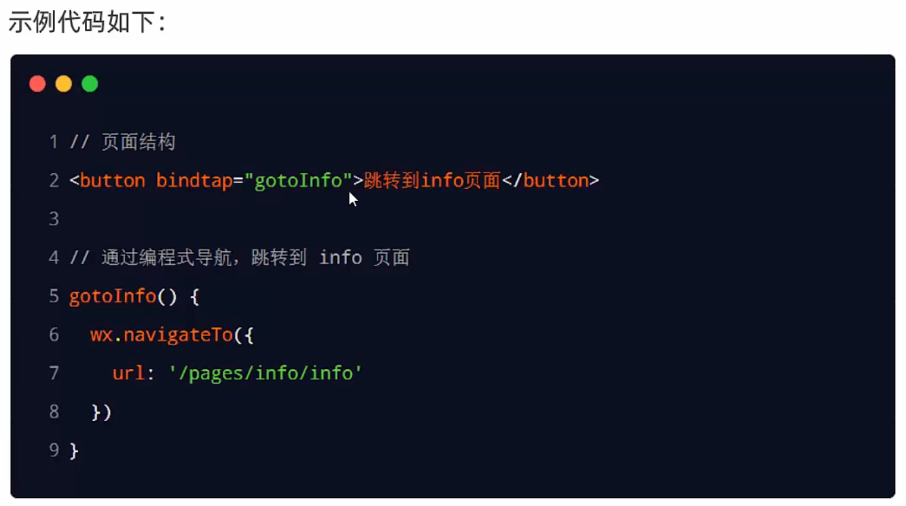

## 3. 后退导航

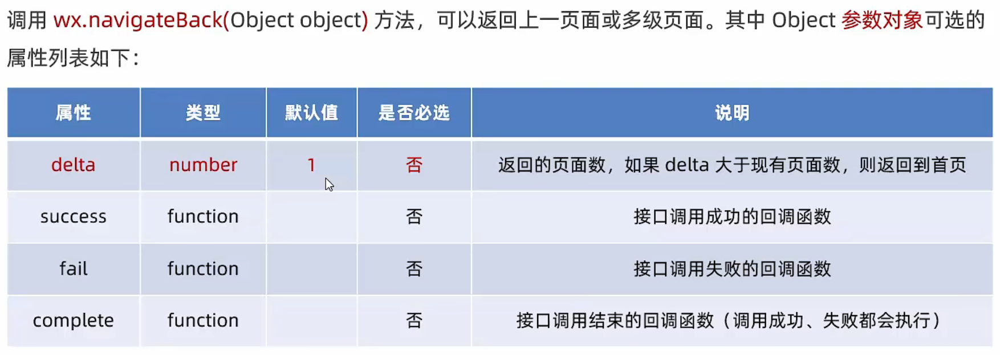

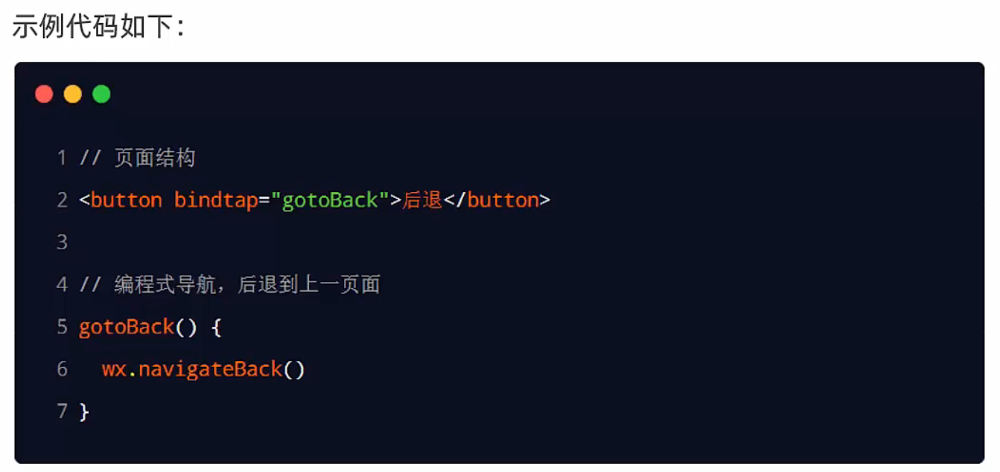

# 导航传参

> - navigateTo  不能跳转tabBar页面  url 支持传参 
> - switchBar    只能跳转tabBar页面  但是url 不支持传参

## 1. 声明式导航传参

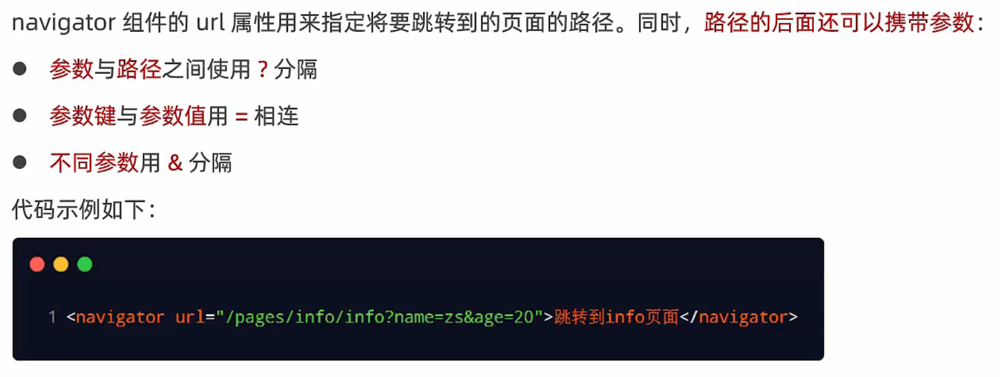

## 2. 编程式导航传参

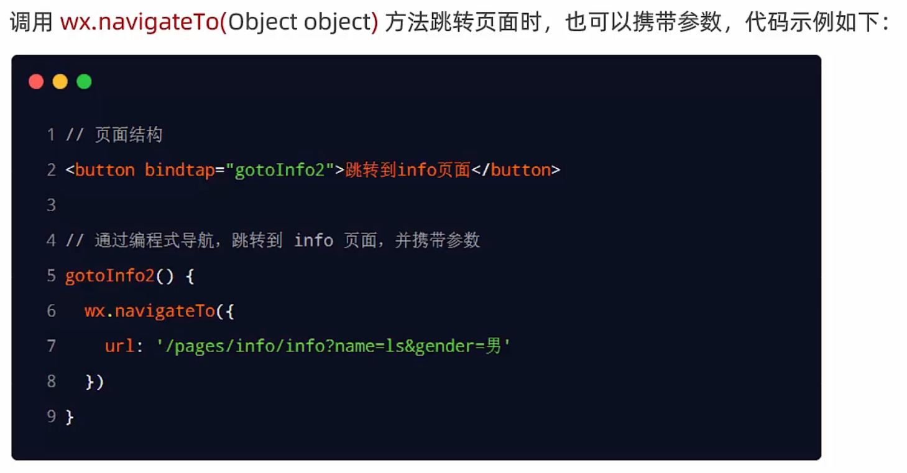

## 3. 在 onLoad 中接收导航参数

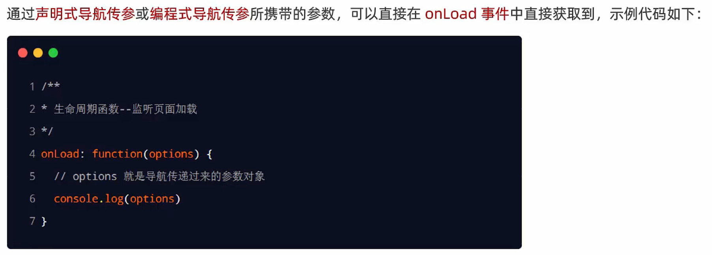

接收示例：

```js
Page({

  /**
   * 页面的初始数据
   */
  data: {
    // 导航传递过来的参数对象
    query: {}
  },

  /**
   * 生命周期函数--监听页面加载
   */
  onLoad(options) {
    // console.log(options);
    this.setData({
      query: options
    })
  }
})
```

