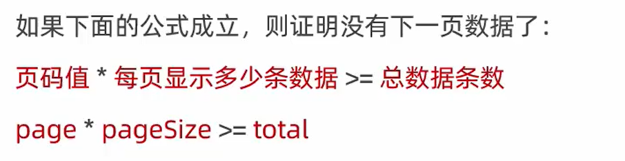

# 下拉刷新事件

## 1. 什么是下拉刷新

**下拉刷新**是移动端的专有名词，指的是通过手指在屏幕上的下拉滑动操作，从而**重新加载页面数据**的行为。

## 2. 启用下拉刷新


## 3. 配置下拉刷新窗口的样式


```json
{
  "usingComponents": {},
  "enablePullDownRefresh": true,
  "backgroundColor": "#efefef",
  "backgroundTextStyle": "dark"
}
```


## 4. 监听页面的下拉刷新事件

在页面的`.js`文件中，通过`onPullDownRefresh()`函数即可监听当前页面的下拉刷新事件。

例如，在页面的`wxml`中有如下的UI结构，点击按钮可以让`count`值自增`+1`：

```html
<!-- 页面结构 -->
<view>count值为：{{count}}</view>
<button bindtap="countAdd">+1</button>
```

```js
Page({

  /**
   * 页面的初始数据
   */
  data: {
    count: 0
  },
    
  // +1 按钮的点击事件处理函数
  countAdd() {
    this.setData({
      count: this.data.count + 1
    })
  }
})
```

在触发页面的下拉刷新事件的时候，如果要把`count`的值重置为`0`，示例代码如下：

```js
  /**
   * 页面相关事件处理函数--监听用户下拉动作
   */
  onPullDownRefresh() {
    this.setData({
      count: 0
    })
  },
```

## 5. 停止下拉刷新的效果

当处理完下拉刷新后，下拉刷新的`loading`效果会一直显示，**不会主动消失**，所以需要手动隐藏`loading`效果。此时，调用`wx.stopPullDownRefresh()`可以停止当前页面的下拉刷新。示例代码：

```js
  /**
   * 页面相关事件处理函数--监听用户下拉动作
   */
  onPullDownRefresh() {
    this.setData({
      count: 0
    });
    // 当数据重置成功之后，调用此函数，关闭下拉刷新的效果
    wx.stopPullDownRefresh();
  },
```

## 6. 项目中解决下拉刷新不会自动关闭

获取后端数据的函数，界面加载时、下拉刷新时、上拉触底时都会调用该函数。

```js
  getColors(cb) { // 获取随机颜色的方法
    this.setData({
      isloding: true
    })
    wx.showLoading({ // 展示loading效果
      title: '数据加载中...'
    })

    // 发起请求，获取随机颜色值的数组
    wx.request({
      url: 'http://192.168.41.216:9999/test/get-branch',
      method: 'GET',
      success: ({
        data: res
      }) => {
        this.setData({
          colorList: [...this.data.colorList, ...res.data]
        })
        // console.log(this.data.colorList);
      },
      complete: () => {
        this.setData({
          isloding: false
        });
        wx.hideLoading(); // 隐藏loading效果
        // wx.stopPullDownRefresh();
        // 若传递了cb函数，就调用cb()
        cb && cb()
      }
    })
  },
```

下拉刷新时调用该函数，并传递参数关闭下拉效果

```js
  /**
   * 页面相关事件处理函数--监听用户下拉动作
   */
  onPullDownRefresh() {
    // 需要重置关键的数据
    this.setData({
      page: 1,
      colorList: [],
      total: 0
    });
    // 重新发起数据请求
    this.getColors(() => {
      wx.stopPullDownRefresh();
    });
  },
```


# 上拉触底事件

## 1. 什么是上拉触底

**上拉触底**是移动端的专有名词，通过手指在屏幕上的上拉滑动操作，从而**加载更多数据**的行为。一般用于加载分页数据。

## 2. 监听页面的上拉触底事件

在页面的`.js`文件中，通过`onReachBottom()`函数即可监听当前页面的上拉触底事件。示例代码如下：

```js
  /**
   * 页面上拉触底事件的处理函数
   */
  onReachBottom() {
    // 要做节流处理，防止频繁发起某个数据请求
    console.log("触发了上拉触底的事件");
  },
```

## 3. 配置上拉触底距离


# 上拉触底案例

> `...`：展开运算符。其实就是把数组的每个数据拆开然后放进去。

```js
Page({

  /**
   * 页面的初始数据
   */
  data: {
    count: 0,
    colorList: [], //随机颜色列表
    isloding: false
  },
  
  getColors() { // 获取随机颜色的方法
    this.setData({
      isloding: true
    });
    wx.showLoading({ // 展示loading效果
      title: '数据加载中...'
    })

    // 发起请求，获取随机颜色值的数组
    wx.request({
      url: 'http://192.168.1.3:9999/test/get-branch',
      method: 'GET',
      success: ({
        data: res
      }) => {
        this.setData({
          colorList: [...this.data.colorList, ...res.data]
        })
        console.log(this.data.colorList);
      },
      complete: () => {
        this.setData({
          isloding: false
        });
        wx.hideLoading(); // 隐藏loading效果
      }
    })
  },

  /**
   * 生命周期函数--监听页面加载
   */
  onLoad(options) {
    this.getColors();
  },
  
  /**
   * 页面上拉触底事件的处理函数
   */
  onReachBottom() {
    if (this.data.isloding) return;
    this.getColors();
    console.log("触发了上拉触底的事件");
  },
})
```

## 对上拉触底进行节流处理

> 注意：新版本已自动节流，不用额外配置，但要了解如何配置
>
> showLoading，mask参数设置true，loading框一旦出现，就不能再操作屏幕了，可以实现节流，默认false


## 判断是否还有下一页数据

