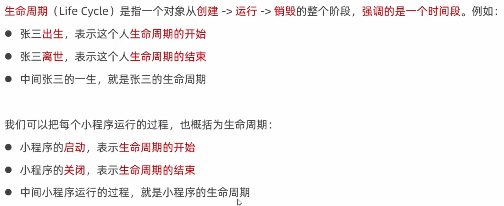
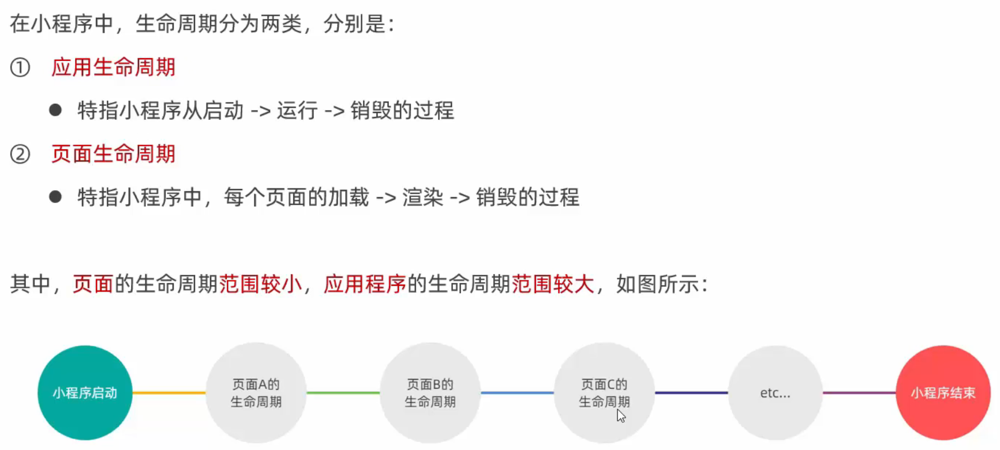
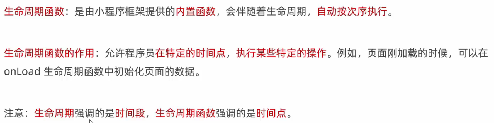
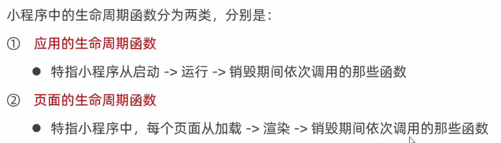
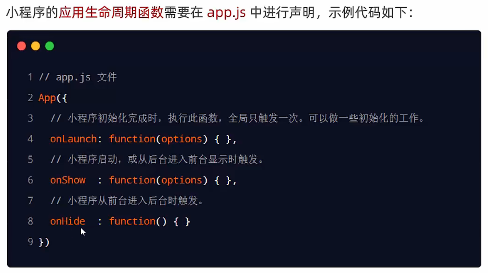
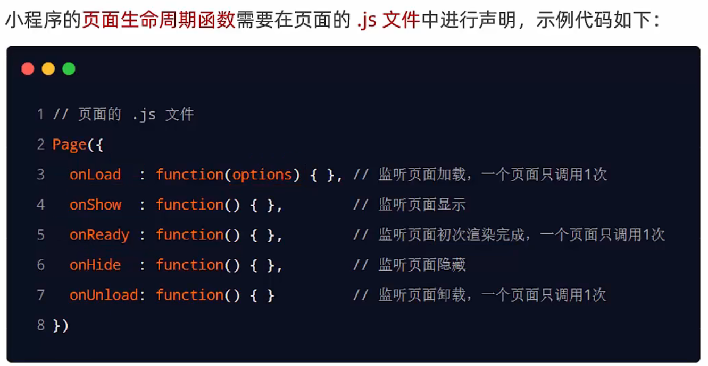

## 1. 什么是生命周期

## 2. 生命周期的分类

## 3. 什么是生命周期函数

## 4. 生命周期函数的分类

## 5. 应用的生命周期函数

## 6. 页面的生命周期函数

> #### onReady()
>
> 页面初次渲染完成时触发。一个页面只会调用一次，代表页面已经准备妥当，可以和视图层进行交互。
>
> 注意：对界面内容进行设置的 API 如[wx.setNavigationBarTitle](https://developers.weixin.qq.com/miniprogram/dev/api/ui/navigation-bar/wx.setNavigationBarTitle.html)，请在`onReady`之后进行。详见[生命周期](https://developers.weixin.qq.com/miniprogram/dev/framework/app-service/page-life-cycle.html)