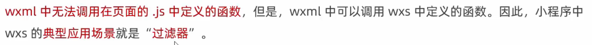
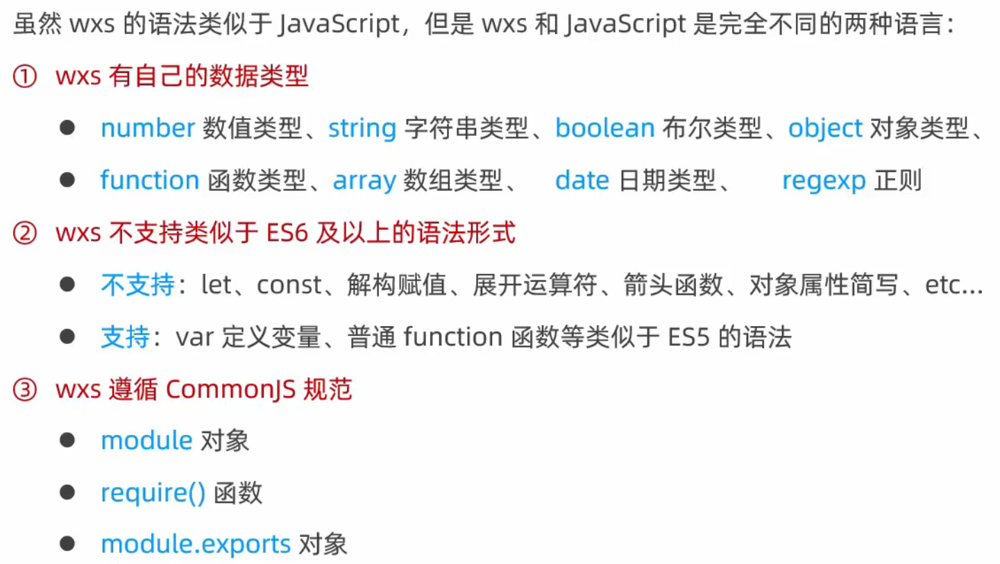
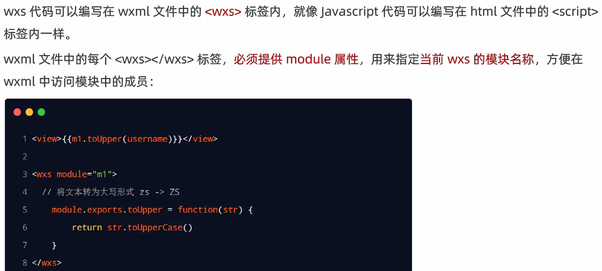
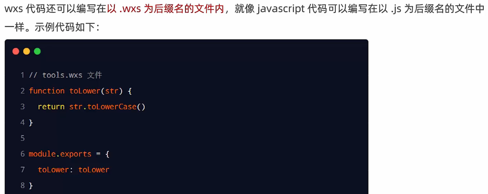
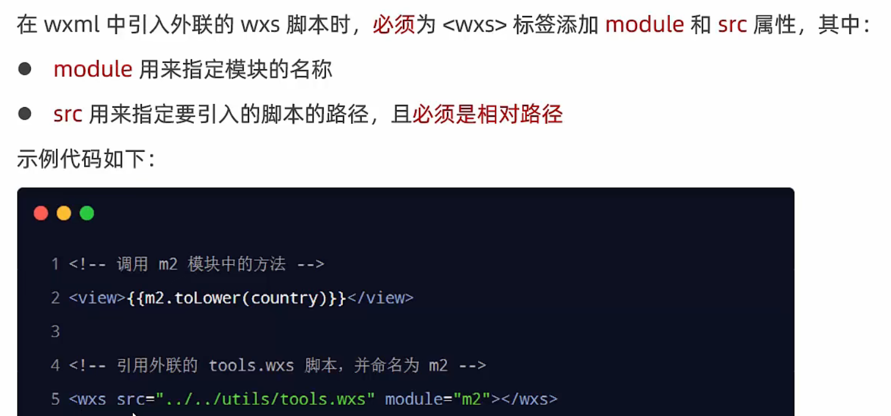
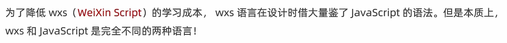
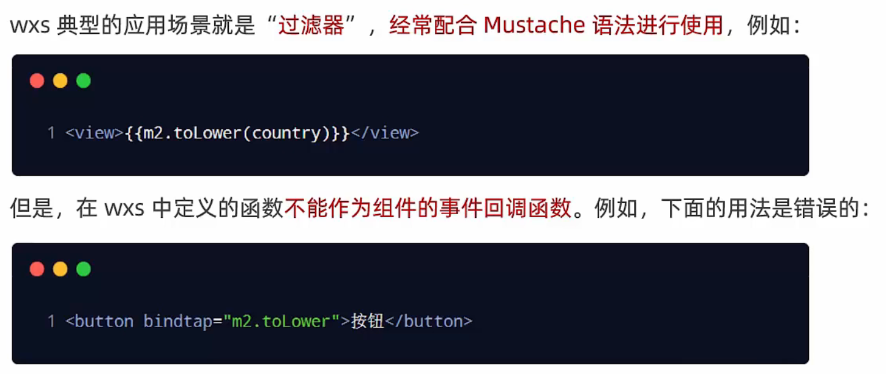
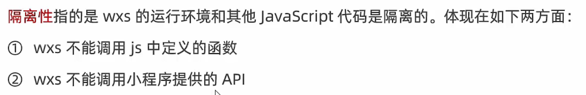
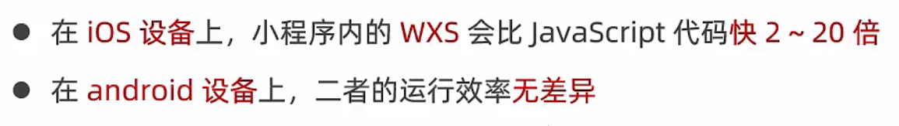

# 概述

## 1. 什么是 wxs

WXS（WeiXin Script）是**小程序独有的一套脚本语言**，结合WXML，可以构建出页面的结构。

## 2. wxs 的应用场景



## 3. wxs 和 JavaScript 的关系*



# 基础语法

## 1. 内嵌 wxs 脚本



## 2. 定义外联的 wxs 脚本



## 3. 使用外联的 wxs 脚本



# WXS 的特点

## 1. 与 JavaScript 不同



## 2. 不能作为组件的事件回调



## 3. 隔离性



## 4. 性能好



# 使用WXS处理手机号

首先，在utils目录下新建tools.wxs文件夹

```js
function splitPhone(str) {
  if (str.length != 11) return str

  var arr = str.split('')

  arr.splice(3, 0, '-')
  arr.splice(8, 0, '-')

  return arr.join('')
}

module.exports = {
  splitPhone: splitPhone
}
```

.wxml界面引入并使用

```html
{{tools.splitPhone('15563585636')}}

<wxs src="/utils/tools.wxs" module="tools" />
```

