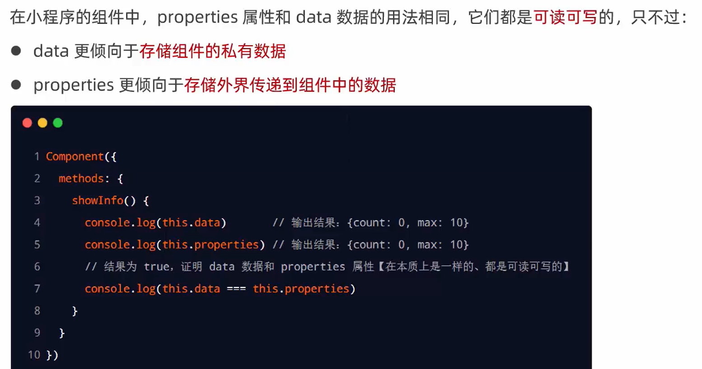

# 组件的创建与引用

## 1. 创建组件


## 2. 引用组件


## 3. 局部引用组件


## 4. 全局引用组件


## 5. 全局引用VS局部引用


## 6. 组件和页面的区别


# 样式

## 1. 组件样式隔离


## 2. 组件样式隔离的注意点


## 3. 修改组件的样式隔离选项


## 4. styleIsolation的可选值


# 数据、方法和属性

## 1. data数据


## 2. methods方法

在小程序组件中，**事件处理函数**和**自定义方法**需要定义到**methods节点**中，示例代码如下：

```js
// components/test/test.js
Component({
  /**
   * 组件的初始数据
   */
  data: {
    count: 0
  },

  /**
   * 组件的方法列表【包含事件处理函数和自定义方法】
   */
  methods: {
    // 事件处理函数
    addCount() {
      this.setData({
        count: this.data.count + 1
      });
      this._showCount(); // 通过 this 直接调用自定义方法
    },
    // 自定义方法建议以 _ 开头
    _showCount() {
      wx.showToast({
        title: 'count值为' + this.data.count,
        icon: 'none'
      })
    }
  }
})
```

```html
<!--components/test/test.wxml-->
<view>count的值为：{{count}}</view>
<button bindtap="addCount">+1</button>
```

## 3. properties属性


## 4. data和properties的区别



> properties是可读可写的 ，全等于data 但是如果 data和properties数据相同，properties优先级更高

## 5. 使用 setData 修改 properties 的值


# 数据监听器

## 1. 什么是数据监听器


## 2. 数据监听器的基本用法

组件的UI结构如下：

```html
<view>{{n1}} + {{n2}} = {{sum}}</view>
<button size="mini" bindtap="addN1">n1自增</button>
<button size="mini" bindtap="addN2">n1自增</button>
```

组件的`.js`文件代码如下：

```js
Component({
  data: { // 数据节点
    n1: 0,
    n2: 0,
    sum: 0
  },

  methods: { // 方法列表
    addN1() {
      this.setData({
        n1: this.data.n1 + 1
      })
    },
    addN2() {
      this.setData({
        n2: this.data.n2 + 1
      })
    }
  },
  observers: { // 数据监听节点
    'n1, n2': function (n1, n2) { // 监听 n1 和 n2 数据的变化
      this.setData({
        sum: n1 + n2			  // 通过监听器，自动计算 sum 的值
      })
    }
  }
})
```

## 3. 监听对象属性的变化


# 数据监听器 - 案例

## 1. 案例效果


新建组件：

```js
// components/test02/test02.js
Component({
  /**
   * 组件的初始数据
   */
  data: {
    rgb: { // rgb 的颜色值对象
      r: 0,
      g: 0,
      b: 0
    },
    fullColor: '0, 0, 0' // 根据rgb对象的三个属性，动态计算 fullColor 的值
  },

  /**
   * 组件的方法列表
   */
  methods: {

  }
})
```

## 2. 渲染 UI 结构

```html
<!--components/test02/test02.wxml-->
<view style="background-color: rgb({{fullColor}});" class="colorBox">颜色值：{{fullColor}}</view>
<button size="mini" bindtap="changeR" type="default">R</button>
<button size="mini" bindtap="changeG" type="primary">G</button>
<button size="mini" bindtap="changeB" type="warn">B</button>
```

```css
/* components/test02/test02.wxss */
.colorBox {
  line-height: 200rpx;
  font-size: 24rpx;
  color: white;
  text-shadow: 0rpx 0rpx 2rpx black;
  text-align: center;
}
```

## 3. 定义 button 的事件处理函数

```js
  /**
   * 组件的方法列表
   */
  methods: {
    changeR() { // 修改rgb对象上r属性的值
      this.setData({
        'rgb.r': this.data.rgb.r + 5 > 255 ? 255 : this.data.rgb.r + 5
      })
    },
    changeG() { // 修改rgb对象上g属性的值
      this.setData({
        'rgb.g': this.data.rgb.g + 5 > 255 ? 255 : this.data.rgb.g + 5
      })
    },
    changeB() { // 修改rgb对象上b属性的值
      this.setData({
        'rgb.b': this.data.rgb.b + 5 > 255 ? 255 : this.data.rgb.b + 5
      })
    },
  }
```

## 4. 监听对象中指定属性的变化

```js
  observers: {
    // 监听 rgb 对象上 r,g,b 三个子属性的变化
    'rgb.r, rgb.g, rgb.b': function (r, g, b) {
      this.setData({
        // 为 data 中的 fullColor 重新赋值
        fullColor: `${r}, ${g}, ${b}`
      })
    }
  }
```

## 组件的完整js

```js
// components/test02/test02.js
Component({
  /**
   * 组件的初始数据
   */
  data: {
    rgb: { // rgb 的颜色值对象
      r: 0,
      g: 0,
      b: 0
    },
    fullColor: '0, 0, 0' // 根据rgb对象的三个属性，动态计算 fullColor 的值
  },

  /**
   * 组件的方法列表
   */
  methods: {
    changeR() { // 修改rgb对象上r属性的值
      this.setData({
        'rgb.r': this.data.rgb.r + 5 > 255 ? 255 : this.data.rgb.r + 5
      })
    },
    changeG() { // 修改rgb对象上g属性的值
      this.setData({
        'rgb.g': this.data.rgb.g + 5 > 255 ? 255 : this.data.rgb.g + 5
      })
    },
    changeB() { // 修改rgb对象上b属性的值
      this.setData({
        'rgb.b': this.data.rgb.b + 5 > 255 ? 255 : this.data.rgb.b + 5
      })
    },
  },
  observers: {
    // 监听 rgb 对象上 r,g,b 三个子属性的变化
    'rgb.r, rgb.g, rgb.b': function (r, g, b) {
      this.setData({
        // 为 data 中的 fullColor 重新赋值
        fullColor: `${r}, ${g}, ${b}`
      })
    }
  }
})
```

## 5. 监听对象中所有属性的变化


# 纯数据字段

## 1. 什么是纯数据字段


## 2. 使用规则


## 3. 使用纯数据字段改造数据监听器案例

```js
// components/test02/test02.js
Component({
  options: {
    // 指定所有 _ 开头的数据字段为纯数据字段
    pureDataPattern: /^_/
  },
  /**
   * 组件的初始数据
   */
  data: {
    // 将 rgb 改造为以 _ 开头的纯数据字段
    _rgb: { // rgb 的颜色值对象
      r: 0,
      g: 0,
      b: 0
    },
    fullColor: '0, 0, 0' // 根据rgb对象的三个属性，动态计算 fullColor 的值
  },

  /**
   * 组件的方法列表
   */
  methods: {
    changeR() { // 修改rgb对象上r属性的值
      this.setData({
        '_rgb.r': this.data._rgb.r + 5 > 255 ? 255 : this.data._rgb.r + 5
      })
    },
    changeG() { // 修改rgb对象上g属性的值
      this.setData({
        '_rgb.g': this.data._rgb.g + 5 > 255 ? 255 : this.data._rgb.g + 5
      })
    },
    changeB() { // 修改rgb对象上b属性的值
      this.setData({
        '_rgb.b': this.data._rgb.b + 5 > 255 ? 255 : this.data._rgb.b + 5
      })
    },
  },
  observers: {
    // 监听 rgb 对象上 r,g,b 三个子属性的变化
    '_rgb.**': function (obj) {
      this.setData({
        // 为 data 中的 fullColor 重新赋值
        fullColor: `${obj.r}, ${obj.g}, ${obj.b}`
      })
    }
  }
})
```

# 组件的生命周期

## 1. 组件全部的生命周期函数

小程序组件可用的全部生命周期如下表所示：


## 2. 组件主要的生命周期函数


## 3. lifetimes节点


# 组件所在页面的生命周期

## 1. 什么是组件所在页面的生命周期


## 2. pageLifetimes节点


## 3. 生成随机的RGB颜色值

```js
Component({
  methods: {
    // 生成随机 RGB 颜色的方法。非事件处理函数建议以 _ 开头
    _randomColor() {
      this.setData({ // 为 data 里面的 _rgb 纯数据字段重新赋值
        _rgb: {
          r: Math.floor(Math.random() * 256),
          g: Math.floor(Math.random() * 256),
          b: Math.floor(Math.random() * 256)
        }
      })
    }
  },
  pageLifetimes: {
    // 组件所在的页面被展示时，立即调用 _randomColor 生成随机颜色值
    show: function () {
      this._randomColor()
    }
  }
})
```

# 插槽

## 1. 什么是插槽


## 2. 单个插槽


## 3. 启用多个插槽


## 4. 定义多个插槽

可以在组件的`.wxml`中使用多个`<slot>`标签，以不同的`name`来区分不同的插槽。示例代码如下：

```html
<!-- 组件模板 -->
<view class="wrapper">
  <!-- name 为 before 的第一个 slot 插槽 -->
  <slot name="before"></slot>
  <view>这是一段固定的文本内容</view>
  <!-- name 为 after 的第二个 slot 插槽 -->
  <slot name="after"></slot>
</view>
```

## 5. 使用多个插槽

在使用**带有多个插槽的自定义组件**时，需要用**slot属性**来将节点插入到不同的`<slot>`中。示例代码如下：

```html
<!-- 引用组件的页面模板 -->
<component-tag-name>
  <!-- 这部分内容将被放置在组件 <slot name="before"> 的位置上 -->
  <view slot="before">这里是插入到组件slot name="before"中的内容</view>
  <!-- 这部分内容将被放置在组件 <slot name="after"> 的位置上 -->
  <view slot="after">这里是插入到组件slot name="after"中的内容</view>
</component-tag-name>
```

# 父子组件之间的通信

## 1. 父子组件之间通信的 3 种方式


## 2. 属性绑定


## 3. 事件绑定


步骤1：在**父组件**的js中，定义一个函数，这个函数即将通过自定义事件的形式，传递给子组件。

```js
  // 父组件中定义 syncCount 方法
  // 将来，这个方法会被传递给子组件，供子组件进行调用
  syncCount() {
    console.log('syncCount');
  },
```

步骤2：在**父组件**的`wxml`中，通过**自定义事件**的形式，将步骤1中定义的函数引用，传递给子组件。

```html
<!-- 使用 bind:自定义事件名称（推荐：结构清晰） -->
<component-tag-name count="{{count}}" bind:sync="syncCount"></component-tag-name>
<!-- 或者在 bind 后面直接写上自定义事件名称 -->
<component-tag-name count="{{count}}" bindsync="syncCount"></component-tag-name>
```

步骤3：在**子组件**的`js`中，通过调用`this.triggerEvent('自定义事件名称', {/* 参数对象 */})`，将数据发送到父组件。

子组件的`js`代码：

```js
  methods: {
    addCount() {
      this.setData({
        count: this.properties.count + 1
      })
      this.triggerEvent('sync', {
        value: this.properties.count
      })
    }
  }
```

子组件的`wxml`代码：

```html
<text>子组件中，count值为：{{count}}</text>
<button type="primary" bindtap="addCount">+1</button>
```

步骤4：在**父组件**的`js`中，通过`e.detail`获取到子组件传递过来的数据。

```js
  syncCount(e) {
    // console.log(e.detail.value);
    this.setData({
      count: e.detail.value
    })
  },
```

## 获取组件实例

可在父组件里调用`this.selectComponent("id或class选择器")`，获取子组件的实例对象，从而直接访问子组件的任意数据和方法。调用时需要传入一个**选择器**，例如`this.selectComponent(".my-component")`。

`wxml`结构

```html
<component-tag-name count="{{count}}" bind:sync="syncCount" class="customA" id="cA"></component-tag-name>
<button bindtap="getChild">获取子组件实例</button>
```

```js
  getChild() { // 按钮的tap事件处理函数
    // 切记下面参数不能传递标签选择器，不然返回的是null
    const child = this.selectComponent('.customA'); // 也可以传递id选择器 #cA
    child.setData({ // 调用子组件的setData方法
      count: child.properties.count + 1
    });
    child.addCount(); // 调用子组件的 addCount 方法
  },
```

# behaviors

## 1. 什么是behaviors


## 2. behaviors的工作方式


## 3. 创建behavior


调用`Behavior(Object object)`方法即可创建一个**共享的behavior实例对象**，供所有的组件使用：

```js
// 调用 Behavior() 方法，创建实例对象
// 并使用 module.exports 将 behavior 实例对象共享出去
module.exports = Behavior({
  // 属性节点
  properties: {},
  // 私有数据节点
  data: {
    username: 'zs'
  },
  // 事件处理函数和自定义方法节点
  methods: {},
  // 其他节点。。。
})
```

## 4. 导入并使用 behavior

在组件中，使用`require()`方法导入需要的`behavior`，**挂载后即可访问behavior中的数据或方法**，示例代码如下：

组件的`js`文件：

```js
// 1. 使用 require() 导入需要的自定义 behavior 模块
const myBehavior = require("../../behaviors/my-behavior");

Component({
  // 2. 将导入的 behavior 实例对象，挂载到 behaviors 数组节点中，即可生效
  behaviors: [myBehavior],
  // 其他组件节点。。。
})
```

组件的`wxml`文件：

```html
<view>在behavior中定义的用户名是：{{username}}</view>
```

## 5. behavior中所有可用的节点


## 6. 同名字段的覆盖和组合规则*

组件和它引用的`behavior`中**可以包含同名字段**，此时可以参考如下3种同名时的处理规则：

1. 同名的数据字段（data）
2. 同名的属性（properties）或方法（methods）
3. 同名的**生命周期函数**

关于详细的覆盖和组合规则，可参考微信小程序官方文档给出的说明：

https://developers.weixin.qq.com/miniprogram/dev/framework/custom-component/behaviors.html
