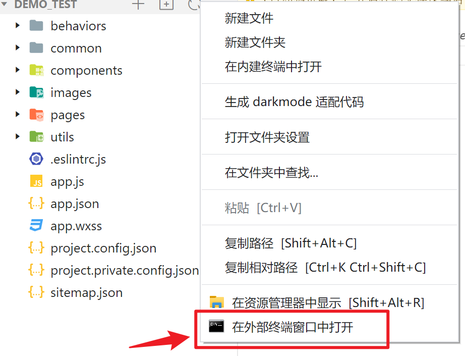

## 小程序对 npm 的支持与限制


# Vant Weapp

## 1. 什么是 Vant Weapp

Vant Weapp是有赞前端团队开源的一套**小程序UI组件库**，助力开发者快速搭建小程序应用。它所使用的是**MIT开源许可协议**，对商业使用比较友好。

官方文档地址：https://vant-ui.github.io/vant-weapp/#/home

## 2. 安装 Vant 组件库

在小程序项目中，安装Vant组件库主要分为如下3步：

1. 通过npm安装
2. 构建npm包
3. 修改app.json

详细操作步骤，可参考Vant官方提供的快速上手教程：https://vant-ui.github.io/vant-weapp/#/quickstart

### ① 打开命令窗口



### ② 初始化包管理配置文件

```
npm init -y
```


### ③ 安装组件库

```
npm i @vant/weapp -S --production
```

### ④ 修改 app.json

> 将 app.json 中的 `"style": "v2"` 去除，小程序的[新版基础组件](https://developers.weixin.qq.com/miniprogram/dev/reference/configuration/app.html#style)强行加上了许多样式，难以覆盖，不关闭将造成部分组件样式混乱。

### ⑤ 修改 project.config.json

开发者工具创建的项目，`miniprogramRoot` 默认为 `miniprogram`，`package.json` 在其外部，npm 构建无法正常工作。

需要手动在 `project.config.json` 内添加如下配置，使开发者工具可以正确索引到 npm 依赖的位置。

```json
{
  ...
  "setting": {
    ...
    "packNpmManually": true,
    "packNpmRelationList": [
      {
        "packageJsonPath": "./package.json",
        "miniprogramNpmDistDir": "./"
      }
    ]
  }
}
```

### ⑥构建 npm 包

打开微信开发者工具，点击 **工具 -> 构建 npm**，并勾选 **使用 npm 模块** 选项，构建完成后，即可引入组件。


## 3. 使用 Vant 组件

安装完 Vant 组件库之后，可以在`app.json`的`usingComponents`节点中引入需要的组件，即可在`wxml`中直接使用组件。实例代码如下：

`app.json`

```json
  "usingComponents": {
    "van-button": "@vant/weapp/button/index"
  },
```

页面的`.wxml`结构

```html
<van-button type="primary">按钮</van-button>
```

## 4. 定制全局主题样式

Vant Weapp 使用 CSS 变量来实现定制主题。关于 CSS 变量的基本用法，请参考MDN文档：

https://developer.mozilla.org/zh-CN/docs/Web/css/using_css_custom_properties

## 5. 定制全局主题样式

在`app.wxss`中，写入CSS变量，即可对全局生效：

```css
/* app.wxss */
page{
  /* 定制警告按钮的背景颜色和边框颜色 */
  --button-danger-background-color:#C00000;
  --button-danger-border-color:#D60000;
}
```

参考官方文档：[定制主题](https://vant-ui.github.io/vant-weapp/#/theme)

# API Promise化

## 1. 基于回调函数的异步 API 的缺点


## 2. 什么是API Promise化

**API Promise化**，指的是**通过额外的配置**，将官方提供的、基于回调函数的异步API，**升级改造为基于Promise的异步API**，从而提高代码的可读性、维护性，避免回调地狱的问题。

## 3. 实现 API Promise 化

在小程序中，实现 API Promise 化主要依赖于`miniprogram-api-promise`这个第三方的 npm 包。它的安装和使用步骤如下：

### ① 打开命令窗口

```
npm install --save miniprogram-api-promise@1.0.4
```

### ② 删除目录下的`miniprogram_npm`文件夹，重新构建npm

> 若不删除`miniprogram_npm`，容易导致构建失败


### ③ `app.js`中调用`promisifyAll()`方法

```js
// 在小程序入口文件中（app.js），只需调用一次 promisifyAll() 方法，即可实现异步 API 的 Promise 化
import { promisifyAll } from 'miniprogram-api-promise'

const wxp = wx.p = {}
// promisify all wx's api
promisifyAll(wx, wxp)
```

## 4. 调用 Promise 化之后的异步 API

```html
<!-- 页面的.wxml结构 -->
<van-button type="danger" bindtap="getInfo">vant按钮</van-button>
```

```js
  // 在页面的 .js 文件中，定义对应的 tap 事件处理函数
  async getInfo() {
    const { data: res } = await wx.p.request({
      method: 'GET',
      url: 'http://192.168.41.216:9999/test/get-branch',
      data: { name: 'zs', age: 20 }
    })
    console.log(res);
  },
```

