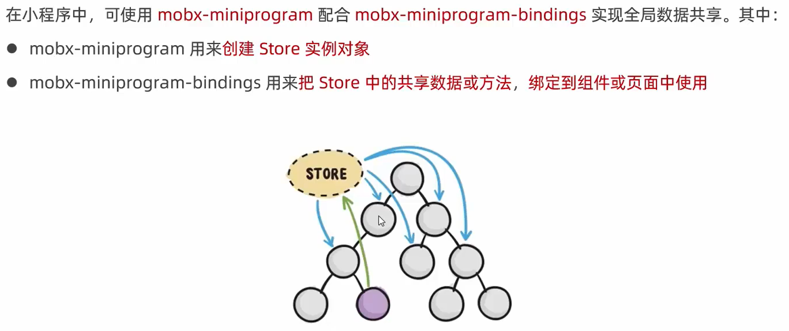

## 1. 什么是全局数据共享


## 2. 小程序中的全局数据共享方案



# MobX

## 1. 安装 MobX 相关的包

在项目中运行如下的命令，安装 MobX 相关的包：

```
npm install --save mobx-miniprogram@4.13.2 mobx-miniprogram-bindings@1.2.1
```

注意：MobX 相关的包安装完毕之后，记得**删除 miniprogram_npm 目录**后，重新**构建npm**。

## 2. 创建 MobX 的 Store 实例

项目中新建`store`文件夹、`store.js`文件


```js
// 在这个 JS 文件中，专门来创建 Store 的实例对象
import { observable, action } from 'mobx-miniprogram'

export const store = observable({
  // 数据字段
  numA: 1,
  numB: 2,
  // 计算属性
  get sum() {
    return this.numA + this.numB
  },
  // actions 方法，用来修改 store 中的数据
  updateNum1: action(function (step) {
    this.numA += step;
  }),
  updateNum2: action(function (step) {
    this.numB += step;
  })
})
```

## 3. 将 Store 中的成员绑定到页面中

```js
// 页面的 .js 文件 ① 导入需要的成员
import { createStoreBindings } from 'mobx-miniprogram-bindings'
import { store } from '../../store/store'
Page({
  onLoad() { // 生命周期函数--监听页面加载 ② 绑定
    this.storeBindings = createStoreBindings(this, {
      store, // 数据源数据
      fields: ['numA', 'numB', 'sum'], // 字段或计算属性
      actions: ['updateNum1'] // 方法
    })
  },

  onUnload() { // 生命周期函数--监听页面卸载 ③ 清理
    this.storeBindings.destroyStoreBingings();
  }
})
```

> ① 导入需要的成员
>
> ② 绑定：将createStoreBindings(this实例, 配置对象)的返回值挂载到this.storeBindings上作为自定义属性存在，方便页面被卸载时做一些清理性质的工作
>
> ③ 清理

## 4. 在页面上使用 Store 中的成员

```html
<!-- 页面的 .wxml 结构 -->
<view>{{numA}} + {{numB}} = {{sum}}</view>
<van-button type="primary" bindtap="btnHandler1" data-step="{{1}}">numA + 1</van-button>
<van-button type="danger" bindtap="btnHandler1" data-step="{{-1}}">numA - 1</van-button>
```

```js
  // 按钮 tap 事件的处理函数
  btnHandler1(e) {
    this.updateNum1(e.target.dataset.step);
  },
```

## 5. 将 Store 中的成员绑定到组件中

```js
import { storeBindingsBehavior } from 'mobx-miniprogram-bindings'
import { store } from '../../store/store'

Component({
  behaviors: [storeBindingsBehavior], // 通过 storeBindingsBehavior 来实现自动绑定

  storeBindings: {
    store, // 指定要绑定的 Store
    fields: { // 指定要绑定的字段数据
      numA: () => store.numA, // 绑定字段的第1种方式
      numB: (store) => store.numB, // 绑定字段的第2种方式
      sum: 'sum' // 绑定字段的第3种方式
    },
    actions: { // 指定要绑定的方法
      updateNum2: 'updateNum2'
    }
  },
})
```

## 6. 在组件中使用 Store 中的成员

```html
<!-- 组件的 .wxml 结构 -->
<view>{{numA}} + {{numB}} = {{sum}}</view>
<van-button type="primary" bindtap="btnHandler2" data-step="{{1}}">numB + 1</van-button>
<van-button type="danger" bindtap="btnHandler2" data-step="{{-1}}">numB - 1</van-button>
```

```js
  // 组件的方法列表
  methods: {
    btnHandler2(e) {
      this.updateNum2(e.target.dataset.step);
    }
  }
```

