# 基础概念

## 1. 什么是分包


## 2. 分包的好处


## 3. 分包前项目的构成

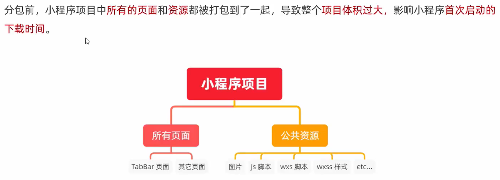

## 4. 分包后项目的构成

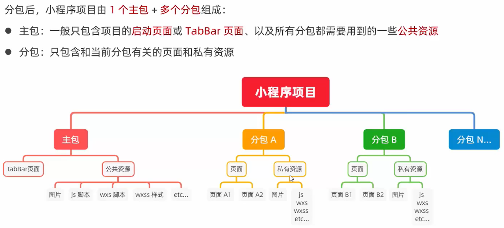

## 5. 分包的加载规则

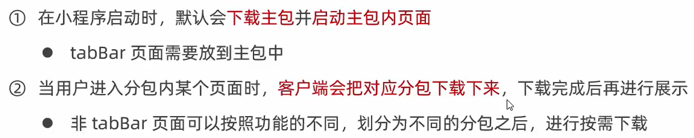

## 6. 分包的体积限制

目前，小程序分包的大小有以下两个限制：

- 整个小程序所有分包大小不超过 20M（主包 + 所有分包）
- 单个分包/主包大小不能超过 2M

# 使用分包

## 1. 配置方法

小程序的目录结构

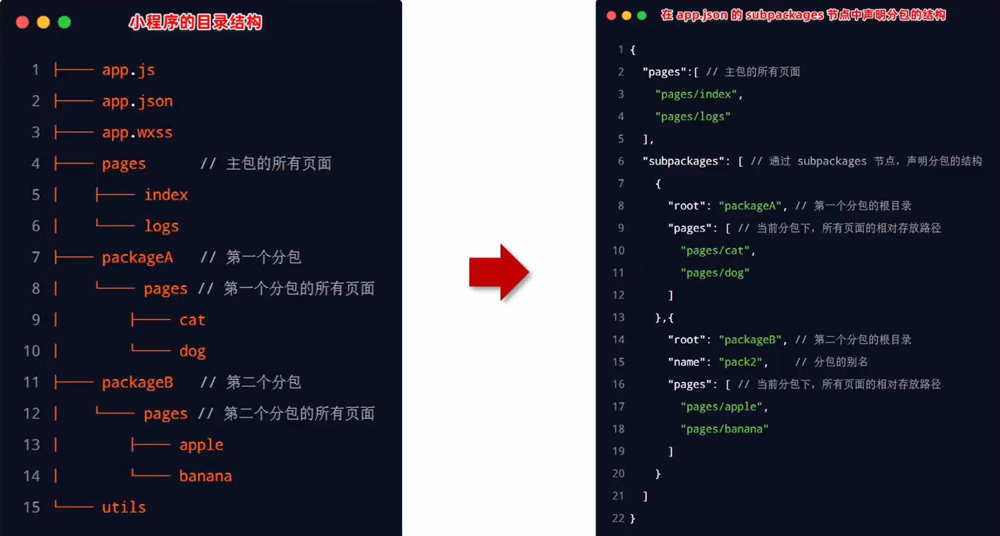

在`app.json`的`subpackages`节点中声明分包的结构

```json
{
  "pages": [
    "pages/home/home",
    "pages/message/message",
    "pages/contact/contact",
    "pages/index/index",
    "pages/logs/logs",
    "pages/list/list"
  ],
  "subpackages": [{
    "root": "packageA",
    "pages": [
      "pages/cat/cat",
      "pages/dog/dog"
    ]
  }, {
    "root": "packageB",
    "name": "pack2",
    "pages": [
      "pages/apple/apple",
      "pages/banana/banana"
    ]
  }]
}
```

### 查看分包体积

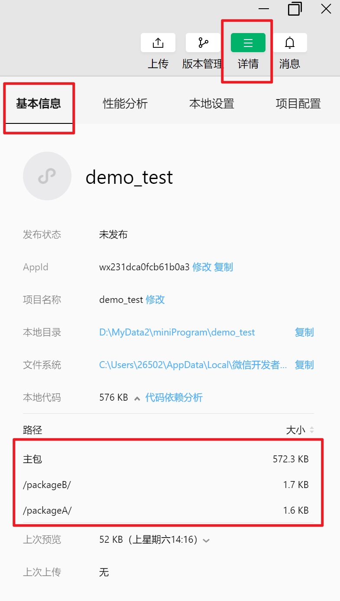

## 2. 打包原则

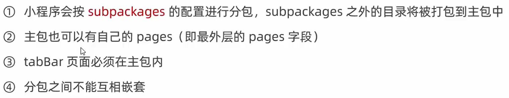

## 3. 引用原则

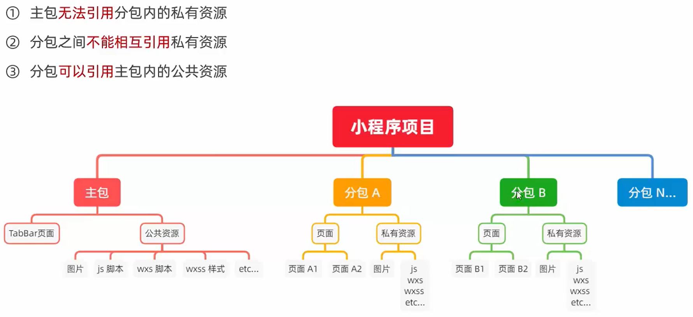

# 独立分包

## 1. 什么是独立分包

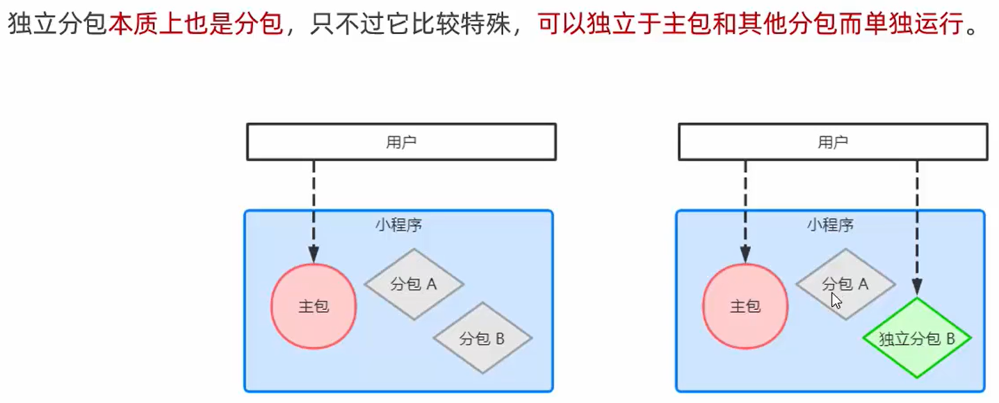

## 2. 独立分包和普通分包的区别


## 3. 独立分包的应用场景

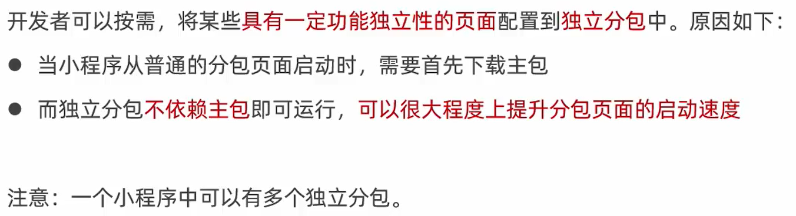

## 4. 独立分包的配置方法

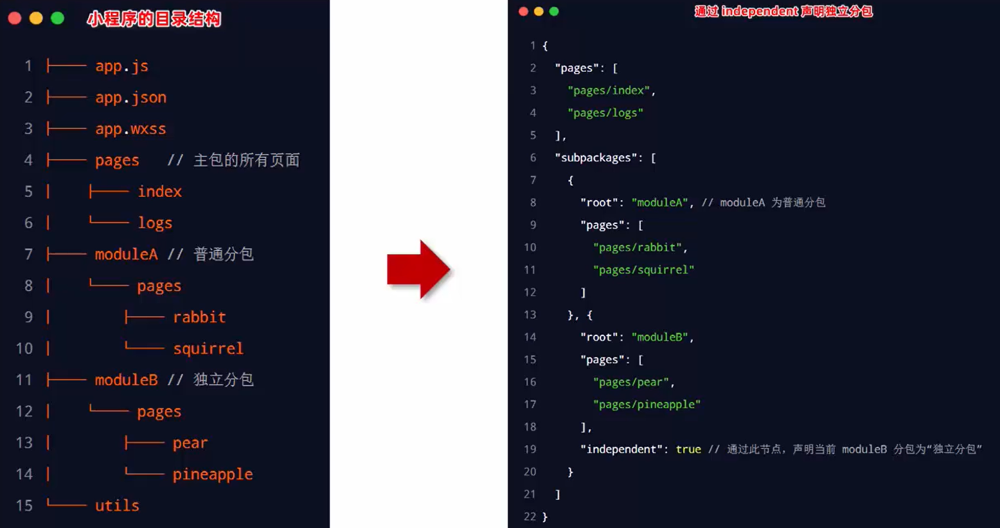

```json
"independent": true
```

## 5. 引用原则


# 分包预下载

## 1. 什么是分包预下载


## 2. 配置分包的预下载

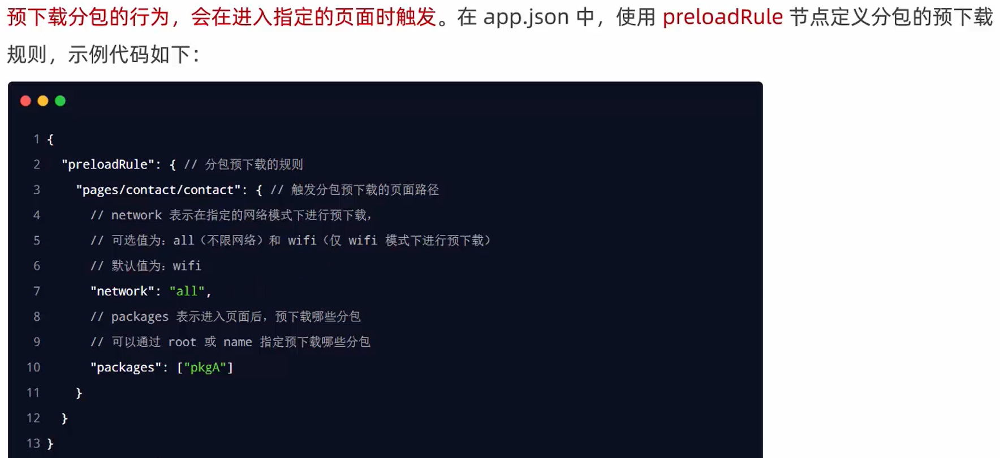

```json
{
  "preloadRule": {
    "pages/contact/contact": {
      "network": "all",
      "packages": ["pack2"]
    }
  }
}
```

## 3. 分包预下载的限制

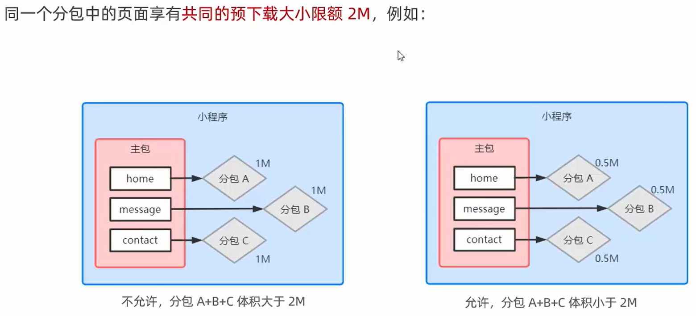