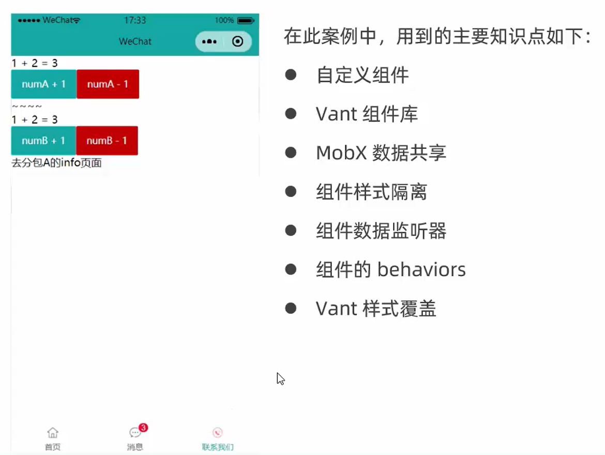
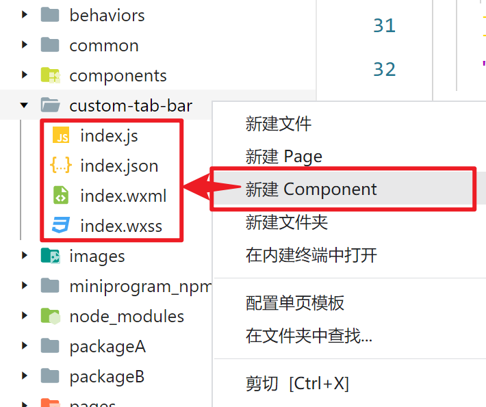

## 1. 案例效果



## 2. 实现步骤

自定义 tabBar 分为 3 大步骤，分别是：

1. 配置信息
2. 添加`tabBar`代码文件
3. 编写`tabBar`代码

详细步骤，可参考小程序官方给出的文档：

https://developers.weixin.qq.com/miniprogram/dev/framework/ability/custom-tabbar.html

### ① 配置信息

- 在 `app.json` 中的 `tabBar` 项指定 `custom` 字段，同时其余 `tabBar` 相关配置也补充完整。
- 所有 tab 页的 json 里需声明 `usingComponents` 项，也可以在 `app.json` 全局开启。

```json
{
  "tabBar": {
    "custom": true,
    "color": "#000000",
    "selectedColor": "#000000",
    "backgroundColor": "#000000",
    "list": [{
      "pagePath": "page/component/index",
      "text": "组件"
    }, {
      "pagePath": "page/API/index",
      "text": "接口"
    }]
  },
  "usingComponents": {}
}
```

### ② 添加`tabBar`代码文件



### ③ 编写`tabBar`代码

`app.json`中配置用到的组件：

```json
  "usingComponents": {
    "van-tabbar": "@vant/weapp/tabbar/index",
    "van-tabbar-item": "@vant/weapp/tabbar-item/index"
  }
```

`custom-tab-bar/index.wxml`

```html
<van-tabbar active="{{ active }}" bind:change="onChange" active-color="#07c160">
  <van-tabbar-item info="{{item.info ? item.info : ''}}" wx:for="{{ list }}" wx:key="index">
    <image slot="icon" src="{{ item.iconPath }}" mode="aspectFit" style="width: 25px; height: 25px;" />
    <image slot="icon-active" src="{{ item.selectedIconPath }}" mode="aspectFit" style="width: 25px; height: 25px;" />
    {{ item.text }}
  </van-tabbar-item>
</van-tabbar>
```

`custom-tab-bar/index.js`

> 将`app.json`文件下的`tabBar`的`list`项复制到该文件的`data`数据源中。

```js
import { storeBindingsBehavior } from 'mobx-miniprogram-bindings'
import { store } from '../store/store'

Component({
  behaviors: [storeBindingsBehavior],
  storeBindings: {
    store,
    fields: {
      active: 'activeTabBarIndex', // 将store中的数据映射为active
      sum: 'sum'
    },
    actions: {
      updateActive: 'updateActiveTabBarIndex' // 将方法进行映射
    }
  },
  observers: { // 监听
    'sum': function (val) {
      if (val < 0) return;
      this.setData({
        'list[1].info': val
      })
    }
  },
  options: {
    styleIsolation: 'shared'
  },
  data: {
    "list": [{
      "pagePath": "pages/home/home",
      "text": "首页",
      "iconPath": "/images/tabs/home.png",
      "selectedIconPath": "/images/tabs/home-active.png"
    }, {
      "pagePath": "pages/message/message",
      "text": "消息",
      "iconPath": "/images/tabs/message.png",
      "selectedIconPath": "/images/tabs/message-active.png",
      info: 2
    }, {
      "pagePath": "pages/contact/contact",
      "text": "联系我们",
      "iconPath": "/images/tabs/contact.png",
      "selectedIconPath": "/images/tabs/contact-active.png"
    }]
  },
  methods: { // 组件的方法列表
    onChange(event) {
      // event.detail 的值为当前选中项的索引
      // 原因是switchtab引起的，第一次点击的更新数据无效，只能完成页面的跳转
      // this.setData({
      //   active: event.detail
      // });
      this.updateActive(event.detail);
      wx.switchTab({
        url: '/' + this.data.list[event.detail].pagePath,
      })
    },
  }

});
```

> 美化徽标：自定义图标后，徽标会超出`tabBar`的高度，需要对徽标的`margin-bottom`的数据进行样式覆盖
>
> 样式覆盖：在自定义组件中使用 Vant Weapp 组件时，需开启`styleIsolation: 'shared'`

```js
Page({
  options: {
    styleIsolation: 'shared'
  }
})
```

`custom-tab-bar/index.wxss`

```css
.van-tabbar-item {
  --tabbar-item-margin-bottom: 0;
}
```

> `custom-tab-bar/index.js`中，active：当前选中标签的索引，onChange()中，由于switchtab界面跳转，第一次点击的更新数据无效，只能完成页面的跳转。
>
> 解决方法，将“选中标签的索引”放到store文件中，作为全局数据共享。

`store/store.js`中新增了`activeTabBarIndex`数据字段作为**选中标签的索引**，还有`updateActiveTabBarIndex`用于修改索引字段。

```js
// 在这个 JS 文件中，专门来创建 Store 的实例对象
import { observable, action } from 'mobx-miniprogram'

export const store = observable({
  // 数据字段
  numA: 1,
  numB: 2,
  activeTabBarIndex: 0,
  // 计算属性
  get sum() {
    return this.numA + this.numB
  },
  // actions 方法，用来修改 store 中的数据
  updateNum1: action(function (step) {
    this.numA += step;
  }),
  updateNum2: action(function (step) {
    this.numB += step;
  }),
  updateActiveTabBarIndex: action(function (index) {
    this.activeTabBarIndex = index;
  })
})
```

参考：[Vant Weapp-tabBar标签栏](https://vant-ui.github.io/vant-weapp/#/tabbar)
