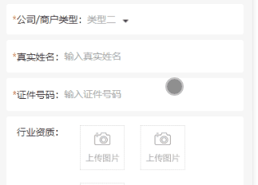
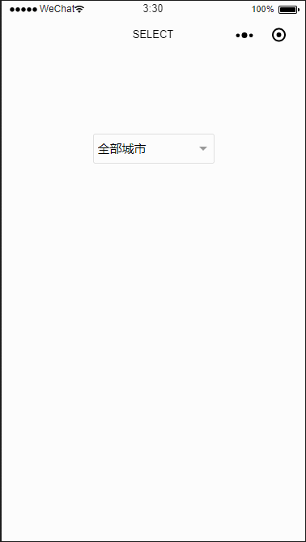
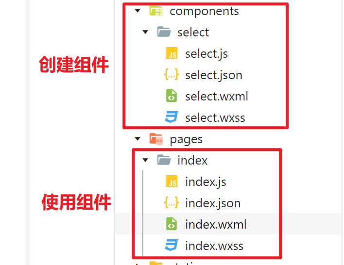

# 微信小程序 一个简单的select下拉框

**用的是transform过渡，没用动画**

看看效果



废话不多说，直接上代码

## wxml:

```html
<view class="item">
  <label class="first"><text>*</text>公司/商户类型：</label>
  <!-- 通过点击事件改变图片的旋转角度、自定义下拉框的高度 -->
  <view class="value" bindtap="select">
    <view style="display:inline-block;">{{type!=''?type:'选择商户类型'}}</view>
    <image src="../img/sj@2x.png" class="sanjiao" style="{{isSelect?'transform:rotateZ(180deg)':''}}"/>
    <!-- select -->
    <view class="select" style="{{isSelect?'height:'+54*types.length+'rpx;':'border:0'}}">
      <view class="type" catchtap="getType" wx:for="{{types}}" data-type="{{item}}" wx:key="type">{{item}}</view>
    </view>
  </view>
</view>

```

## wxss:

```css

.sanjiao{
  width: 18rpx;
  height: 10rpx;
  margin-left: 20rpx;
  transition: 0.5s;/* 选转图片过渡 */
}
.select{
  position: absolute;
  z-index: 10;
  border: 2rpx solid #aaaaaa;
  padding: 0 8rpx;
  top:46rpx;
  left: -10rpx;
  width: 210rpx;
  overflow: auto;
  height: 0;
  max-height: 200rpx;
  background-color:#fff;
  box-sizing: border-box;
  transition: height 0.5s;/* 高度变换过渡 */
}
.select .type{
  color: #aaaaaa;
  border-top: 2px solid #dadada;
  padding: 6rpx;
}
.select :first-child{
  border: 0;
}
.item{
display: flex;
flex-direction: row;
}

```

## js

```js
  data: {
    isSelect:false,//展示类型？
    types:['类型一','类型二'],//公司/商户类型
    type:"",//公司/商户类型
  },
  //点击控制下拉框的展示、隐藏
  select:function(){
    var isSelect = this.data.isSelect
    this.setData({ isSelect:!isSelect})
  },
  //点击下拉框选项，选中并隐藏下拉框
  getType:function(e){
    let value = e.currentTarget.dataset.type
    this.setData({
      type:value ,
      isSelect: false,
    })
  },

```


# 微信小程序 select 下拉框组件

## 注意点

> 因为组件比页面先加载，所以传值过去是空的，加个wx:if
>
> *数据加载是可以的, 注意博主的 四、组件的使用 中的key="city_id" text="city_name" , 这个city_name和city_id需要自己处理下获取到的数据, 跟city_name和city_id对应
>
> 微信自带小组件：https://developers.weixin.qq.com/miniprogram/dev/component/picker.html

## 一、效果图



## 二、组件源码



### \1. select.wxml

```html
<view class="select-box">
  <view class="select-current" catchtap="openClose">
    <text class="current-name">{{current.name}}</text>
  </view>
  <view class="option-list" wx:if="{{isShow}}" catchtap="optionTap">
    <text class="option" data-id="{{defaultOption.id}}" data-name="{{defaultOption.name}}">
        {{defaultOption.name}}
    </text>
    <text class="option" wx:for="{{result}}" wx:key="{{item.id}}" data-id="{{item.id}}" data-name="{{item.name}}">
        {{item.name}}
    </text>
  </view>
</view>
```

说明：用 catchtap 而不用 bindtap 是为了阻止事件冒泡，为了实现点击页面其他地方关闭 select， 所以在父页面（index.wxml）最外层绑定了 bindtap="close" 方法， 不阻止冒泡的话会执行父组件的 close 方法

 

### \2. select.js

```js
Component({
  properties: {
    options: {
      type: Array,
      value: []
    },
    defaultOption: {
      type: Object,
      value: {
        id: '000',
        name: '全部城市'
      }
    },
    key: {
      type: String,
      value: 'id'
    },
    text: {
      type: String,
      value: 'name'
    }
  },
  data: {
    result: [],
    isShow: false,
    current: {}
  },
  methods: {
    optionTap(e) {
      let dataset = e.target.dataset
      this.setData({
        current: dataset,
        isShow: false
      });

      // 调用父组件方法，并传参
      this.triggerEvent("change", {
        ...dataset
      })
    },
    openClose() {
      this.setData({
        isShow: !this.data.isShow
      })
    },

    // 此方法供父组件调用
    close() {
      this.setData({
        isShow: false
      })
    }
  },
  lifetimes: {
    attached() {
      // 属性名称转换, 如果不是 { id: '', name:'' } 格式，则转为 { id: '', name:'' } 格式
      let result = []
      if (this.data.key !== 'id' || this.data.text !== 'name') {
        for (let item of this.data.options) {
          let {
            [this.data.key]: id, [this.data.text]: name
          } = item
          result.push({
            id,
            name
          })
        }
      }
      this.setData({
        current: Object.assign({}, this.data.defaultOption),
        result: result
      })
    }
  }
})
```

说明：properties中的 key 和 text 是为了做属性名转换。比如我现在的数据结构如下：

```json
[{
      city_id: '001',
      city_name: '北京'
    }, {
      city_id: '002',
      city_name: '上海'
    }, {
      city_id: '003',
      city_name: '深圳'
 }]
```

而 select 组件要求的数据结构是：

```json
[{
      id: '001',
      name: '北京'
    }, {
      id: '002',
      name: '上海'
    }, {
      id: '003',
      name: '深圳'
}]
```

因此我们就要将 city_id 转换成 id，city_name 转换成 name。 怎么实现属性名转换呢？ 就是通过 key 和 text 这两个参数。

 

### \3. select.json

```
{
  "component": true,
  "usingComponents": {}
}
```

 

### \4. select.wxss

```css
.select-box {
  position: relative;
  width: 100%;
  font-size: 30rpx;
}

.select-current {
  position: relative;
  width: 100%;
  padding: 0 10rpx;
  line-height: 70rpx;
  border: 1rpx solid #ddd;
  border-radius: 6rpx;
  box-sizing: border-box;
}

.select-current::after {
  position: absolute;
  display: block;
  right: 16rpx;
  top: 30rpx;
  content: '';
  width: 0;
  height: 0;
  border: 10rpx solid transparent;
  border-top: 10rpx solid #999;
}

.current-name {
  display: block;
  width: 85%;
  height: 100%;
  word-wrap: normal;
  overflow: hidden;
}

.option-list {
  position: absolute;
  left: 0;
  top: 76rpx;
  width: 100%;
  padding: 12rpx 20rpx 10rpx 20rpx;
  border-radius: 6rpx;
  box-sizing: border-box;
  z-index: 99;
  box-shadow: 0rpx 0rpx 1rpx 1rpx rgba(0, 0, 0, 0.2) inset;
  background-color: #fff;
}

.option {
  display: block;
  width: 100%;
  line-height: 70rpx;
  border-bottom: 1rpx solid #eee;
}

.option:last-child {
  border-bottom: none;
  padding-bottom: 0;
}
```

## 三、组件的使用

### index.wxml

```html
<view class="container" bindtap="close">
  <view class="select-wrap">
    <select id="select" options="{{options}}" key="city_id" text="city_name" bind:change="change"></select>
  </view>
</view>
```

### index.js

```js
Page({
  data: {
    options: [{
      city_id: '001',
      city_name: '北京'
    }, {
      city_id: '002',
      city_name: '上海'
    }, {
      city_id: '003',
      city_name: '深圳'
    }],
    selected: {}
  },
  change(e) {
    this.setData({
      selected: {
        ...e.detail
      }
    })
    wx.showToast({
      title: `${this.data.selected.id} - ${this.data.selected.name}`,
      icon: 'success',
      duration: 1000
    })
  },
  close() {
    // 关闭select
    this.selectComponent('#select').close()
  }
})
```

### index.json

```json
{
  "usingComponents": {
    "select": "/components/select/select"
  }
}
```

### index.wxss

```css
page {
  height: 100%;
}

.select-wrap {
  width: 300rpx;
}

.selected {
  margin-top: 50%;
}
```