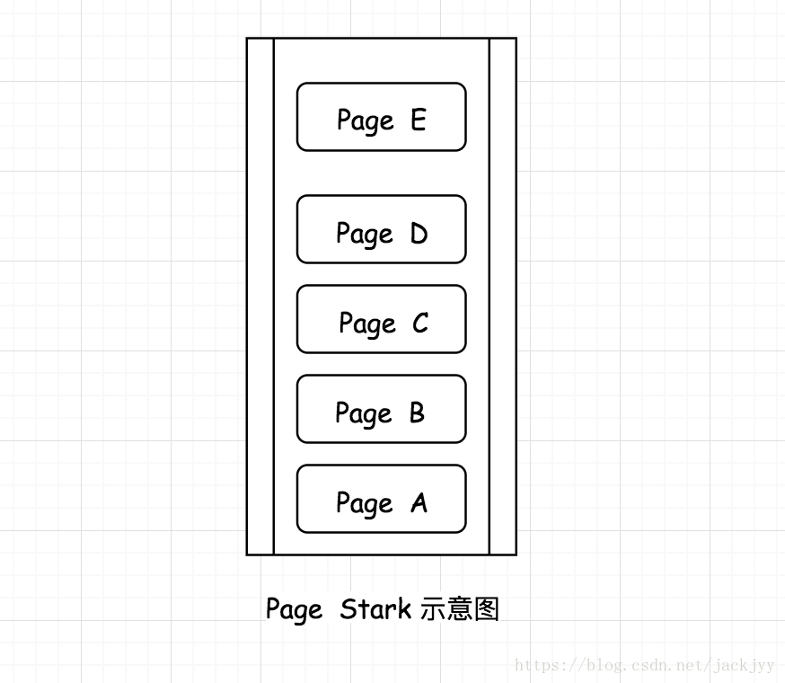
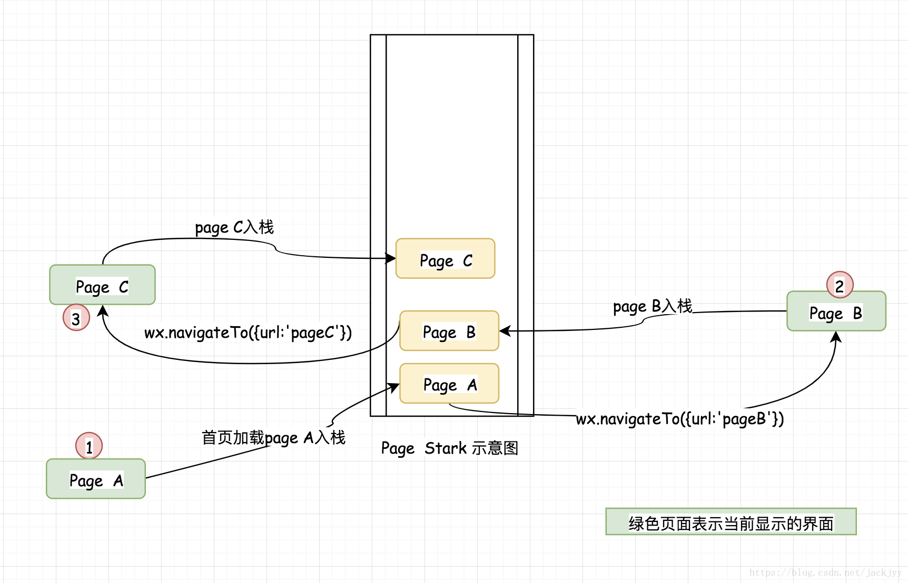
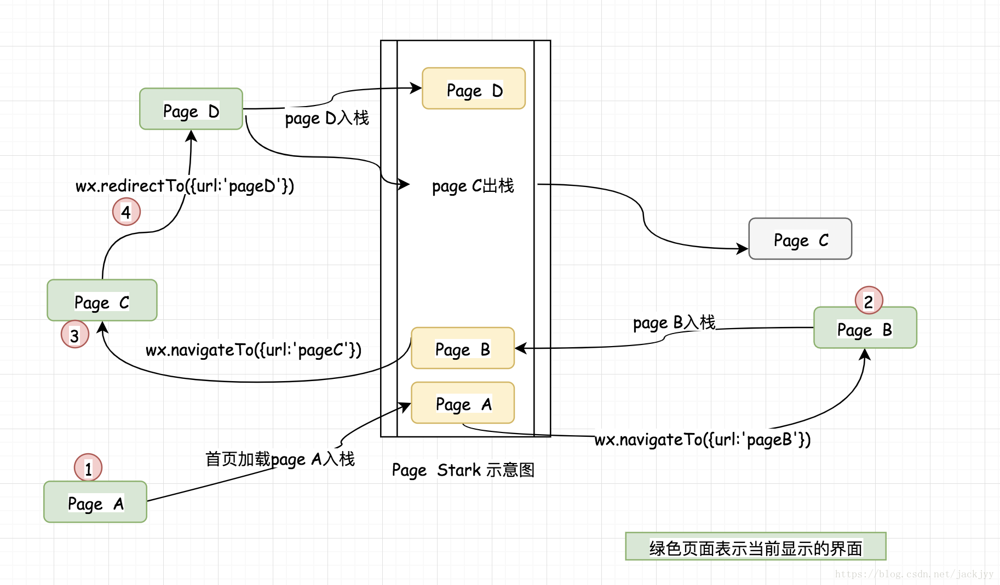
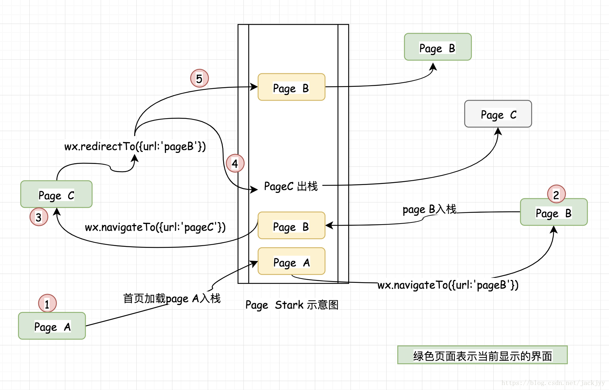
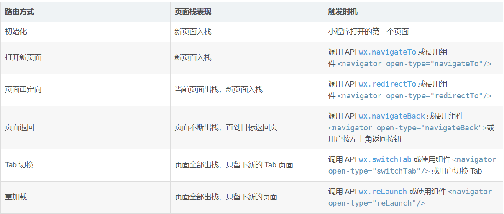

# 页面栈，页面跳转问题 

## 页面栈 

首先我们要理解在小程序中页面的路由是小程序框架本身控制的我们不要去手动管理， 小程序框架通过一个页面栈的设计来管理所有的界面，为了便于理解你可以看一下示意图。

　　**小程序的页面栈最大能存放十个页面，当页面栈中的页面等于10时，在使用navigateTo这种方式是不能再跳页的**。下面我们分析一下页面栈的变化过程，从分析中，我们需要明白的一个重要问题就是，当客户按返回按钮的时候究竟会跳转到那个界面，这是我们分析页面栈变化的的意义。首先我们在页面中调用两次navigateTO，页面栈情况如下

 　这时显示的界面是pageC ，如果客户在此时返回则会一切正常，回退的第一个界面是pageB，然后是pageA。**但是如果在pageC 界面调用 wx.redirectTo({url:'pageD'}) 则情况就会不一样了**，我们先看一下跳转到pageD后页面栈的情况如何。

根据栈的情况，我们可以分析出。**如果使用 wx.redirectTo跳转到pageD页面，然后在回退的时候是不能再次回退到pageC的，而会直接回退到pageB。**

通过上面对页面栈的分析，我们可以看到栈的变化是会影响客户回退页面的顺序的，所以根据自己的需要合理的使用不同的跳转方法是非常重要的。如果使用不当就会导致跳转混乱让人摸不清头脑

下面分析一种调转重复页面的情况。如果我们的pageB页面是一个数据列表页面，比如商品列表，pageC是一个商品的编辑界面，一般我们会通过pageB然后进如pageC对商品进行修改，修改后返回pageB。这是很常见的一个场景，但是如果使用不当机会出现如下情况

 如图所示栈中出现了两个相同的pageB界面，这个时候如果用户按退出键就会出现一个页面出现2次的情况，而且有一个界面的数据也是旧的数据。因此为了避免这个问题，我们应该在 PageC 页面避免将 PageB重复压入栈中，**所以在pageC页面 使用wx.navigateBack({delta:1}); 进行页面回退**。**而数据刷新的问题则在页面的onShow函数中进行即可。**

 

## 路由方法与页面栈变化对应关系

> 特别注意 :
> - **navigateTo, redirectTo 只能打开非 tabBar 页面。**
> - **switchTab 只能打开 tabBar 页面。**
> - **reLaunch 可以打开任意页面。**
> - **页面底部的 tabBar 由页面决定，即只要是定义为 tabBar 的页面，底部都有 tabBar。**
> - **调用页面路由带的参数可以在目标页面的onLoad中获取。**
