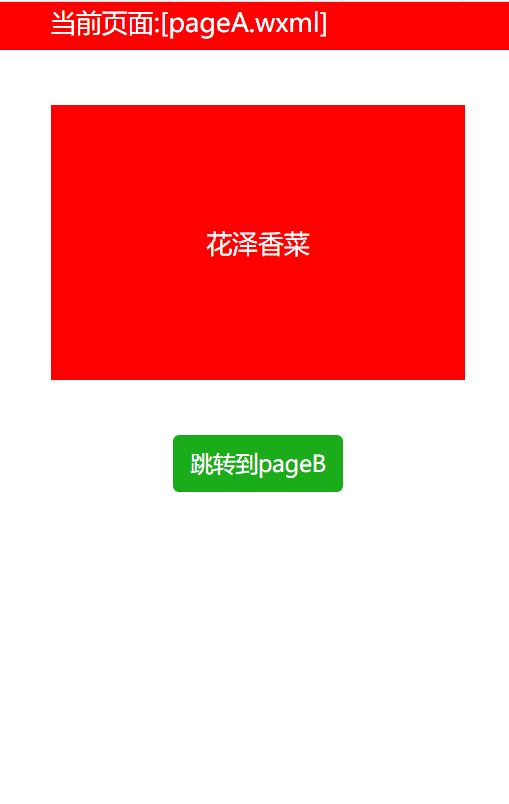
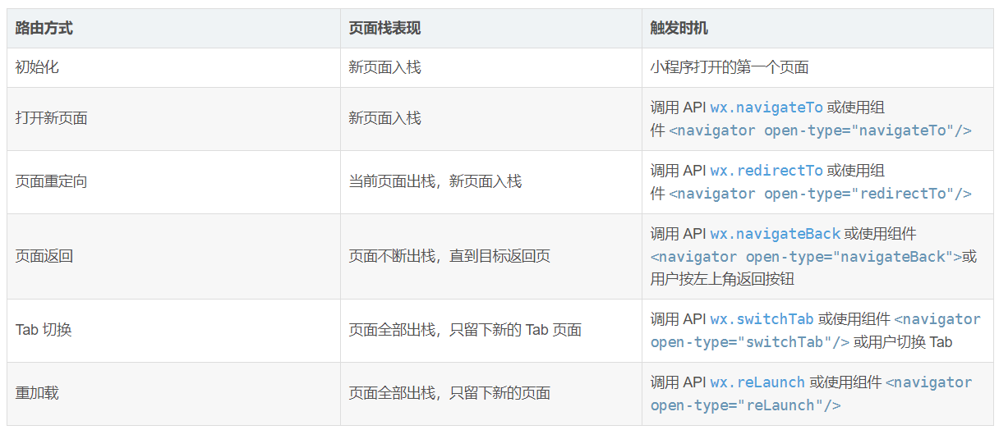
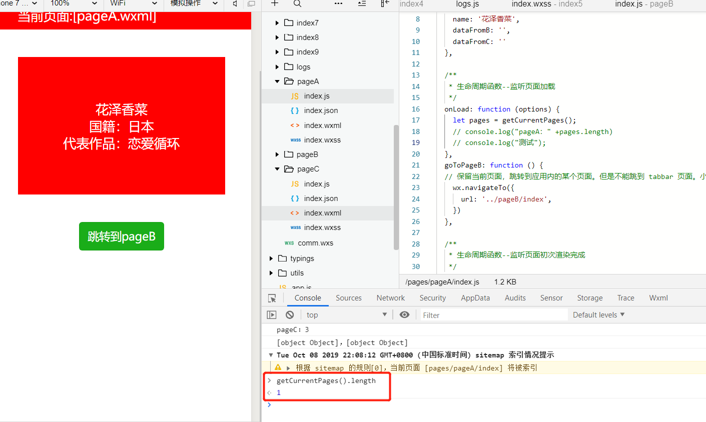

# 微信小程序——详细讲解页面传值(多种方法)

## 1、使用navigator的url带参传值

（1）在pageA页面有一个固定的值要传递到pageB页面，比如说一个固定的值user_id要传递给B

```html
<navigator url="../index/pageB?user_id='12345678'">index4</navigator>
```

> 注：?后面为你要传递的值

这样在pageB页面js的onload函数里面，使用setData方法可以获取到传递过来的值，并将它赋值给pageB页面初始数据
在pageB页面的data里面声明一个初始数据

```js
data: {
    user_id:''
 },
```

然后在onload函数中进行操作，页面加载时获取

```js
onLoad: function (options) {
    this.setData({
      user_id:options.user_id
    })
    console.log(this.data.user_id)
  },
```

（2）在一般情况下我们要传多个值，与上面的差不多，只是多加了一个`&`，下面我代码示范

pageA

```html
<navigator url="../index/pageB?user_id='12345678'&user_name='lhs'">index</navigator>
```

pageB

```js
data: {
    user_id:'',
    user_name:''
  },
onLoad: function (options) {
    this.setData({
      user_id:options.user_id,
      user_name: options.user_name,
    })
    console.log(this.data.user_id)
    console.log(this.data.user_name)
  },
```

（3）当然也可以在js页面传值，比如使用`wx.navigateTo`、`wx.redirectTo`等，下面我让大家看看与`navigator`对应关系

| 属性      | 类型   | 默认值   | 必填 | 说明     | 最低版本                                                     |
| :-------- | :----- | :------- | :--- | :------- | :----------------------------------------------------------- |
| open-type | string | navigate | 否   | 跳转方式 | [1.0.0](https://developers.weixin.qq.com/miniprogram/dev/framework/compatibility.html) |

| 合法值       | 说明                                                         | 最低版本                                                     |
| :----------- | :----------------------------------------------------------- | :----------------------------------------------------------- |
| navigate     | 对应 [wx.navigateTo](https://developers.weixin.qq.com/miniprogram/dev/api/route/wx.navigateTo.html) 或 [wx.navigateToMiniProgram](https://developers.weixin.qq.com/miniprogram/dev/api/navigate/wx.navigateToMiniProgram.html) 的功能 |                                                              |
| redirect     | 对应 [wx.redirectTo](https://developers.weixin.qq.com/miniprogram/dev/api/route/wx.redirectTo.html) 的功能 |                                                              |
| switchTab    | 对应 [wx.switchTab](https://developers.weixin.qq.com/miniprogram/dev/api/route/wx.switchTab.html) 的功能 |                                                              |
| reLaunch     | 对应 [wx.reLaunch](https://developers.weixin.qq.com/miniprogram/dev/api/route/wx.reLaunch.html) 的功能 | [1.1.0](https://developers.weixin.qq.com/miniprogram/dev/framework/compatibility.html) |
| navigateBack | 对应 [wx.navigateBack](https://developers.weixin.qq.com/miniprogram/dev/api/route/wx.navigateBack.html) 或 [wx.navigateBackMiniProgram](https://developers.weixin.qq.com/miniprogram/dev/api/navigate/wx.navigateBackMiniProgram.html) （基础库 2.24.4 版本支持）的功能 | [1.1.0](https://developers.weixin.qq.com/miniprogram/dev/framework/compatibility.html) |
| exit         | 退出小程序，`target="miniProgram"`时生效                     | [2.1.0](https://developers.weixin.qq.com/miniprogram/dev/framework/compatibility.html) |

从上面可以看出`navigator`的`open-type="navigate"`(不写默认值是`navigate`)等于`wx.navigateTo`

好了，我接着使用`wx.navigateTo`使用传值；首先在pageA绑定一个点击事件

```html
<button catchtap="pageB">index</button>
```

在事件中写入参数，当然如果是传多个参数的话就要在后面加`&`

```js
pageB: function () {
    wx.navigateTo({
      url: '../logs/logs?user_id=' + 520,
    })
  },
```

**详细：**

1. `wx.navigateTo`：保留当前页面，跳转到应用内的某个页面。但是不能跳到`tabbar`页面。使用 [wx.navigateBack](https://developers.weixin.qq.com/miniprogram/dev/api/route/wx.navigateBack.html) 可以返回到原页面。小程序中页面栈最多十层。**（可带参）**

2. `wx.redirectTo`：关闭当前页面，跳转到应用内的某个页面。但是不允许跳转到`tabbar`页面。**（可带参）**

3. `wx.switchTab`：跳转到`tabBar`页面，并关闭其他所有非`tabBar`页面**（不可带参）**

4. `wx.reLaunch`：关闭所有页面，打开到应用内的某个页面**（可带参）**

5. `wx.navigateBack`：关闭当前页面，返回上一页面或多级页面。可通过 [getCurrentPages](https://developers.weixin.qq.com/miniprogram/dev/reference/api/getCurrentPages.html) 获取当前的页面栈，决定需要返回几层。**（没有url属性，不可带参）**

**总结：**

> `switchTab`这种导航方式，不能带参，也就是说不能通过url进行传参，解决方法就是如果要跳转到tab页面，使用`reLaunch`方法

## 2、利用`getCurrentPages`进行页面传值

### （1）`getCurrentPages()`获取当前页面栈。数组中第一个元素为首页，最后一个元素为当前页面。

pageA：dataFromB 和 dataFromC 都是从 pageB 和 pageC 获取的，暂时没有数据

```html
<text class='currentPage'>当前页面:[pageA.wxml]</text>
<view class='container'>
    <text>{{name}}</text>    
    <text>{{dataFromB}}</text>
    <text>{{dataFromC}}</text>
</view>

<button type = "primary" catchtap='goToPageB'>跳转到pageB</button>
```

pageA的样式

```css
page{
    display: flex;
    flex-direction: column;
    align-items: center;
    height: 100%;
    width: 100%;
    background: #fff;
}

.currentPage{
    width: 100%;
    height: 80rpx;
    padding-left: 150rpx;
    background-color: red;
    line-height: 80rpx;
    color: #fff;

}
.container{
    width: 600rpx;
    height: 300rpx;
    background-color: red;
    margin-top: 80rpx;
    display: flex;
    flex-direction: column;
    align-items: center;
    justify-content: center;
    margin-bottom: 80rpx;
    color: #fff;
}
```

pagaA要初始化数据，绑定goTopageB跳转到pageB

```js
data: {
    name: '花泽香菜',
    dataFromB: '',
    dataFromC: ''
  },
goToPageB: function () {
  // 保留当前页面，跳转到应用内的某个页面。但是不能跳到 tabbar 页面。小程序中页面栈最多十层
    wx.navigateTo({
      url: '../pageB/index',
    })
  },
```

pageB：array[index]是传值给pageA的数据，这里绑定goToPageC函数跳到pageC

```html
<text class='currentPage'>当前页面:[pageB.wxml]</text>
<view class='container'>
    <!-- <text>{{name}}</text> -->
    <picker bindchange="bindPickerChange" value="{{index}}" range="{{array}}">
        <view class="picker">
            国籍：{{array[index]}}
        </view> 
    </picker>
</view>

<button type = "primary" catchtap='goToPageC'>跳转到pageC</button>
```

pageB的样式

```css
page {
    display: flex;
    flex-direction: column;
    align-items: center;
    height: 100%;
    width: 100%;
    background: #fff;
}

.currentPage {
    width: 100%;
    height: 80rpx;
    padding-left: 150rpx;
    background-color: #0ff;
    line-height: 80rpx;
}

.container {
    width: 600rpx;
    height: 300rpx;
    background-color: #0ff;
    margin-top: 80rpx;
    display: flex;
    align-items: center;
    justify-content: center;
    margin-bottom: 80rpx;
}
```

初始化pageB数据，这里是通过getCurrentPages获取页面栈给pageA传值的

```js
data: {
    array: ['德国', '日本', '英国', '法国', '比利时'],
  },
// 传值
  bindPickerChange: function (e) {
    let pages = getCurrentPages();
  
    let currPage = null; //当前页面
    let prevPage = null; //上一个页面

    if (pages.length >= 2) {
      currPage = pages[pages.length - 1]; //最后一个元素为当前页面。
      prevPage = pages[pages.length - 2]; //上一个页面
      console.log(currPage + "，" + prevPage);
    }
    if (prevPage) {
      //给pageA页面赋值
      prevPage.setData({
        dataFromB: '国籍：' + this.data.array[e.detail.value]
      });
    }
    //给当前页面赋值
    this.setData({
      index: e.detail.value
    })
  },
  goToPageC: function () {
    wx.navigateTo({
      url: '../pageC/index',
    })
  },
```

pageC：通过绑定goToPageA函数跳回pageA页面

```html
<text class='currentPage'>当前页面:[pageC.wxml]</text>
<view class='container'>
    <!-- <text>{{name}}</text> -->
    <picker bindchange="bindPickerChange" value="{{index}}" range="{{array}}">
        <view class="picker">
            作品：{{array[index]}}
        </view> 
    </picker>
</view>

<button type = "primary" catchtap='goToPageA'>跳转到pageA</button>
```

pageC样式

```css
page {
　　 display: flex;
    flex-direction: column;
    align-items: center;
    height: 100%;
    width: 100%;
    background: #fff;
}
.currentPage {
    width: 100%;
    height: 80rpx;
    padding-left: 150rpx;
    background-color: pink;
    line-height: 80rpx;
}
.container {
    width: 600rpx;
    height: 300rpx;
    background-color: pink;
    margin-top: 80rpx;
    display: flex;
    align-items: center;
    justify-content: center;
    margin-bottom: 80rpx;
}
```

初始化数据，这里是通过`wx.navigateBack`返回pageA，**如果使用`wx.navigateTo`返回pageA是没有传值**

```js
/**
   * 页面的初始数据
   */
  data: {
    array: ['恋爱循环', '大丈夫'],
  },
  bindPickerChange: function (e) {
    let pages = getCurrentPages();

    let currPage = null; //当前页面
    let prevPage = null; //上一个页面

    if (pages.length >= 2) {
      currPage = pages[pages.length - 1]; //最后一个元素为当前页面。
      prevPage = pages[pages.length - 3]; //pageA页面
      console.log(currPage + "，" + prevPage);
    }
    if (prevPage) {
      //给上一个页面赋值
      prevPage.setData({
        dataFromC: '代表作品：' + this.data.array[e.detail.value]
      });
    }
    //给当前页面赋值
    this.setData({
      index: e.detail.value
    })
  },
  goToPageA: function () {
    // 关闭当前页面，返回上一页面或多级页面。
    wx.navigateBack({
      delta:2
    })
  },
```

 运行效果：



**注意：**

- **不要尝试修改页面栈，会导致路由以及页面状态错误。**
- 不要在 `App.onLaunch` 的时候调用 `getCurrentPages()`，此时 `page` 还没有生成。
- 小程序页面栈最多有十个，多了就不能使用wx.navigateTo跳转


### （2）[页面栈](18.2页面栈，页面跳转问题 .md)

****

从上图可知，使用`wx.navigateBack`页面不断出栈，直到目标返回页；**即pageA使用wx.navigateTo跳到pageB，pageB使用wx.navigateTo跳到pageC，pageC使用wx.navigateBack跳到pageA，而页面栈是一路出栈的直到返回pageA，这时页面栈就只有一个pageA**

举个例子，pagaA查看页面栈的数量：



总数是1，而这个页面栈就是pageA了

 

 

## 3、globalData全局对象

在 app.js 中定义全局变量

```js
globalData: {
    userInfo: null,
    globalName: "lhs"
  }
```

在其他页面可以取到全局变量

```js
let app = getApp();    
console.log(app.globalData.globalName)
```

 

 

## 4、数据缓存

**数据缓存，类似于`cookie,localstorage,sessionstorage`等本地缓存的方法，只不过微信小程序有它自己的本地缓存API。**当然，为什么非要使用这种方法呢？

因为有第一二种方法不能用的情况，举个例子，同样要将页面A的内容传递给页面B，但是页面B和页面A没有父子页面关系，说简单一点，就是A页面和B页面没有跳转关系，但是B页面就是要从A页面拿数据，**前面提到页面带参跳转就没有用了，如果页面层级太多，页面栈的方法也就没有，所以就要用到我们的第三种方法，数据缓存，将页面A的数据本地缓存，然后在B页面的onLoad函数中使用就行**

### （1）wx.setStorage(OBJECT)和wx.getStorage(OBJECT)（异步接口）

将数据存储在本地缓存中指定的 key 中。会覆盖掉原来该 key 对应的内容。除非用户主动删除或因存储空间原因被系统清理，否则数据都一直可用。单个 key 允许存储的最大数据长度为 1MB，所有数据存储上限为 10MB。

首先在页面A的`onload`中使用`wx.setStorage`将要B页面需要的值存储起来，如果需要存储多个值，可以封装成数组或者对象键值对的形式

```js
data: {
    info:{'name': '周杰伦',
      'phone': '123456789',
      'address': '台北'}  
  },
  /**
   * 生命周期函数--监听页面加载
   */
  onLoad: function (options) {
    var that = this
    wx.setStorage({
      key: 'information',
      data: that.data.info,
      success(res){//等同于success:function(res),es6的写法，es6在小程序中都可以使用，推荐使用
     。。。。。。。
        }
    })    
  },
```

在B页面我们只需要使用wx.getStorage()就可以拿到你需要的值了

```js
data: {
    name:'',
    phone:'',
    address:''
  },

  /**
   * 生命周期函数--监听页面加载
   */
  onLoad: function (options) {
    var that = this
    wx.getStorage({
      key: 'information',
      success: function(res) {
        console.log(res.data)
        that.setData({
          name: res.data.name,
          phone: res.data.phone,
          address: res.data.address
        })
      }
    })  
  },
```

当然现在我们可以在A页面采取页面跳转跳到B页面看有没有获取到数据，其实也没有必要，答案当然是获取到了

注：这里还有一个同步 [wx.setStorageSync](https://developers.weixin.qq.com/miniprogram/dev/api/storage/wx.setStorageSync.html)和[wx.getStorageSync](https://developers.weixin.qq.com/miniprogram/dev/api/storage/wx.getStorageSync.html)，使用方法一样

 

### （2）`wx.clearStorage`和`wx.clearStorageSync`（异步，同步清除缓存）

这种方法的弊端就在这儿，清除缓存，什么时候清除合理，都是值得思考的问题
**我想一般就是在退出登录的时候执行吧，不能过早，也不能过晚，时机很重要**

 

### （3）`wx.removeStorage(OBJECT)`和`wx.removeStorageSync(OBJECT)`（异步，同步）

从本地缓存中异步移除指定 key
使用方法和存储数据一样，OK，不多做赘述

 

### （4）`wx.getStorageInfo(OBJECT)`和`wx.getStorageInfoSync`（异步，同步）

`wx.getStorageInfo`异步获取当前storage的相关信息，比如说已经占用了多少存储空间

```js
wx.getStorageInfo({
  success: function(res) {
    console.log(res.keys)//当前storage中所有的key
    console.log(res.currentSize)//当前占用的空间大小, 单位kb
    console.log(res.limitSize)//限制的空间大小，单位kb
  }
})
```

`wx.getStorageInfoSync()`同步获取当前storage的相关信息

```js
try {
  const res = wx.getStorageInfoSync()
  console.log(res.keys)
  console.log(res.currentSize)
  console.log(res.limitSize)
} catch (e) {
  // Do something when catch error
}
```

看到这里大家应该注意到，**结尾有Sync的为同步。**

**同异步区别：**

**1、同步方法会堵塞当前任务，直到同步方法处理返回。**
**2、异步方法不会塞当前任务。**