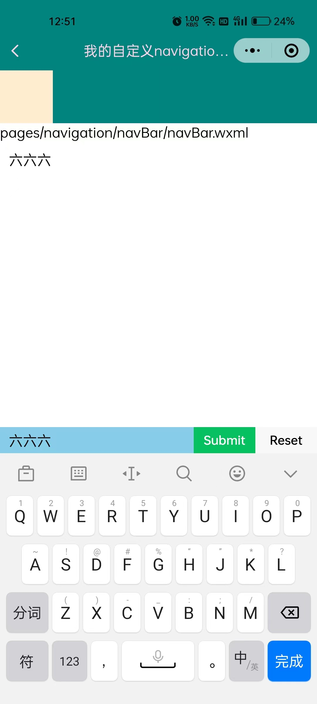
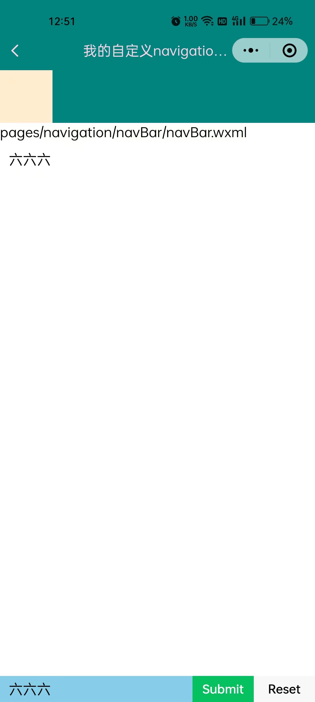

# 软键盘顶飞NavBar的解决策略

- 小程序的 input 组件聚焦后弹起键盘，自动通过页面上移的方式将输入框所在位置定位到键盘上方。
  如果输入框本身就位于页面顶端，则不会造成上推。
- 但是，如果输入框是位于页面底端，有时候我们只希望输入框定位到键盘上方，而页面其他元素不动。

## 解决

> | 属性            | 类型        | 默认值 | 必填 | 说明                                                         | 最低版本                                                     |
> | :-------------- | :---------- | :----- | :--- | :----------------------------------------------------------- | :----------------------------------------------------------- |
> | adjust-position | boolean     | true   | 否   | 键盘弹起时，是否自动上推页面                                 | [1.9.90](https://developers.weixin.qq.com/miniprogram/dev/framework/compatibility.html) |
> | bindfocus       | eventhandle |        | 是   | 输入框聚焦时触发，event.detail = { value, height }，height 为键盘高度，在基础库 1.9.90 起支持 | [1.0.0](https://developers.weixin.qq.com/miniprogram/dev/framework/compatibility.html) |
> | bindblur        | eventhandle |        | 是   | 输入框失去焦点时触发，event.detail = { value, encryptedValue, encryptError } | [1.0.0](https://developers.weixin.qq.com/miniprogram/dev/framework/compatibility.html) |
>
> 键盘高度发生变化`bindkeyboardheightchange`，Android机在失去焦点时不能被触发，所以这里不能用。
>
> 这里实现的是一个类似聊天对话框的功能，通过关闭输入框聚焦后的页面上推，获取键盘高度给输入框定位位置来实现的。

navBar.wxml

```html
<!--pages/navigation/navBar/navBar.wxml-->
<nav-bar my-class="nav-bgc-class" show-back="{{true}}" title="我的自定义navigation bar99999999" extend-height="{{60}}">
  <view slot="extend">
    <view style="width: 60px; height: 60px; background-color: blanchedalmond;">
    </view>
  </view>
</nav-bar>

<text>pages/navigation/navBar/navBar.wxml</text>
<view style="width: 100%;height: 100px;margin: 10px;">{{inputContent}}</view>
<form catchsubmit="formSubmit" catchreset="formReset">
  <view class="bot_inp" style="{{bot_inp}}">
    <input class="inp" name="input" placeholder="请输入内容" model:value="{{inputContent}}" bindinput="bindinput" adjust-position="{{false}}" bindfocus="bindfocus" bindblur="bindblur" />
    <button class="btn" type="primary" formType="submit">Submit</button>
    <button class="btn" formType="reset">Reset</button>
  </view>
</form>
```

navBar.js

```js
// pages/navigation/navBar/navBar.js
Page({

  /**
   * 页面的初始数据
   */
  data: {
    inputContent: "",
    bot_inp: "",      // 底部输入框的动态样式
  },
  bindfocus(e) {  // 聚焦时触发
    let bot_inp = e.detail.height === 0 ? "" : `bottom: ${e.detail.height}px`;
    this.setData({ bot_inp });
  },
  bindblur() {        // 失焦时触发
    this.setData({ bot_inp: "" });
  },
  bindinput() { },
  formSubmit(e) {
    console.log('form发生了submit事件，携带数据为：', e.detail.value)
  },
  formReset(e) {
    console.log('form发生了reset事件，携带数据为：', e.detail.value)
  },
})
```

navBar.wxss

```css
/* pages/navigation/navBar/navBar.wxss */
.bot_inp {
  width: 100%;
  position: fixed;
  bottom: 0;
  display: flex;
  align-items: center;
  background-color: skyblue;
  /* 兼容 iOS < 11.2 */
  bottom: constant(safe-area-inset-bottom);
  /* 兼容 iOS >= 11.2 */
  bottom: env(safe-area-inset-bottom);
}

.bot_inp .inp {
  flex: 6;
  padding-left: 10px;
}

.bot_inp .btn {
  flex: 2;
  padding: 5px 0px;
  border-radius: 0;
  font-size: 14px;
  font-weight: 500;
}

.bot_inp .input-placeholder {
  color: #ffffff;
}
```


## 预览图


