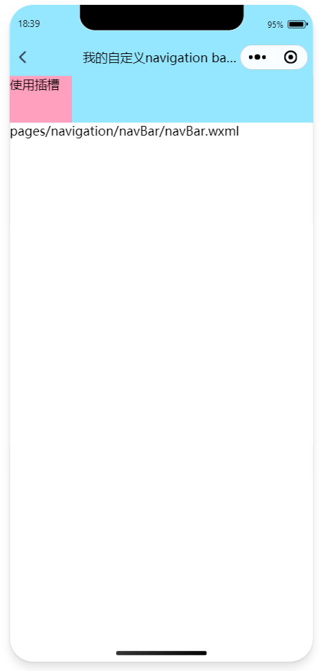

# 自定义NavBar导航栏

## 1. 添加属性`"navigationStyle": "custom"`

全局： app.json中添加属性`"navigationStyle": "custom"`

```json
"window": {
  "backgroundTextStyle": "light",
  "navigationBarBackgroundColor": "#fff",
  "navigationBarTitleText": "Weixin",
  "navigationBarTextStyle": "black",
  "navigationStyle": "custom"
},
```

局部： 单个文件index.json中添加属性`"navigationStyle": "custom"`

```json
{
  "usingComponents": {},
  "navigationStyle": "custom"
}
```

## 2. 自定义组件

1. 在项目的根目录中，鼠标右键，创建 `components` -> `test` 文件夹
2. 在新建的 `components` -> `test` 文件夹上，鼠标右键，点击`新建 Component`
3. 键入组件的名称之后回车，会自动生成组件对应的 4 个文件，后缀名分别为 js，json，.wxml和.wxss

> 新建完成后会报错：**Error: xxx.js 已被代码依赖分析忽略，无法被其他模块引用**
>
> 报错是因为微信开发者工具有缓存了，清一下缓存重新编译即可。

nav-bar.js

```js
// components/nav-bar/nav-bar.js
Component({
  // multipleSlots 为组件开启多插槽模式
  options: {
    multipleSlots: true,
  },
  // properties 组件用来储存外部数据
  properties: { // 由父页面传递的数据
    showBack: { type: Boolean, value: true },  // 是否显示返回按钮，默认显示
    title: { type: String, value: "默认标题" }, // navBar的标题
    extendHeight: { type: Number, value: 0 },  // 插槽内容高度，默认为0
  },
  lifetimes: {
    attached: function () { // 在组件实例进入页面节点树时执行，可以使用setData，绝大多数初始化工作在这个时机进行

      // 获取系统信息(同步版本) 取得：状态栏的高度(px), 可使用窗口宽度(px)
      const { statusBarHeight, screenWidth } = wx.getSystemInfoSync();

      // 获取菜单按钮（右上角胶囊按钮）的布局位置信息。坐标信息以屏幕左上角为原点。
      const { width, height, top, right, left } = wx.getMenuButtonBoundingClientRect();

      let navBarHeight = statusBarHeight + 44;  // 导航栏高度 = 状态栏高度 + 44(所有机型都适用)
      let totalHeight = navBarHeight + this.data.extendHeight; // 导航栏总高度 = 导航栏高度 + 插槽内容高度
      let menuRight = screenWidth - right;      // 胶囊距右方间距（保持左右间距一致）
      let menuTop = top;                        // 胶囊距顶部间距
      let menuHeight = height;                  // 胶囊高度（自定义内容与胶囊高度一致）
      let titleWidth = (right - width) * 2 - screenWidth; // 标题的最大宽度（不和胶囊重叠）
      let titleRight = screenWidth - left;      // 标题右侧距离（不和胶囊重叠）

      this.setData({
        total_height: `height: ${totalHeight}px;`,
        nav_button: `width: ${menuHeight}px; height: ${menuHeight}px; margin-top: ${menuTop}px; margin-left: ${menuRight}px;`,
        nav_title: `width: ${titleWidth}px; height: ${menuHeight}px; right: ${titleRight}px; top: ${menuTop}px; line-height: ${menuHeight}px;`,
        extend: `position: absolute; top: ${navBarHeight}px`,
      });
    },
  },
  // methods对象 定义组件内的各种方法
  methods: {
    // 返回按钮触发的函数
    _navback() {
      wx.navigateBack();
    },
  },
});
```

> 注意：
>
> 为了确保手机端运行的准确性，`setData`函数中仅赋值，不进行任何计算。
>
> **导航栏高度 = 状态栏到胶囊的间距(胶囊距上距离-状态栏高度) * 2 + 胶囊高度 + 状态栏高度**，刘海屏的iphone上，`menu.bottom + menu.top - statusHeight`高度的导航栏和系统自带的导航栏比对一下高度，明显矮了一点。
> 所以，**导航栏高度 = 状态栏高度 + 44**，任何机型都是。
>
> `getMenuButtonBoundingClientRect`和`getSystemInfoSync`有些机型会出现第一次获取不到或者获取的值为0的情况，要针对这2个API做好补救方案。给个默认值或者定时器重复获取。
>
> 在`attached`执行`getSystemInfo`的同步版本`getSystemInfoSync`，可以考虑用异步方案`getSystemInfo`。这样`attached`能更快点。

nav-bar.json

```json
{
  "component": true,
  "usingComponents": {}
}
```

navbar.wxml

```html
<!--components/nav-bar/nav-bar.wxml-->
<!-- 自定义顶部栏 -->
<view class="nav_wrap" style="{{total_height}}">
  <view class="nav_btn" style="{{nav_button}}" wx:if="{{showBack}}" bindtap="_navback">
    <image class="back_img" src="/images/nav/nav_back.png" mode="aspectFill"></image>
  </view>
  <!--  中间的标题 -->
  <view class="nav_title" style="{{nav_title}}">
    {{title}}
  </view>
  <view style="{{extend}}">
    <slot name="extend"></slot>
  </view>
</view>
<!-- 占位，高度与顶部栏一样 -->
<view style="{{total_height}}"></view>
```

navbar.wxss

```css
/* components/nav-bar/nav-bar.wxss */
/* 顶部固定定位   标题要居中   自定义按钮和标题要和右边微信原生的胶囊上下对齐 */
.nav_wrap {
  --nav-bgcolor: #95e6ff;
  --nav-color: #000000;
  width: 100%;
  position: fixed;
  top: 0;
  background: var(--nav-bgcolor, #95e6ff);
  z-index: 9999999;
}

/* 返回键 */
.nav_btn {
  position: absolute;
  /* 让里面的图片元素垂直居中 */
  display: flex;
  align-items: center;
}

.back_img {
  width: 38rpx;
  height: 38rpx;
}

/* 标题 */
.nav_title {
  color: var(--nav-color, #000000);
  text-align: center;
  position: absolute;
  /* 超出部分省略号显示 */
  white-space: nowrap;
  overflow: hidden;
  text-overflow: ellipsis;
}
```

## 3. 使用组件

navBar.json

```json
{
  "usingComponents": {
    "nav-bar": "/components/nav-bar/nav-bar"
  },
  "navigationStyle": "custom"
}
```

navBar.wxml

```html
<!--pages/navigation/navBar/navBar.wxml-->
<nav-bar my-class="nav-bgc-class" show-back="{{true}}" title="我的自定义navigation bar99999999" extend-height="{{60}}">
  <view slot="extend">
    <view style="width: 80px; height: 60px; background-color: blanchedalmond;">使用插槽</view>
  </view>
</nav-bar>
<text>pages/navigation/navBar/navBar.wxml</text>
```

## 效果图


