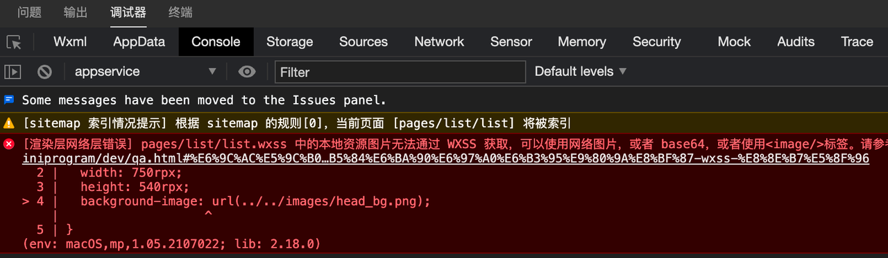

# 微信小程序如何设置背景图片？

> 解决微信小程序设置背景图片本地图片无法使用问题

## 问题描述

在微信小程序当我们使用本地图片作为背景图片的时候我们会参与以下问题。
代码：

```css
.bg {
  width: 750rpx;
  height: 540rpx;
  background-image: url(../../images/head_bg.png);
}
```

在页面使用这个样式的时候小程序会报错。


## 解决方案

小程序背景图片无法直接使用本地图片。有4种解决方案：

1. 使用image组件，在布局下面盖上一层图片。缺点：布局结构可读性不高。
2. 将图片通过在线转化网站，转化成base64格式。缺点：base64内容太长了，影响样式代码阅读。
3. **直接通过行内样式解决。缺点：代码看上去不够优雅。（最简单）**
4. **直接使用网络图片。缺点：需要放到服务器上。（最灵活）**

建议使用第4种方法解决，虽然首次操作会有点麻烦，但是这样可以增加灵活度后续可以不发版本直接替换远程图片。

如果是公司都有服务器放一下就好了。但是我们是独立开发，服务器怎么办解决？别忘了，其实我们可以将图片放在云开发的云存储里面会自动生成在线图片链接。

### 放在云存储上

1. 进入云开发控制台
   
2. 进入云存储空间
   
3. 拖拽图片到云存储空间，不勾选任何配置，点击确定即可上传成功了
   
4. 点击文件名称，复制文件地址
   

CSS代码：

```css
.head-bg{
  width: 750rpx;
  height: 540rpx;
  background-image: url('https://xxxxxxxxxx.tcb.qcloud.la/head_bg.png');
  background-size: 100% 100%;
}
```

WXML代码

```html
<view>
  <!-- 头部 -->
  <view class="head-bg" >
      <!-- 省略无关代码 -->
  </view>
</view>
```

### 行内样式

> 模拟器上是可以显示的，真机上是显示不出来的
>
> ```html
> <view :style="'background-image: url(' + require('@/static/image/xxx.png') + ')'"> </view> 
> 
> 主要是使用require()把图片变成base64来使用，这样可以不用使用网络请求直接用本地图片了
> ```

当然如果实际业务需求没有替换图片的需求也可以使用第3个方案，这个是最省事的方案。代码如下：

```css
<view>
  <!-- 头部 -->
  <view style="background-image: url(../../../../images/head_bg.png);background-size: 100% 100%;" >
        <!-- 省略无关代码 -->    
  </view>
</view>
```

### Base64编码格式

第2个方案，Base64编码格式，先将图片转化成base64编码。点击传送到[base64图片在线转换工具](http://tool.chinaz.com/tools/imgtobase/)

```css
background-image: url('base64编码')
```

### 用内容覆盖图片

第1个方案，用内容覆盖图片
wxml代码

```css
<view class="container">
  <image src='../image/head_bg.png'></image>
  <view class='content'>
    我是内容
  </view>
</view>
```

wxss代码

```css
.container{
  width: 100%;
  height: 600rpx;
  margin: 0;
  padding: 0;
  position: relative;
}
image{
  position: absolute;
  width: 100%;
  height: 600rpx;
}
.content{
  position: absolute;
  z-index: 1;
}
```

