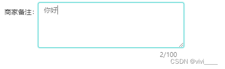

# textarea 文本框 实现右下角展现 动态字数

## 动态绑定

- 实例：Vue2版本的antdv给textArea添加限制输入长度，并实时显示已输入字数


```html
<a-textarea 
	v-model="remark"
	placeholder="请输入备注" 
	:auto-size="{ minRows: 4, maxRows: 6 }"
	:maxLength = "100" 
/>
```

给textArea添加下标，实时显示

```html
<span style="position: relative;left: 250px;user-select: none;z-index: 999;top: -10px;">{{remark.length}}/100</span>
```

最终效果



## 输入时触发`js`事件

### html

```html
<textarea id="handledMsg" maxlength="200" cols="70" rows="5" class="textarea-style" placeholder="请输入处理方法,不超过200字"
    onkeyup="setLength(this,200,'wordsLength');"></textarea>
<span id="wordsLength" style="position:absolute; right:5px; bottom:3vh;font-size:12px; color:#BDCADA">0/200</span>
```

### css

```css
.textarea-style {
    border: 1px solid #000001;
    border-radius: 5pt;
    height: 60pt;
    font-size: 10pt;
    margin-bottom: 2vh;
    width: 100%;
    color: #000001;
    overflow-x: hidden;
    text-indent: 20px
}
```

### js

```js
function setLength(obj, maxlength, id) {
    var num = maxlength - obj.value.length;
    var leng = id;
    if (num < 0) {
        num = 0;
    }
    document.getElementById(leng).innerHTML = num + "/200";
}
```

