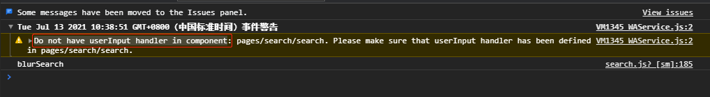
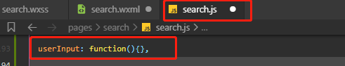

# -Do not have handler in component

**问题：Do not have userInput handler in component**

**原因：input组件使用了简易双向绑定【model:value="{{keywords}}"】，没有使用input事件**

**解决方法：input组件添加bindinput事件，对应js文件添加事件函数**

