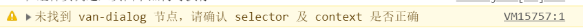

# 未找到 van-dialog 节点，请确认 selector 及 context 是否正确

# 报错（警告信息）



# 解决方法

添加context: this在弹出框

```js
Dialog.alert({
  context: this,//不添加这个会报如上错误
  title: '标题',
  message: '弹窗内容'
}).then(() => {
  // on close
});
```

# 完整页面如下

## 前端wxml页面

```html
<van-dialog id="van-dialog"/>
```

## js页面

```js
import Dialog from '@vant/weapp/dialog/dialog';
Component({
  /**
   * 组件的属性列表
   */
  properties: {
    
  },

  /**
   * 组件的初始数据
   */
  data: {

  },

  /**
   * 组件的方法列表
   */
  methods: {
  },
  lifetimes: {
    attached: function() {
      console.log('在组件实例进入页面节点树时执行')
      Dialog.alert({
        context: this,//不添加这个会报如上错误
        title: '标题',
        message: '弹窗内容'
      }).then(() => {
        // on close
      });
    },
    detached: function() {
    	console.log('在组件实例被从页面节点树移除时执行')
    },
  },
})
```

## json页面

```json
{
  "component": true,
  "usingComponents": {
    "van-dialog": "@vant/weapp/dialog/index"
  }
}
```

