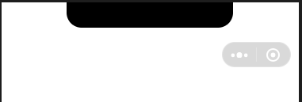
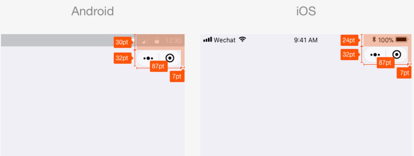
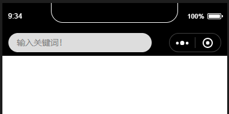
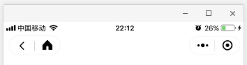
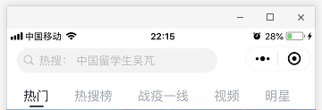

# 自定义navigationBar顶部导航栏，兼容适配所有机型

## 前言

navigationBar相信大家都不陌生把？今天我们就来说说自定义navigationBar，把它改变成我们想要的样子（搜索框+胶囊、搜索框+返回按钮+胶囊等）。

## 思路

- 隐藏原生样式
- 获取胶囊按钮、状态栏相关数据以供后续计算
- 根据不同机型计算出该机型的导航栏高度，进行适配
- 编写新的导航栏
- 引用到页面

## 正文

##### 一、隐藏原生的navigationBar

window全局配置里有个参数：

`navigationStyle`（导航栏样式），`default`=默认样式，`custom`=自定义样式。

```
"window": {
	"navigationStyle": "custom"
}
```

让我们看看隐藏后的效果：

可以看到原生的navigationBar已经消失了，剩下孤零零的胶囊按钮，胶囊按钮是无法隐藏的。

##### 二、准备工作

###### 1.获取胶囊按钮的布局位置信息

我们用wx.getMenuButtonBoundingClientRect()[【官方文档】](https://developers.weixin.qq.com/miniprogram/dev/api/ui/menu/wx.getMenuButtonBoundingClientRect.html)获取胶囊按钮的布局位置信息，坐标信息以屏幕左上角为原点：

```
const menuButtonInfo = wx.getMenuButtonBoundingClientRect();
```

| width | height | top        | right      | bottom     | left       |
| :---- | :----- | :--------- | :--------- | :--------- | :--------- |
| 宽度  | 高度   | 上边界坐标 | 右边界坐标 | 下边界坐标 | 左边界坐标 |

下面是官方给的示意图，方便大家理解几个坐标。


###### 2.获取系统信息

用wx.getSystemInfoSync()[【官方文档】](https://developers.weixin.qq.com/miniprogram/dev/api/base/system/system-info/wx.getSystemInfoSync.html)获取系统信息，里面有个参数：statusBarHeight（状态栏高度），是我们后面计算整个导航栏的高度需要用到的。

```
const systemInfo = wx.getSystemInfoSync();
```

##### 三、计算公式

我们先要知道导航栏高度是怎么组成的，
计算公式：**导航栏高度 = 状态栏高度 + 44**。

## 实例 [【源码下载】](https://github.com/FaxMiao/navigationBar)

自定义导航栏会应用到多个、甚至全部页面，所以封装成组件，方便调用；下面是我写的一个简单例子：

### app.js

```js
App({
    globalData: {
        navBarHeight: 0, // 导航栏高度
        menuRight: 0, // 胶囊距右方间距（方保持左、右间距一致）
        menuTop: 0, // 胶囊距顶部间距
        menuHeight: 0, // 胶囊高度（自定义内容可与胶囊高度保证一致）
    },
    onLaunch: function(options) {
        const that = this;
        // 获取系统信息
        const systemInfo = wx.getSystemInfoSync();
        // 胶囊按钮位置信息
        const menuButtonInfo = wx.getMenuButtonBoundingClientRect();
        console.log(systemInfo)
        console.log(menuButtonInfo)
        // 导航栏高度 = 状态栏高度 + 44(所有机型都适用)
        that.globalData.navBarHeight = systemInfo.statusBarHeight + 44;
        that.globalData.menuRight = systemInfo.screenWidth - menuButtonInfo.right;
        that.globalData.menuTop = menuButtonInfo.top;
        that.globalData.menuHeight = menuButtonInfo.height;
    }
})
```

### app.json

```json
{
    "pages": [
        "pages/index/index"
    ],
    "window": {
        "backgroundTextStyle": "light",
        "navigationBarBackgroundColor": "#000",
        "navigationBarTitleText": "测试环境",
        "navigationBarTextStyle": "white"
    },
    "sitemapLocation": "sitemap.json"
}
```

> 小程序根目录下的 `sitemap.json` 文件用于配置小程序及其页面是否允许被微信索引，文件内容为一个 JSON 对象，如果没有 `sitemap.json` ，则默认为所有页面都允许被索引


### 下面为组件代码：

/components/navigation-bar/navigation-bar.wxml

```html
<!-- 自定义顶部栏 -->
<view class="nav-bar" style="height:{{navBarHeight}}px;">
    <input 
           class="search" 
           placeholder="输入关键词！" 
           style="height:{{menuHeight}}px; min-height:{{menuHeight}}px; line-height:{{menuHeight}}px; left:{{menuRight}}px; top:{{menuTop}}px;"
           ></input>
</view>

<!-- 占位，高度与顶部栏一样 -->
<view style="height:{{navBarHeight}}px;"></view>
```

/components/navigation-bar/navigation-bar.json

```json
{
  "component": true
}
```

/components/navigation-bar/navigation-bar.js

```js
const app = getApp()
Component({
    properties: {
        // defaultData（父页面传递的数据）
        defaultData: {
            type: Object,
            value: {
                title: "我是默认标题"
            },
            observer: function (newVal, oldVal) {}
        }
    },
    data: {
        navBarHeight: app.globalData.navBarHeight,
        menuRight: app.globalData.menuRight,
        menuTop: app.globalData.menuTop,
        menuHeight: app.globalData.menuHeight,
    },
    attached: function () {    },
    methods: {    }
})
```

/components/navigation-bar/navigation-bar.wxss

```css
.nav-bar {
  position: fixed;
  width: 100%;
  top: 0;
  color: #fff;
  background: #000;
}

.nav-bar .search {
  width: 60%;
  color: #333;
  font-size: 14px;
  background: #fff;
  position: absolute;
  border-radius: 50px;
  background: #ddd;
  padding-left: 14px;
}
```

### 以下是调用页面的代码，也就是引用组件的页面：
/pages/index/index.wxml

```html
<navigation-bar default-data="{{defaultData}}"></navigation-bar>
<view class="content">内容...</view>
```

/pages/index/index.json

```json
{
    "navigationStyle": "custom",
    "usingComponents": {
        "navigation-bar": "/components/navigation-bar/navigation-bar"
    }
}
```

/pages/index/index.js

```js
const app = getApp();
Page({
    data: {
        // 组件参数设置，传递到组件
        defaultData: {
            title: "我的主页", // 导航栏标题
        }
    },
    onLoad() {    }
})
```

效果图：


好了，以上就是全部代码了，大家可以文中复制代码，也可以[【下载源码】](https://github.com/FaxMiao/navigationBar)，直接到开发者工具里运行，记得appid用自己的或者测试哦！

下面附几张其它小程序的效果图，大家也可以尝试照着做：
 

## 总结

- 本文写了自定义navigationBar的一些基础性东西，里面涉及组件用法、参数传递、导航栏相关。

