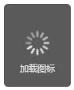
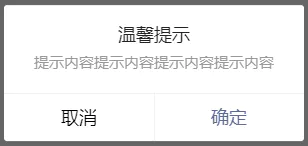
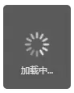
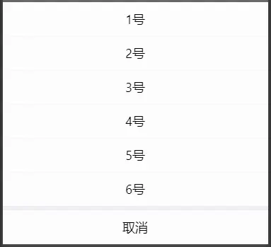

# 消息提示框

## 前言

相比H5弹出框的实现方式要么用插件，要么自己写；微信小程序则提供了几个弹出框api，使用起来更简单、方便；每个api都有不同的使用方式、场景，今天我们就来说说小程序的几种弹出框。

## 目录

- wx.showToast()
- wx.showModal()
- wx.showLoading()
- wx.showActionSheet()
- wx.hideToast()
- wx.hideLoading()

## 正文

##### 一、wx.showToast()

显示消息提示框；

```javascript
wx.showToast({
    title: "成功", // 提示的内容
    icon: "success", // 图标，默认success
    image: "", // 自定义图标的本地路径，image 的优先级高于 icon
    duration: 3000, // 提示的延迟时间，默认1500
    mask: false, // 是否显示透明蒙层，防止触摸穿透
    success: function () {
        console.log("接口调用成功的回调函数");
    },
    fail: function () {
        console.log("接口调用失败的回调函数");
    },
    complete: function () {
        console.log("接口调用结束的回调函数（调用成功、失败都会执行）");
    }
})
```

**icon的值一共4个：**

| success | 显示成功图标，此时 title 文本最多显示 7 个汉字长度           |
| ------- | ------------------------------------------------------------ |
| error   | 显示失败图标，此时 title 文本最多显示 7 个汉字长度           |
| loading | 显示加载图标，此时 title 文本最多显示 7 个汉字长度           |
| none    | 不显示图标，此时 title 文本最多可显示两行，[1.9.0](https://developers.weixin.qq.com/miniprogram/dev/framework/compatibility.html)及以上版本支持 |

- success：显示成功图标，此时 title 文本最多显示 7 个汉字长度
- loading：显示加载图标，此时 title 文本最多显示
- 7 个汉字长度 none：不显示图标，此时 title 文本最多可显示多行

**效果展示：**





##### 二、wx.showModal()

显示模态对话框


```javascript
wx.showModal({
    title: "温馨提示", // 提示的标题
    content: "提示内容提示内容提示内容提示内容", // 提示的内容
    showCancel: true, // 是否显示取消按钮，默认true
    cancelText: "取消", // 取消按钮的文字，最多4个字符
    cancelColor: "#000000", // 取消按钮的文字颜色，必须是16进制格式的颜色字符串
    confirmText: "确定", // 确认按钮的文字，最多4个字符
    confirmColor: "#576B95", // 确认按钮的文字颜色，必须是 16 进制格式的颜色字符串
    success: function (res) {
        console.log("接口调用成功的回调函数");
        if (res.confirm) {
            console.log('用户点击确定')
        } else if (res.cancel) {
            console.log('用户点击取消')
        }
    },
    fail: function () {
        console.log("接口调用失败的回调函数");
    },
    complete: function () {
        console.log("接口调用结束的回调函数（调用成功、失败都会执行）");
    }
})
```

**success（调用成功）：可以监测用户点击确定或取消按钮**

- confirm：为 true 时，表示用户点击了确定按钮
- cancel：为 true 时，表示用户点击了取消

**效果展示：**



##### 三、wx.showLoading()

显示 loading 提示框，需主动调用 wx.hideLoading 才能关闭提示框；


```javascript
wx.showLoading({
    title: "温馨提示", // 提示的内容
    mask: true, // 是否显示透明蒙层，防止触摸穿透
    success: function (res) {
        console.log("接口调用成功的回调函数");
    },
    fail: function () {
        console.log("接口调用失败的回调函数");
    },
    complete: function () {
        console.log("接口调用结束的回调函数（调用成功、失败都会执行）");
    }
})
```

**温馨提示：**

- 需主动调用wx.hideLoading才能关闭提示框，可设置延迟自动关闭；
- 常用于接口请求，请求时wx.showLoading，成功返回数据后wx.hideLoading，可以避免接口请求时用户多次点击。

**效果展示：**



##### 四、wx.showActionSheet()

显示操作菜单


```javascript
wx.showActionSheet({
    itemList: ["1号", "2号", "3号", "4号", "5号", "6号"], // 按钮的文字数组，长度最大为6
    itemColor: "#000000", // 按钮的文字颜色，默认#000000
    success: function (res) {
        console.log("接口调用成功的回调函数");
        // 用户点击的按钮序号，从上到下的顺序，从0开始
        console.log(res.tapIndex)
    },
    fail: function () {
        console.log("接口调用失败的回调函数");
    },
    complete: function () {
        console.log("接口调用结束的回调函数（调用成功、失败都会执行）");
    }
})
```

**success（调用成功）：可以返回用户点击的序号**

- tapIndex：用户点击的按钮序号，从上到下的顺序，从0开始

**效果展示：**




##### 五、wx.hideToast()

隐藏消息提示框

```javascript
wx.hideToast();
```

##### 六、wx.hideLoading()

隐藏 loading 提示框

```javascript
wx.hideLoading();
```

## 总结

- `wx.showLoading`和`wx.showToast`同时只能显示一个；
- `wx.showToast`应与`wx.hideToast`配对使用；
- `wx.showLoading`应与`wx.hideLoading`配对使用；

