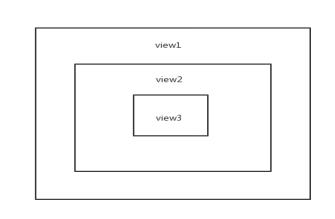

# 微信小程序bindtap与catchtap的区别

### 1、什么是事件

　　(1) 事件是视图层到逻辑层的通讯方式。

　　(2) 事件可以将用户的行为反馈到逻辑层进行处理。

　　(3) 事件可以绑定在组件上，当达到触发事件，就会执行逻辑层中对应的事件处理函数。

　　(4) 事件对象可以携带额外信息，如 id,dataset,touches

### 2、如何使用事件

　　(1) 简单来说就是将事件绑定到组件上面，bindtap和catchtap都属于点击事件，绑定了之后点击组件可以触发这个函数。

　　(2) 函数tapName会接受一个参数event，event里面存储了一些函数调用的上下文信息

　　(3) 标签元素

```html
<view id="tapTest" data-hi="WeChat" bindtap="tapName"> Click me! </view>
```

　　(4) 绑定事件

```js
Page({
    tapName: function(event) {
        console.log(event)
    }
})
```

### 3、bindtap和catchtap的区别

　　(1) 相同点：首先他们都是作为点击事件函数，就是点击时触发。在这个作用上他们是一样的，可以不做区分。

　　(2) 不同点：**他们的不同点主要是bindtap是冒泡的，catchtap是非冒泡的。**

### 4、小程序中事件分为冒泡事件和非冒泡事件。

　　(1) 本文以冒泡事件tap（手指触摸后马上离开，也就是点击事件）为例子来区别bind和catch事件

　　(2) bindtap? 事件绑定不会阻止冒泡事件向上冒泡

　　(3) catchtap? 事件绑定可以阻止冒泡事件向上冒泡

### 5、例子

1、假如有三个view点击事件都是用的bindtap，三个view是层级包含关系?



```html
<view id="outer" bindtap="out">
    outer view
    <view id="middle" bindtap="middle">
        middle view
        <view id="inner" bindtap="inner">
            inner view
        </view>
    </view>
</view>
```

2、我么在js里代码是在相对应的事件打印出log，代码如下?

```js
out:function(e){
    console.log("--out bindtap click")
}, 
middle: function (e) {
    console.log("--middle bindtap click")
}, 
inner: function (e) {
    console.log("--inner bindtap click")
}
```

3、bindtap执行结果

　　点击out view打印出一条log --> out bindtap click

　　点击middle view打印出两条log --> middle bindtap click--out bindtap click

　　点击innew view打印出三条log --> inner bindtap click--middle bindtap click--out bindtap click

　　可以看出bindtap不阻止向上冒泡，所以点击inner一直冒泡到了最外层。

4、如果我们只修改middle view的bindtap为catchtap

　　点击out view打印出一条log --> out bindtap click（因为没有上层元素故而无法向上冒泡）

　　点击middle view打印出一条log --> middle bindtap click（catchtap阻止向上冒泡）

　　点击innew view打印出两条log --> inner bindtap click--middle bindtap click（catchtap阻止向上冒泡）