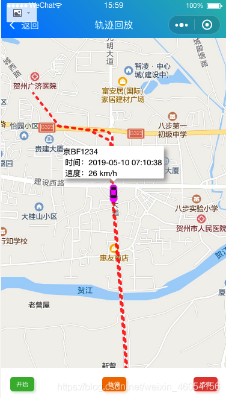

# 微信小程序中地图--行走轨迹

```html
    <map id="map" longitude="{{longitude}}" latitude="{{latitude}}" scale="16"
      bindcontroltap="controltap"  bindmarkertap="markertap" markers="{{markers}}" polyline="{{polyline}}"
      bindregionchange="regionchange" show-location style="width: 100%; height:{{height}}px;" >
    </map>

  <view class="padding flex flex-wrap justify-between align-center bg-white">
    <button  class='cu-btn bg-green shadow sm' bindtap='beginTrack'> 开始 </button>
    <button  class='cu-btn bg-orange shadow sm' bindtap='pauseTrack'> 暂停 </button>
    <button  class='cu-btn bg-red shadow sm' bindtap='endTrack'> 结束 </button>
  </view>

```

```js
//index.js
//获取应用实例
const app = getApp()

Page({
  data: {
    StatusBar: app.globalData.StatusBar,
    CustomBar: app.globalData.CustomBar,
    height: wx.getSystemInfoSync().windowHeight,
    latitude: 0,
    longitude: 0,
    playIndex: 0,   
    timer: null,
    markers: [],
    polyline: [],
    pointsInfo:[]
  },
  regionchange(e) {
    //console.log(e.type)
  },
  markertap(e) {
    //console.log(e.markerId)
  },
  controltap(e) {
    //console.log(e.controlId)
  },
  beginTrack:function(e){

  },
  onLoad: function (options){
    var that = this;
    wx.request({
      url: 'http://**/getTrack',
      data: {  
        beginTime:"开始时间",
        endTime:"结束时间"
      },
      method: "post",
      success: function (res) {
        that.setData({
          pointsInfo:res.data.pointsInfos,
          polyline: [{
            points: res.data.points,
            color: "#FF0000DD",
            width: 4,
            dottedLine: true
          }],
          markers: [{
            iconPath: '../../img/location.jpg',
            id: 0,
            latitude: res.data.points[0].latitude,
            longitude: res.data.points[0].longitude,
            width: 30,
            height: 30,
            title: that.data.brandNumber,
            callout: {
              content: that.data.brandNumber + ' \n 时间：' + res.data.pointsInfos[0].create_time + ' \n 速度：' + res.data.pointsInfos[0].speed + ' km/h',
              color: "#000000",
              fontSize: 13,
              borderRadius: 2,
              bgColor: "#fff",
              display: "ALWAYS",
              boxShadow: "5px 5px 10px #aaa"
            }
          }],
          latitude: res.data.points[0].latitude,
          longitude: res.data.points[0].longitude,
        })
      }
    })
  },
  /**
   * 开始
   */
  beginTrack:function(){
    var that = this;
    var i = that.data.playIndex == 0 ? 0 : that.data.playIndex;
    that.timer = setInterval(function () {
      i ++
      that.setData({
        playIndex: i,
        latitude: that.data.polyline[0].points[i].latitude,
        longitude: that.data.polyline[0].points[i].longitude,
        markers: [{
          iconPath: '../../img/car/e0.png',
          id: 0,
          latitude: that.data.polyline[0].points[i].latitude,
          longitude: that.data.polyline[0].points[i].longitude,
          width: 30,
          height: 30,
          title: that.data.brandNumber,
          callout: {
            content: that.data.brandNumber + ' \n 时间：' + that.data.pointsInfo[i].create_time + ' \n 速度：' + that.data.pointsInfo[i].speed + ' km/h',
            color: "#000000",
            fontSize: 13,
            borderRadius: 2,
            bgColor: "#fff",
            display: "ALWAYS",
            boxShadow: "5px 5px 10px #aaa"
          }
        }]
      }) 
      if ((i+1) >= that.data.polyline[0].points.length) { 
        that.endTrack();
      }
    }, 500) 
  }, 
  /**
   * 暂停
   */
  pauseTrack:function(){
    var that = this;  
    clearInterval(this.timer)
  },
  /**
   * 结束
   */
  endTrack:function(){
    var that = this; 
    that.setData({
      playIndex: 0,
      latitude: that.data.polyline[0].points[0].latitude,
      longitude: that.data.polyline[0].points[0].longitude,
      markers: [{
        iconPath: '../../img/car/e0.png',
        id: 0,
        latitude: that.data.polyline[0].points[0].latitude,
        longitude: that.data.polyline[0].points[0].longitude,
        width: 30,
        height: 30,
        title: that.data.brandNumber,
        callout: {
          content: that.data.brandNumber + ' \n 时间：' + that.data.pointsInfo[0].create_time + ' \n 速度：' + that.data.pointsInfo[0].speed + ' km/h',
          color: "#000000",
          fontSize: 13,
          borderRadius: 2,
          bgColor: "#fff",
          display: "ALWAYS",
          boxShadow: "5px 5px 10px #aaa"
        }
      }]
    }) 
    clearInterval(this.timer)
  }
})
```

后台数据使用的是百度鹰眼的数据。最终效果：

