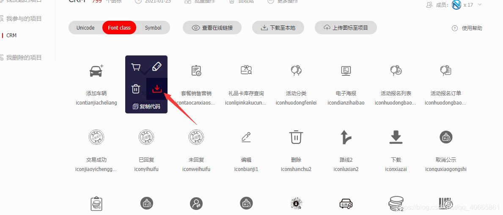
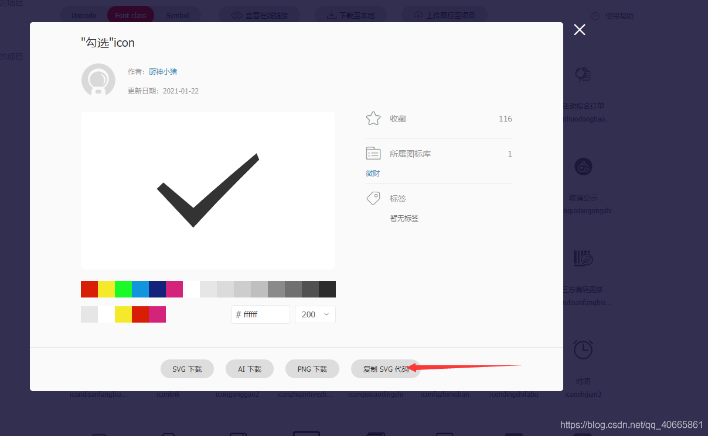
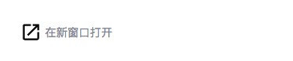

# 小程序的开发之使用SVG

昨天突然提出要在小程序中使用SVG，因为我们的小程序项目是有主题色的。不同的主题色时有些图片一直是固定的，显的有些格格不入，所以打算使用SVG来实现根据主题色的颜色进行变化。

## 什么是SVG

SVG是”Scalable Vector Graphics”的简称。中文可以理解成“可缩放矢量图形”。是一个基于XML的图形描述语言。它是可以用于描述静态图、动画，以及用户界面的一种图形格式。1999年由万维网联盟发布。于2013年成为W3C推荐标准。

## SVG有哪些优势

与其他图像格式相比，使用SVG的优势在于：

- SVG 可被非常多的工具读取和修改
- SVG 与JPEG和GIF图像比起来，尺寸更小，且可压缩性更强。
- SVG 使用 XML 格式定义图形
- SVG 图像在放大或改变尺寸的情况下其图形质量不会有所损失

## SVG在小程序中的使用

由于前面提到的SVG的特性，因此他被广泛应用于各种开发中，尤其适合各种icon和图标，下面就结合具体的开发记录下小程序中使用SVG的过程。

## 获取对应SVG代码





```html
//已处理
<svg t="1611887157319" class="icon" viewBox="0 0 1024 1024" version="1.1" xmlns="http://www.w3.org/2000/svg" p-id="26313" width="200" height="200"><path d="M64.132646 496.564449l57.085136-54.933123L383.858528 664.712077c0 0 195.159842-180.534749 552.393989-479.748459l23.016203 57.541531c0 0-297.774941 287.705608-576.84896 594.112136L64.132646 496.564449z" p-id="26314"></path></svg>
//未处理
<svg fill="#000000" height="24" viewBox="0 0 24 24" width="24" xmlns="http://www.w3.org/2000/svg">
    <path d="M0 0h24v24H0z" fill="none"/>
    <path d="M19 19H5V5h7V3H5c-1.11 0-2 .9-2 2v14c0 1.1.89 2 2 2h14c1.1 0 2-.9 2-2v-7h-2v7zM14 3v2h3.59l-9.83 9.83 1.41 1.41L19 6.41V10h2V3h-7z"/>
</svg>
```

其中最外层的 fill="#000000" 就是SVG的填充色，可以根据需求修改对应的填充颜色（由于示例中的SVG比较简单，因此只有一个填充颜色，并非所有SVG的最外层的fill都是他的填充色）。我们可以直接使用这部分代码，也阔以通过一些SVG优化工具进一步进行优化。

[在线压缩](https://jakearchibald.github.io/svgomg/)

将SVG图片直接拖入页面右侧的画布，他会根据一些通用优化方式对SVG进行初步优化，点击上方的 MAKEUP ，再看我们SVG的代码已经发生了变化（当然这里由于我们的示例图标比较简单，主要是删除了代码间的无效空白）

## 小程序引用图片的几种方式

首先，我们知道小程序引用图片的方式并不多。目前小程序并不支持直接引用svg文件，也不支持直接引用本地文件。总结下来，可行的方法有如下几种：

img的src引用

- 云文件的cloudID
- 图片的https链接
- 图片base64格式

字体图标

- 阿里的icon就是引用ttf文件，然后在text中使用图标对应的类名

background-image的url属性

- 图片的https链接

- data类型Url

我们知道，如果直接引用图片，是很难修改颜色的，因为每个像素都已经填充了颜色，且进行了压缩。所以排除了img的src引用方式，以及background-image的第一种方式。

我们选择background-image的data类型url，引用svg格式的图片。具体怎么做呢？

首先使用上面获取到的SVG代码，我们需要把这个svg格式先转为data类型的url。可以通过以下网址在线转换： [在线svg内联格式生成](https://codepen.io/jakob-e/pen/doMoML)。

这一步本质上是先对svg做了url-encode，主要是#</>这些符号做转义。然后在转义后的字符串前面加上data:image/svg+xml,字样。

转换后的svg格式如下：

```js
background-image: url("data:image/svg+xml, %3Csvg height='24' width='24' xmlns='http://www.w3.org/2000/svg'%3E%3Cpath d='M0 0h24v24H0z' fill='none'/%3E%3Cpath d='M19 19H5V5h7V3H5c-1.11 0-2 .9-2 2v14c0 1.1.89 2 2 2h14c1.1 0 2-.9 2-2v-7h-2v7zM14 3v2h3.59l-9.83 9.83 1.41 1.41L19 6.41V10h2V3h-7z'/%3E%3C/svg%3E");
```

## 在具体代码中引用SVG

至此我们就完成了在小程序中使用SVG的所有准备工作了，接下来在代码中使用就和普通的css中引用SVG没有太大区别。具体代码如下：

- index.wxml：

  ```html
  <view class="svg-demo-container">
      <text class="icon-open-new icon"></text>
      <text class="svg-demo-text">在新窗口打开</text>
  </view>
  ```

- index.wxss：

  ```css
  .svg-demo-container {
      margin: 50rpx;
      width: 300rpx;
      display: flex;
      align-items: center; 
    }
  	
    .svg-demo-text {
      color: #888896;
      font-size: 26rpx;
      margin-left: 9rpx;
    }
  	
    .icon-open-new {
      background-image: url("data:image/svg+xml, %3Csvg height='24' width='24' xmlns='http://www.w3.org/2000/svg'%3E%3Cpath d='M0 0h24v24H0z' fill='none'/%3E%3Cpath d='M19 19H5V5h7V3H5a2 2 0 0 0-2 2v14a2 2 0 0 0 2 2h14c1.1 0 2-.9 2-2v-7h-2v7zM14 3v2h3.59l-9.83 9.83 1.41 1.41L19 6.41V10h2V3h-7z'/%3E%3C/svg%3E");
      background-size: cover;
    }
  	
    .icon {
      display: inline-block;
      width: 50rpx;
      height: 50rpx;
    }
  ```

  

## 小程序根据主题色，动态修改svg颜色

按照上述的步骤，我们仅需要稍微改变一下，就可以修改svg的颜色。

原理是：`先替换svg文件中所有的十六进制颜色为主题色，然后再填充到background-image的url中即可`。

我们写一个替换颜色的函数：

```js
const changeColor = function(url,color){
	let res = url.replace(/%23[a-zA-Z0-9]{6}/g, color.replace("#", "%23"));//转义后的#等于%23，利用正则表达式，替换所有%23后6位为新的十六进制六位数。
	return res;
}
```

然后对`index.wxml和index.wxss`进行一些修改：

```html
  <view class="svg-demo-container">
    <text style="background-image: url({{svgData}})" class="icon11"></text>
    <text class="svg-demo-text">在新窗口打开</text>
  </view>
```

```css
.icon11{
  background-size: cover;
  display: inline-block;
  width: 70rpx;
  height: 70rpx;
}
```

在`index.js`中处理相关的逻辑：

```js
const svg = "data:image/svg+xml, %3Csvg height='24' width='24' xmlns='http://www.w3.org/2000/svg'%3E%3Cpath d='M0 0h24v24H0z' fill='none'/%3E%3Cpath d='M19 19H5V5h7V3H5a2 2 0 0 0-2 2v14a2 2 0 0 0 2 2h14c1.1 0 2-.9 2-2v-7h-2v7zM14 3v2h3.59l-9.83 9.83 1.41 1.41L19 6.41V10h2V3h-7z'/%3E%3C/svg%3E"

  data: {
    svgData: '"' + svg + '"'
  },
  onLoad: function (options) {
	let svgData = this.changeColor(this.data.svgData, '#707070');
    this.setData({
      svgData: svgData
    })
  },
```

在最后放上一段可以直接将SVG代码转成dataUrl的函数，这样就可以不用每次去打开网站去转换了：

```js
svgData(svg)
{
  // 将被设置到 dataset 中的属性还原出来
  svg = svg.replace(/data-(.*?=(['"]).*?\2)/g, '$1');
 
  // 将被设置到 data-xlink-href 的属性还原出来
  svg = svg.replace(/xlink-href=/g, 'xlink:href=');
 
  // 将 dataset 中被变成 kebab-case 写法的 viewBox 还原出来
  svg = svg.replace(/view-box=/g, 'viewBox=');
 
  // 清除 SVG 中不应该显示的 title、desc、defs 元素
  svg = svg.replace(/<(title|desc|defs)>[\s\S]*?<\/\1>/g, '');
 
  // 为非标准 XML 的 SVG 添加 xmlns，防止视图层解析出错
  if (!/xmlns=/.test(svg)) svg = svg.replace(/<svg/, "<svg xmlns='http://www.w3.org/2000/svg'");
 
  // 对 SVG 中出现的浮点数统一取最多两位小数，缓解数据量过大问题
  svg = svg.replace(/\d+\.\d+/g, (match) => parseFloat(parseFloat(match).toFixed(2)));
 
  // 清除注释，缓解数据量过大的问题
  svg = svg.replace(/<!--[\s\S]*?-->/g, '');
 
  // 模拟 HTML 的 white-space 行为，将多个空格或换行符换成一个空格，减少数据量
  svg = svg.replace(/\s+/g, " ");
 
  // 对特殊符号进行转义，这里参考了 https://github.com/bhovhannes/svg-url-loader/blob/master/src/loader.js
  svg = svg.replace(/[{}\|\\\^~\[\]`"<>#%]/g, function (match) {
    return '%' + match[0].charCodeAt(0).toString(16).toUpperCase();
  });
 
  // 单引号替换为 \'，由于 kbone 的 bug，节点属性中的双引号在生成 outerHTML 时不会被转义导致出错
  // 因此 background-image: url( 后面只能跟单引号，所以生成的 URI 内部也就只能用斜杠转义单引号了
  svg = svg.replace(/'/g, "\\'");
 
  // 最后添加 mime 头部，变成 Webview 可以识别的 Data URI
  return 'data:image/svg+xml,' + svg.trim();
}
```

方法调用：

```js
let svg= this.svgData('<svg t="1611718873814" class="icon" viewBox="0 0 1024 1024" version="1.1" xmlns="http://www.w3.org/2000/svg" p-id="26375" width="200" height="200"><path d="M64.132646 496.564449l57.085136-54.933123L383.858528 664.712077c0 0 195.159842-180.534749 552.393989-479.748459l23.016203 57.541531c0 0-297.774941 287.705608-576.84896 594.112136L64.132646 496.564449z" p-id="26376"></path></svg>')
```

