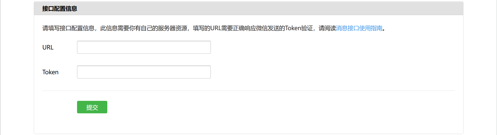

# 配置微信公众号测试账号

打开网址[`weixin.qq.com`](https://weixin.qq.com/)，点击进入下面的**公众号**，扫码登录或注册公众号。

进入后，**设置与开发 -> 基本配置**。如果我们要对公众号进行开发，就需要在这里完成一些配置，主要是服务器的配置。

如果申请的账号类型不满足一些条件，一些接口是无法使用的，可去**设置与开发 -> 接口权限**中查看当前公众号一些接口的权限状态。

微信公众平台提供了一个微信公众平台测试账号，里面有很多高级接口供开发者体验。**开发者工具 -> 公众平台测试账号**。

## 接入微信公众平台

具体操作看官方文档的[接入指南](https://developers.weixin.qq.com/doc/offiaccount/Basic_Information/Access_Overview.html)。

1. 填写服务器配置

   微信公众平台中，**开发者工具 -> 公众平台测试账号**，进入测试账号管理页，接口配置信息。`URL`，填写内网穿透工具随机生成的URL地址；`Token`，相当于令牌，自己设置就可以。

   

2. 验证服务器地址的有效性

   双向验证，微信服务器要验证开发者的服务器是否真实有效，开发者服务器要验证消息是否来自微信的服务器。

   填写完配置信息的`URL`和`Token`后，点击提交按钮，微信服务器就会像`URL`地址发送`get`请求，携带4个参数：

   | 参数      | 描述                                                         |
   | :-------- | :----------------------------------------------------------- |
   | signature | 微信加密签名，signature结合了开发者填写的 token 参数和请求中的 timestamp 参数、nonce参数。 |
   | timestamp | 时间戳                                                       |
   | nonce     | 随机数                                                       |
   | echostr   | 随机字符串                                                   |

   我们需要进行代码校验，生成`signature`，生成后的`signature`要和微信服务器请求地址是携带的`signature`进行比较，若一致，返回`echostr`字符串，完成双向验证。

   具体操作：

   - 在Web服务器同界面下，新建`checkSignature.js`文件：

     ```js
     const crypto = require('crypto');
     module.exports = (opts) => {
         const {
             signature,
             timestamp,
             nonce,
         } = opts
         const MY_TOKEN = 'muyv'; // 自己设置的Token
         const array = new Array(MY_TOKEN, timestamp, nonce);
         const MY_SIGNATURE = crypto.createHash('sha1')
             .update(array.sort().toString().replace(/,/g, ""), 'utf-8')
             .digest('hex');
     
         console.log('微信服务器signature', signature);
         console.log('校验生成的signature', MY_SIGNATURE);
     
         return MY_SIGNATURE === signature
     }
     ```

   - 修改`www.js`文件中的`get`请求：

     ```js
     const express = require('express');
     const http = require('http');
     const app = express();
     const server = http.createServer(app);
     const PORT = 8080;
     
     server.listen(PORT, () => {
         console.log(`正在监听 ${PORT} 端口`);
     })
     
     app.get('/', (req, res) => {
         const query = req.query;
         const isFromWechatServer = require('./checkSignature')(query);
         console.log(isFromWechatServer);
         if (isFromWechatServer) {
             res.send(query.echostr);
         } else {
             res.send('');
         }
     })
     ```

   - 接入成功标志：填写完配置信息后点击提交按钮，提示**配置成功**字样。

