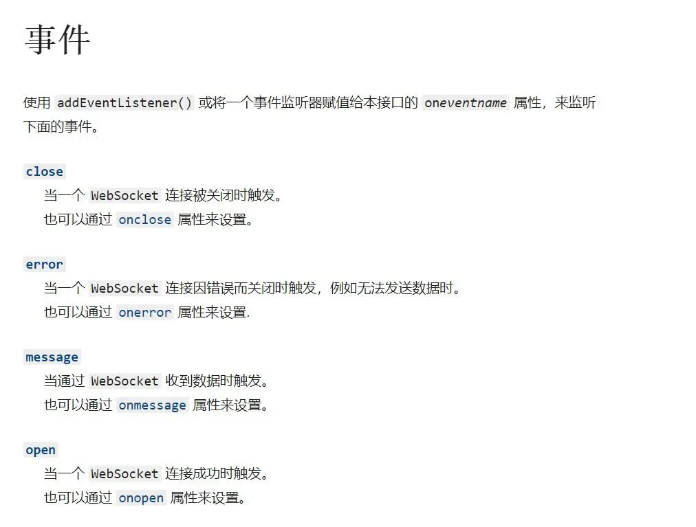
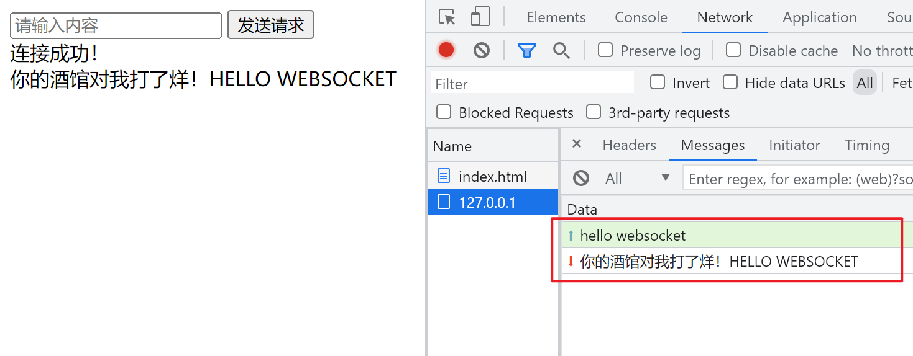

# Nodejs搭建简单的websocket服务

### 简单的后台服务搭建流程

```bash
└──websocket-server
	├──node_modules
	├──app.js
	├──index.html
	└──package.json
```


- 创建一个文件夹 `websocket-server`
- 终端执行`cd`命令进入到`websocket-server`文件夹
- 执行`yarn add nodejs-websocket`或`npm install nodejs-websocket`,用以安装nodejs的`websocket`模块
- 待模块安装完成后，在当前目录新建`app.js`文件
- 简单代码如下`app.js`

```js
var ws = require("nodejs-websocket");

const PORT = 3000;

var server = ws.createServer((conn) => {
    console.log("连接成功");

    // 异常处理，不然每次页面一刷新，后端会直接报错并停掉服务。(对连接关闭时和异常的事件进行处理)
    conn.on("error", () => {
        console.log("error");
    });

    conn.on("close", () => {
        console.log("连接关闭");
    });

    // 后端接收数据处理，并返回给前端
    conn.on("text", (data) => {
        // 接受到前端发送的数据后，将字母转为大写返回给前端
        conn.send(`你的酒馆对我打了烊！${data.toUpperCase()}`);
    });

});

server.listen(PORT, () => {
    console.log("服务器启动成功，监听端口" + PORT);
});
```

- 创建服务的过程和使用`http`模块创建服务的过程类似，终端执行`node app.js`,可以看到终端打印出，监听了端口3000，这样一个简单的websocket后台服务就创建完了。

### 前端与websocket服务建立连接

- 在当前目录下创建`index.html`文件

```html
<input type="text" placeholder="请输入内容">
<button>发送请求</button>
<div></div>
<script>
    var input = document.querySelector("input");
    var button = document.querySelector("button");
    var div = document.querySelector("div");
    // 创建一个websocket连接，并监听websocket的open事件
    // 这里的地址不是http协议，而是websocket
    var socket = new WebSocket("ws://127.0.0.1:3000");
    socket.addEventListener("open", () => {
        div.innerHTML = "连接成功！";
    });
    // 在button上监听一个点击事件，调用websocket的send()方法向后端发送input的内容
    button.addEventListener("click", () => {
        var value = input.value;
        socket.send(value);
        input.value = "";
    });
    socket.addEventListener("message", (e) => {
        var dv = document.createElement("div");
        dv.innerHTML = e.data;
        div.appendChild(dv);
    })
</script>
```

- 如下为websocket的事件API

  

### 运行结果



> 红色内容为后端返回的内容，绿色内容为我们发送给后端的内容。