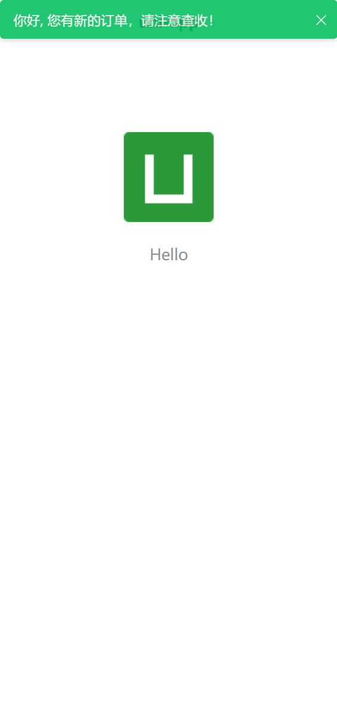

# 【前端】node+express模拟websocket通信实现消息通知

> 最近要弄推送通知的，由于H5不能控制通知栏，便退而求其次要在页面显示通知，由于为了提前做好准备，便打算用node+express来简单实现模拟，配合使用[【uni-app】实现h5环境下页面弹出通知消息。

先创建一个文件夹，npm init来初始化一个node项目，此时项目中会生成一个package.json文件。

```bash
└──Server
	├──node_modules
	├──ws
	│	└──dev-server.js
	└──package.json
```


## 以下是我安装的依赖

package.json

```json
{
  "name": "server",
  "version": "1.0.0",
  "description": "node + express 前端专用服务器，用于提供接口、模拟mock数据",
  "main": "index.js",
  "scripts": {
    "ws": "node ws/dev-server.js",
    "test": "echo \"Error: no test specified\" && exit 1"
  },
  "keywords": [],
  "author": "",
  "license": "ISC",
  "dependencies": {
    "@types/express": "^4.17.3",
    "@types/node": "^13.9.0",
    "@types/ws": "^7.2.2",
    "express": "^4.17.1",
    "express-ws": "^4.0.0",
    "node": "^13.10.1",
    "nodemon": "^2.0.2",
    "save": "^2.4.0",
    "socket.io": "^2.3.0",
    "ts-node-dev": "^1.0.0-pre.44",
    "typescript": "^3.8.3",
    "ws": "^7.2.3"
  }
}
```

## 具体实现的代码

dev-server.js

```js
const express = require('express');
const app = express();
const expressWs = require('express-ws');

expressWs(app); //引入的expressWs方法将app对象传入：


// ws：websocket实例，该实例可以监听来自客户端的消息发送事件（message事件）；
app.ws('/socketTest', function (ws, req) {
  ws.send('你连接成功了');
  ws.on('message', function (msg) {
    console.log('-----socketTest message---', msg)
    ws.send('echo:' + msg);
  });
}).get('/socketTest', function (req, resp) {
  console.log('-----socketTest get---', resp);
}).post('/socketTest', function (req, resp) {
  console.log('-----socketTest post---');
});

app.listen('8888', () => {
  console.log('open Browser on http://127.0.0.1:8888');
});
```

运行命令`npm run ws`。

## 附加上uni-app项目内的代码

新建默认uni-app项目

App.vue

```vue
<script>
	export default {
		data() {
			return {
				socketOpen: false,
				socketMsgQueue: ['你好', '我好', '大家好', '世界和平', '你好', '我好', '大家好', '世界和平']
			};
		},
		onLaunch: function() {
			// #ifdef H5
			this.onSocketTask();
			// #endif
			console.log('App Launch');
		},
		onShow: function() {
			console.log('App Show');
		},
		onHide: function() {
			console.log('App Hide');
		},
		methods: {
			// 建立websocket连接
			onSocketTask() {
				uni.connectSocket({
					url: 'ws://127.0.0.1:8888/socketTest'
				});
				this.onSocketOpen();
				uni.onSocketError(res => {
					uni.showToast({
						title: 'WebSocket连接打开失败，请检查',
						icon: 'none'
					});
					console.log('WebSocket连接打开失败，请检查！');
				});
				uni.onSocketClose(res => {
					console.log('WebSocket 已关闭！');
				});
				this.onSocketMessage();
			},

			// WebSocket连接打开 执行的事件
			onSocketOpen() {
				this.socketMsgQueue = ['你好', '我好', '大家好', '世界和平'];
				uni.onSocketOpen(res => {
					console.log('WebSocket连接已打开！');
					this.socketOpen = true;
					let i = 0;
					let timer = setInterval(() => {
						if (this.socketMsgQueue && i < this.socketMsgQueue.length) {
							this.sendSocketMessage(this.socketMsgQueue[i]);
						} else {
							clearInterval(timer);
							this.socketMsgQueue = [];
						}
						i++;
					}, 3000);
				});
			},

			// 发送消息
			sendSocketMessage(msg) {
				if (this.socketOpen) {
					uni.sendSocketMessage({
						data: msg,
						success: res => {
							this.$notify.show({
								type: 'success',
								text: msg + ', 您有新的订单，请注意查收！',
								auto: true, // 通知自动隐藏
							});
							console.log('发送消息-success', res);
						},
						fail: e => {
							console.error('发送消息-fail', e);
						}
					});
				} else {
					this.socketMsgQueue.push(msg);
				}
			},

			// 收到服务器内容
			onSocketMessage() {
				uni.onSocketMessage(res => {
					console.log('收到服务器内容：' + res.data);
				});
			}
		}
	};
</script>
```

## 到此就成功实现了，最后放上效果图



想看消息弹出来的效果，需要配合使用[【uni-app】实现h5环境下页面弹出通知消息
