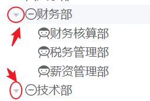
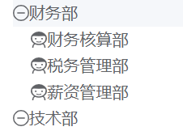
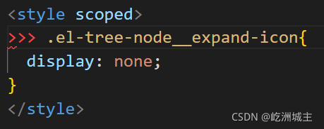
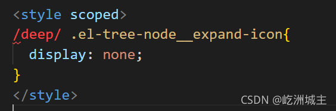
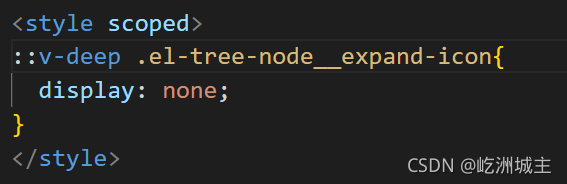

# vue组件样式穿透`/deep/`、`::v-deep`、`>>>`区别

## 什么是样式穿透?

vue引用了第三方组件，需要在组件中局部修改第三方组件的样式，而又不想去除scoped属性造成组件之间的样式污染。此时只能通过一些方法，穿透scoped。

## 1.  样式穿透 >>>

如果项目使用的是css原生样式，那么你可以直接使用`>>>`穿透修改

但如果是`sass/less`的话可能无法识别，这时候需要使用`/deep/`和`::v-deep`选择器。

```html
<style scoped>
	.a {
		/* b是第三方组件类名 */
		>>> .b {
			background: orange;
		}
	}
</style>
```

有些`Sass 、Less`之类的预处理器无法正确解析`>>>`。

可以使用`/deep/`操作符，或者`::v-deep`( 都是>>> 的别名)

## 2.  /deep/

```html
<style lang="sass" scoped>
 /*用法1*/
.a {
	/* b是第三方组件类名 */
	/deep/ .b {
		background: orange;
	}
}

/*用法2*/
.a /deep/ .b { 
	background: orange;
}
</style>
```

## 3. ::v-deep

```html
<style lang="scss" scoped>
/*用法1*/
.a {
	/* b是第三方组件类名 */
	::v-deep .b {
		background: orange;
	}
}

/*用法2*/
.a ::v-deep .b {
	background: orange;
}
</style>
```

> vue3.0的环境下，安装项目时选择了`dart-sass`，这个不支持`/deep/`和`>>>`的写法，只能用`::v-deep`，选择`node-sass`就不会有这个问题。
> 建议使用第三种方式，`/deep/`在某些时候会报错，`::v-deep`更保险并且编译速度更快。



**比如 上图是基于 element-ui 搭建的样式,要想隐藏 图中的小三角, 就要用到样式穿透**



 

 

 

> 虽然三种方法都生效了,但是`>>>`和`/deep/`显示报错， 所以**强烈推荐 使用`::v-deep`**

## 2023.7.28 更新

> 关于vue的css穿透：[Github](https://github.com/vuejs/rfcs/blob/master/active-rfcs/0023-scoped-styles-changes.md#deep-selectors).

在我们日常开发中经常配合 element-plus 开发项目，如果想要修改element-plus组件自带的样式需要使用`::v-deep`或者`/deep/`，但是在我开发中这个并不生效

在通过集成终端警告的提示下可以发现，样式穿透的方法已经被修改，换成如下即可，样式能够得到修改

```css
:deep(.el-carousel__container){    /* 括号中为需要修改的类名 */
    height: 373px;
}
```

> 关于 分页 `.el-pagination` 这样写也生效：

```html
<style scoped>
/* 把表格的分页放到右边 */
.el-pagination {
  justify-content: end;
}
</style>
```

> 关于 弹窗 `.el-message-box` 这样写才生效：（穿透都试过了）

```html
<style>
/* 设计模板后，展示模板代码的弹窗宽度 */
.el-message-box {
  max-width: 800px;
}
</style>
```

