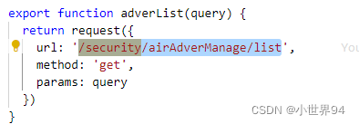

# vue.config.js配置跨域代理

跨域是指，协议不一致，域名地址不一致，端口号不一致，满足三个其中的一个就叫做跨域。

像我们本地的vue项目运行起来，访问的地址一般是localhost，这个时候请求后台的接口，肯定就会存在跨域问题，所以我们要是想正常访问接口的话，就需要解决掉跨域问题。

- 解决方法一：
后台来解决，让前端存在跨域问题也可以正常访问接口

- 解决方法二：
本地配置proxy代理

前端解决本地开发环境的方法一般是配置proxy代理，配置方法如下：

1. 打开vue.config.js文件，找到devServer属性下面的proxy属性，如果没有的话就添加上

例如我的接口访问地址是：

`http://47.95.206.121:8080/security/airAdverManage/list`，因为我这个接口中有一个`security`是公共的，所以我可以拿出来这一部分做跨域配置


如图所示，就进行了跨域转发配置，我们的请求到时候就可以这么写




---


当然我们还有第二种配置方法，如果是我们的接口中没有公共的部分，也就是说比如上面那个接口的security有的接口有，有的接口没有，那么我们就需要另外设置一个代理名称，设置如下


用api来设置代理转发，接口请求就需要都带上api 


如上就是我们本地解决跨域问题 proxy的设置方法

值得注意的是，这个设置只有是在本地的时候是起作用的，线上解决跨域问题的方法

1. 访问地址和域名地址放到同一个域名下面
2. 后台代码设置可以允许跨域，并且配置好nginx


## 济丰订单系统的本地跨域问题解决

开发中，要请求后台的二维码，接口地址：

`http://116.196.97.56/prod-api/newWeb/plat/wechat/v2/login/qrcode`

接口中的`/prod-api/`是公共的，可以拿出这一部分来做跨域配置：

```js
module.exports = {
  devServer: {
    port: 8989,
    proxy: {
      '/prod-api': {
        target: 'http://116.196.97.56/',
        changeOrigin: true,
        ws: true,
        pathRewrite: {
          '^/prod-api': '/prod-api'
        }
      }
    }
  }
}
```

进行了跨域转发配置，请求的时候就可以这么写：

```js
export function getcode(query) {
  return request({
    // url: "/prod-api/newWeb/plat/wechat/v2/login/qrcode",
    // 正常写法为上面这种，因为，在此之前引入了一个js文件，其中定义了：axios.defaults.baseURL = "/prod-api";
    url: "/newWeb/plat/wechat/v2/login/qrcode",
    method: "get",
    responseType: "blob",
    data: query,
  });
}
```

