## 说明

## 1.如何本地启动(vscode)
1. 用vscode打开文件夹
1. 点击终端--新建终端 
1. npm install(yarn install/cnpm install)
1. npm run serve(同上)

## 2.项目目录(可能操作得目录)

1. src--api(接口)
       purchase    采购模块的接口
       sale             销售模块的接口
       setting        设置模块的接口
       user             左菜单、企业列表  、按钮接口
       login            登录接口
       request       全局接口封装

2. src--assets(静态图片)

3. layouts(布局)
        1)header---AdminHeader(页面头部)

4. src--pages(页面)
	- login               登录页面
	- index              首页
	- mater             采购模块---物料订单模块
	- purchase       采购模块---采购纸箱订单及采购平板模块
	- supplier         采购模块--供应商资料，生产商及供应商权限
	- demand         采购模块--需求
		- demand-add          新增需求
		- demand-list            需求订单
		- demand-order       需求订单
	- sale                 销售模块
	- setting            设置模块

5. src--router(路由)
        permission.js  操作左菜单接口，处理路由数据(getRoutesConfig这个是左菜单接口)

6. src--store(存储全局变量)

7. src--utils
        buttons.js 处理全局权限按钮的方法

8. vue.config.js 改动的地方(域名代理)

## 3.新增页面注意事项:需要后端在左菜单接口添加数据

---
## 其他
### vuex状态管理库中：本地临时存储用户数据

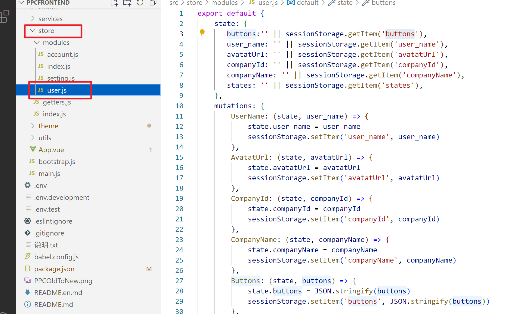

### router路由中：封装了左侧菜单的路由信息对象数组

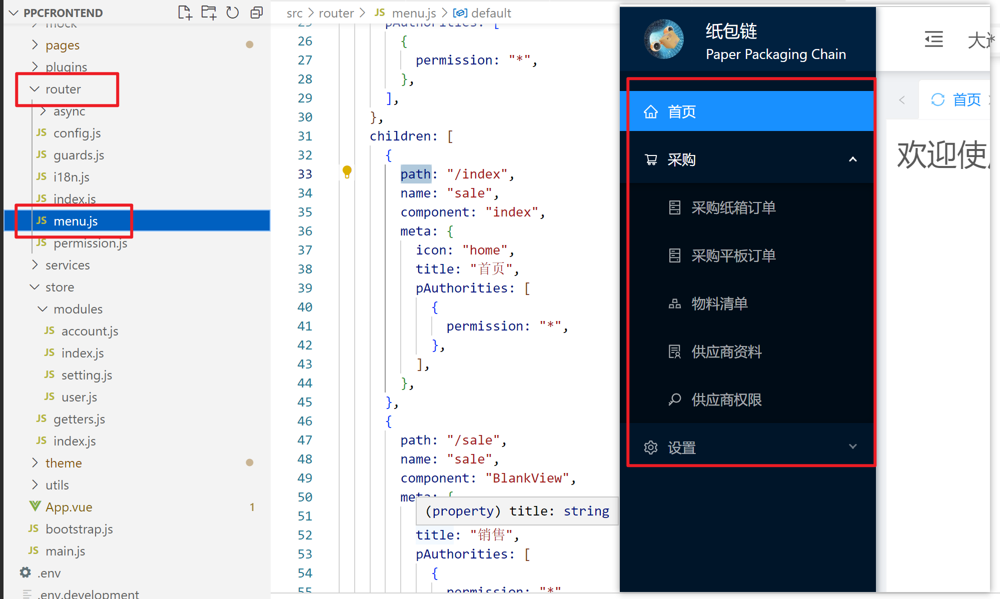

### axios中：封装的请求二维码的接口

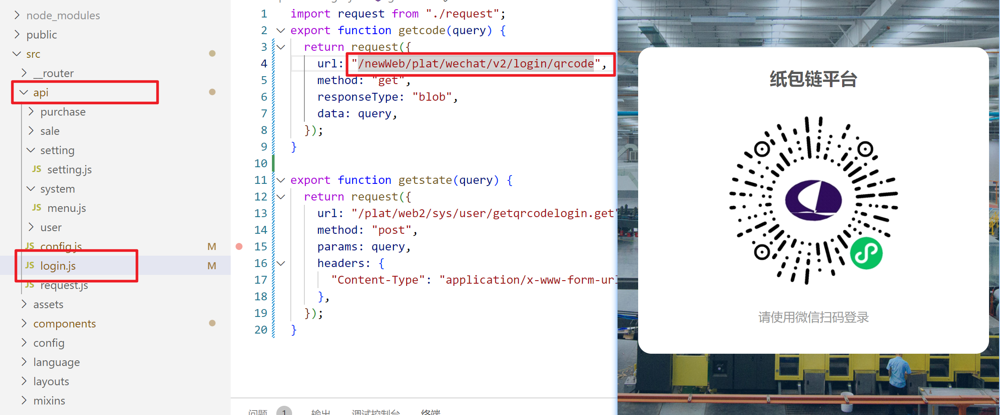

## 新增页面步骤

以`供应商权限`页为例：

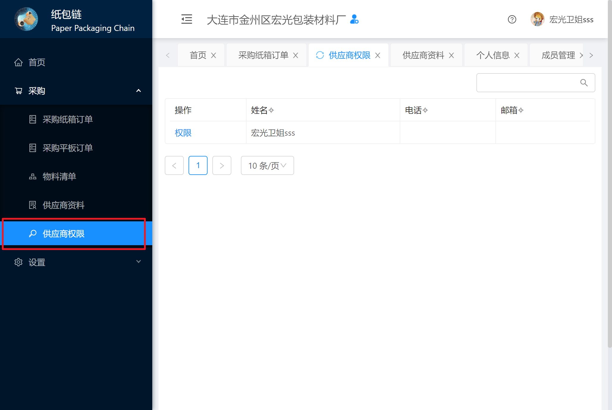

### ①新建`supplier-limit.vue`文件，作为供应商权限列表页

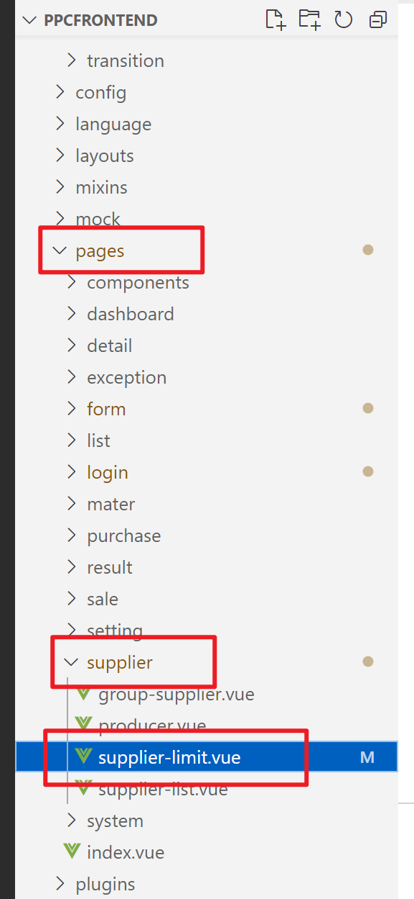

### ②在路由信息对象数组中，以子路由的形式添加路由信息对象

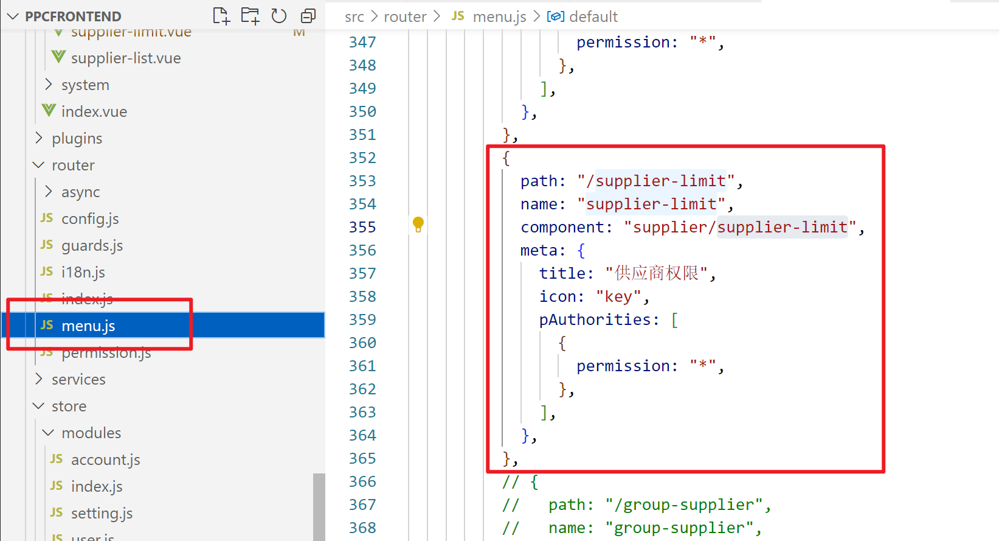

### ③编写`supplier-limit.vue`的静态界面

### ④封装相应接口，请求后端数据

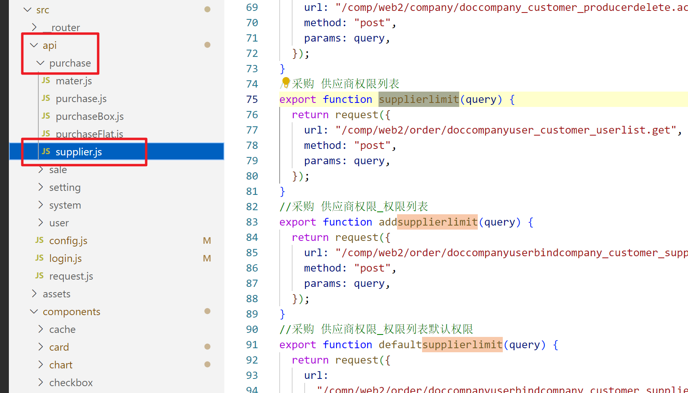

## 关于全局权限按钮的详细说明

上面说明中：可能操作的目录
>    (7)src--utils
>         buttons.js 处理全局权限按钮的方法

### 该文件的使用示例：

在`权限列表页`中，发现定义了该vue对象使用到的数据，定义如下：

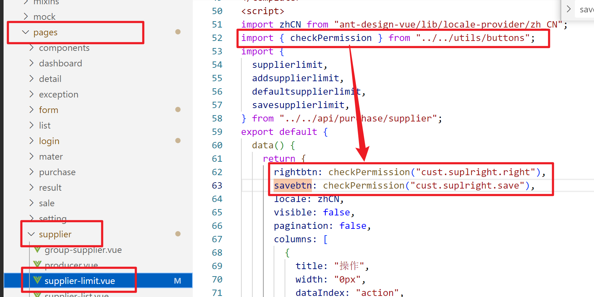

去到引入的`buttons.js`文件下查看，看到返回的是`布尔值`

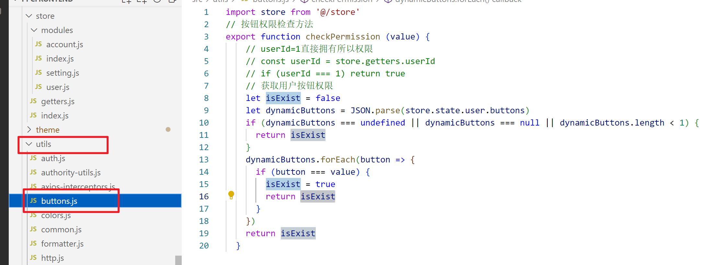

#### 使用定义的数据：判断按钮是否渲染，就是登录的该用户是否有权限执行此操作

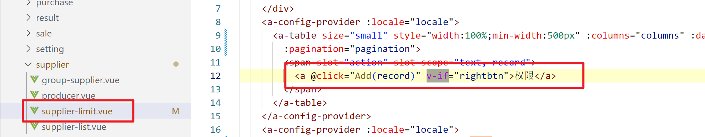

点击a标签后的弹窗：

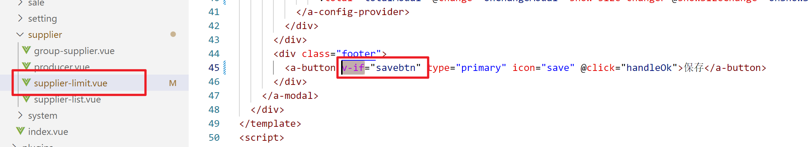

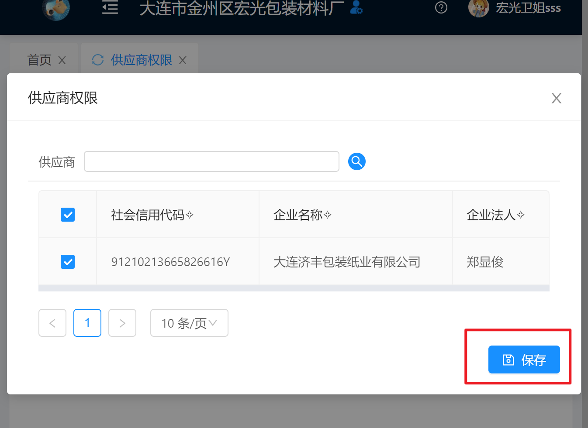

## `buttons.js`文件中的数据`dynamicButtons`

`dynamicButtons`使用的是vuex状态管理库存储

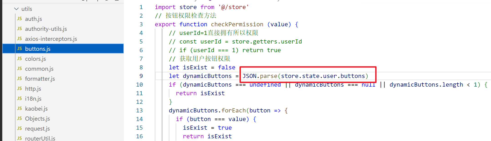

存储账户全局权限的数据（状态管理库中）

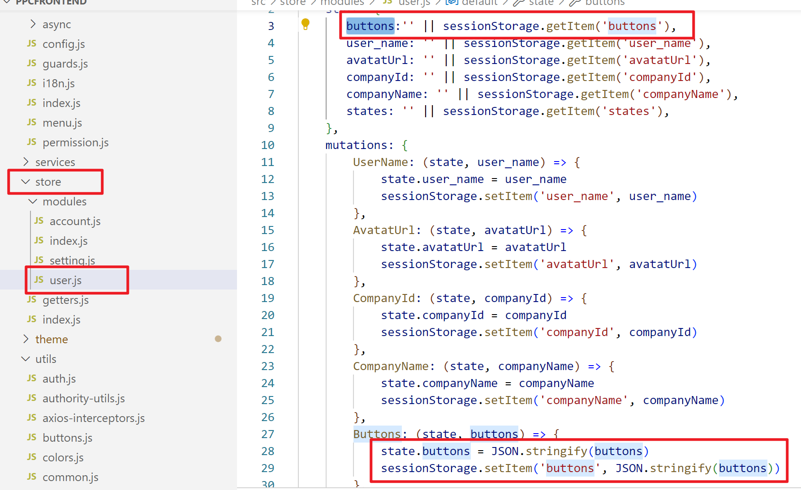

## 关于左菜单菜单数据

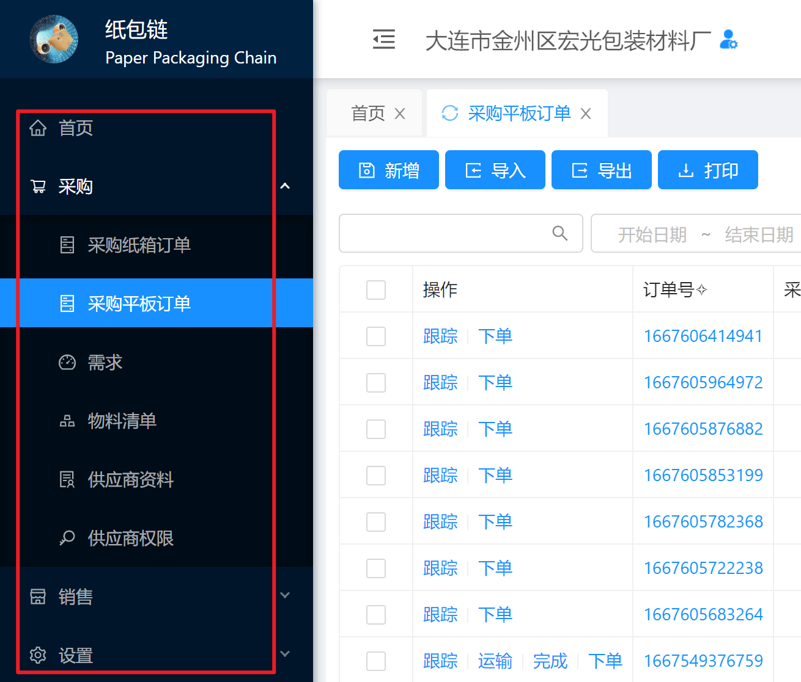

上边"说明"中提到：

> 新增页面时，需要后端在左菜单接口添加数据

左菜单的菜单数据是使用的后台获取到的。

调用过程如下：

### ①封装获取左菜单菜单数据的接口

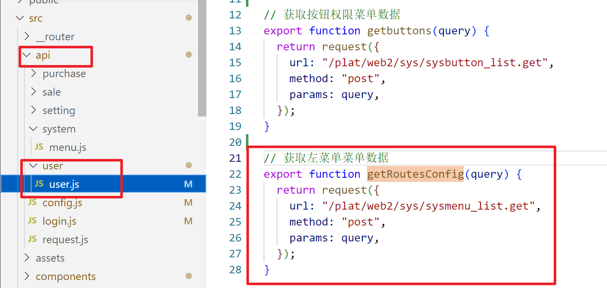 

### ②在路由中调用接口，获取后端的菜单数据

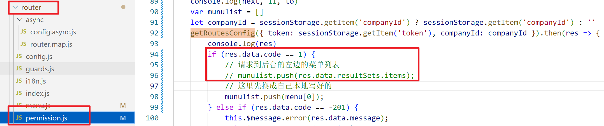

### 为了方便开发，在路由中写了一些静态数据

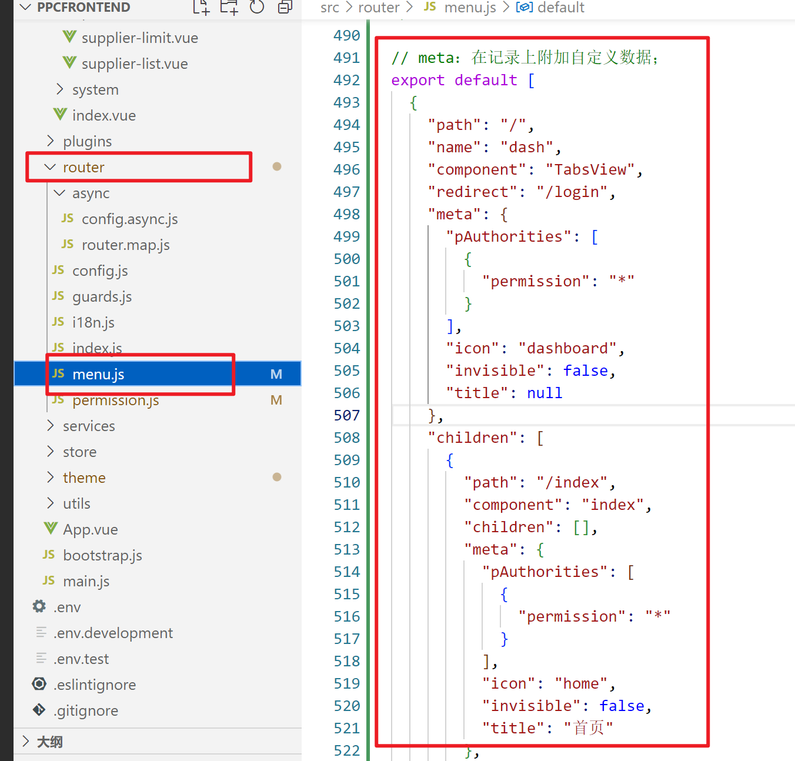

将静态数据引入，

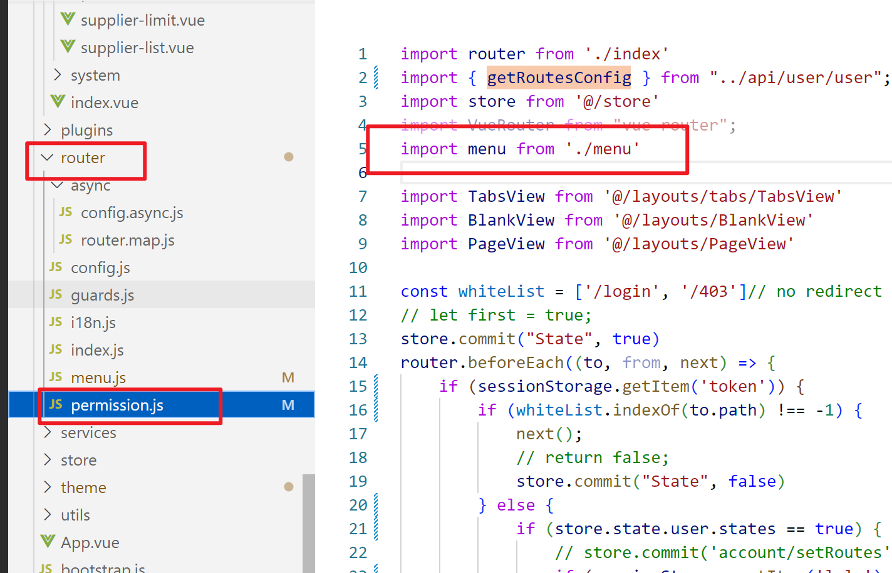

并使用：

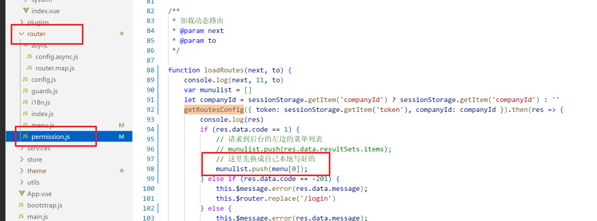
