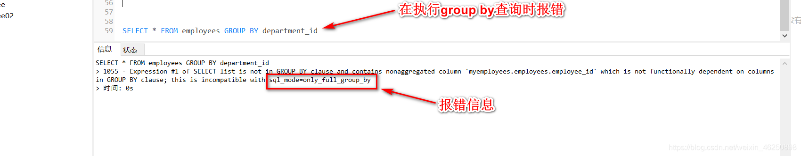

# mysql8及以上`only_full_group_by`报错及解决办法


## 问题复现

执行查询SQL：`SELECT * FROM employees GROUP BY department_id`



出现这个报错的原因是，在mysql8及以上默认使用`sql-mode=only_full_group_by`，在`ONLY_FULL_GROUP_BY`这种模式下：对于`GROUP BY`聚合操作，如果在 `SELECT` 中的列，没有在 `GROUP BY` 中出现，那么这个SQL是不合法的，因为列不在`GROUP BY`从句中。

也就是说对于上面的查询我得写成这样：`SELECT department_id FROM employees GROUP BY department_id`

## 问题解决

### 1、修改配置文件

(我是使用修改配置文件解决的，当然，不止这一种解决方案)


在配置文件`my.conf`(`my.ini`)(linux下是/etc/my.cnf)中 修改 ：(118行左右)

```ini
; sql-mode="ONLY_FULL_GROUP_BY,STRICT_TRANS_TABLES,NO_ZERO_IN_DATE,NO_ZERO_DATE,ERROR_FOR_DIVISION_BY_ZERO,NO_ENGINE_SUBSTITUTION"
sql-mode="STRICT_TRANS_TABLES,NO_ZERO_IN_DATE,NO_ZERO_DATE,ERROR_FOR_DIVISION_BY_ZERO,NO_ENGINE_SUBSTITUTION"
```

> **my.ini配置文件位置**
>
> MySQL的`my.ini`配置文件一般是可以在MySQL的根目录（`C:\Program Files\MySQL\MySQL Server 8.0`）找到的，
>
> 若找不到，可以去
>
> `C:\ProgramData\MySQL\MySQL Server 8.0` 这里看下

### 2、重启MySQL服务

右击“此电脑” ——>管理——>服务和应用程序——>服务——>找到MySQL服务并重启该服务。


