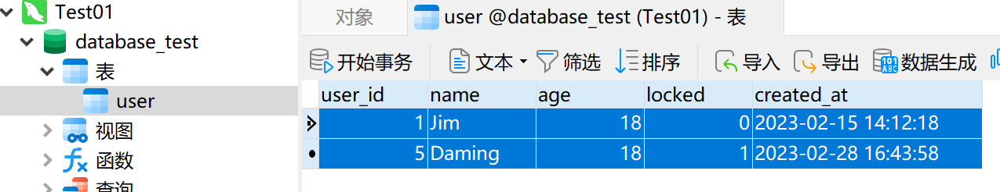
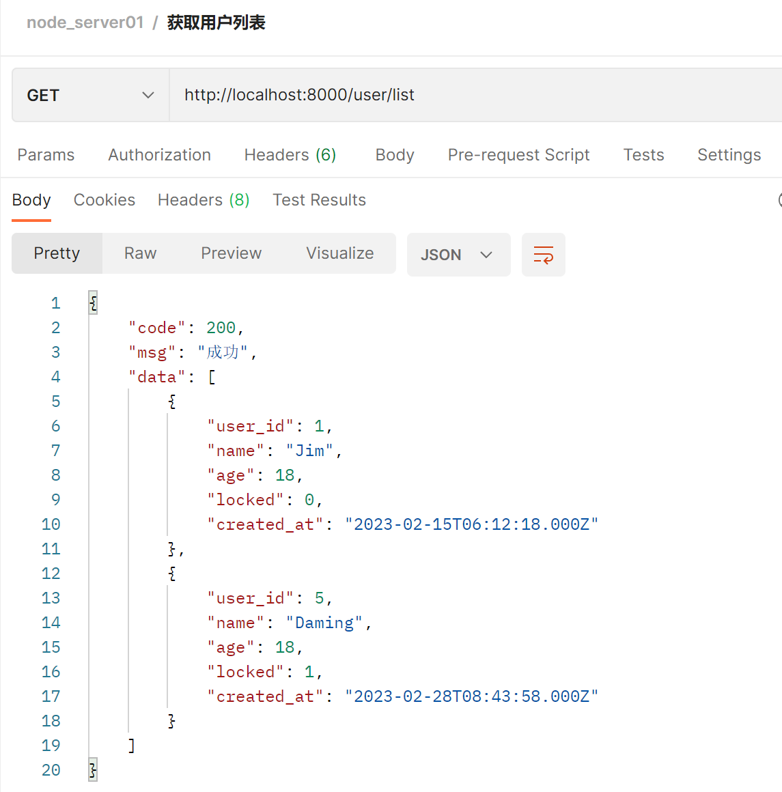
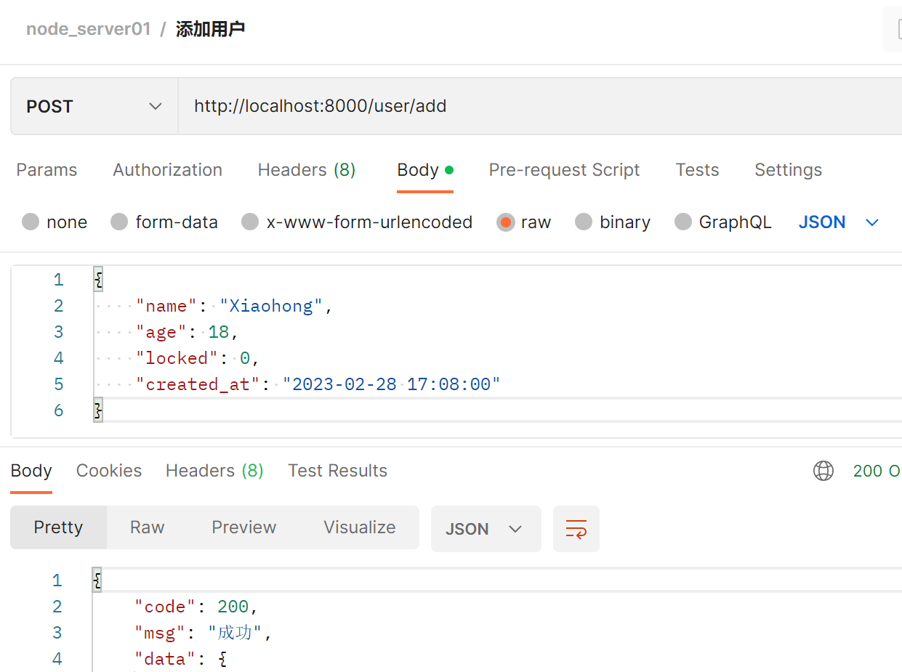
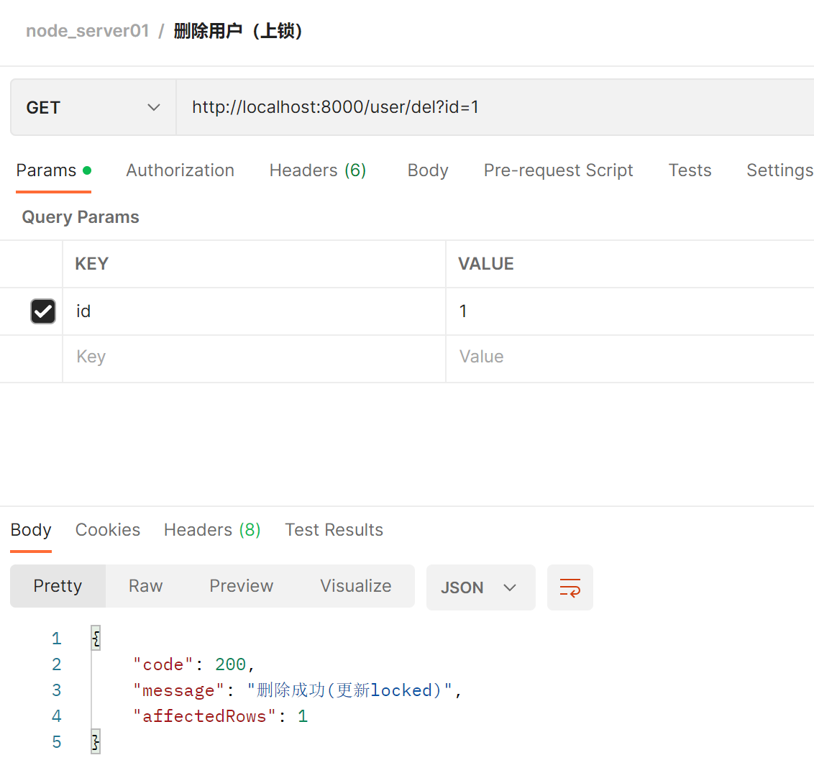
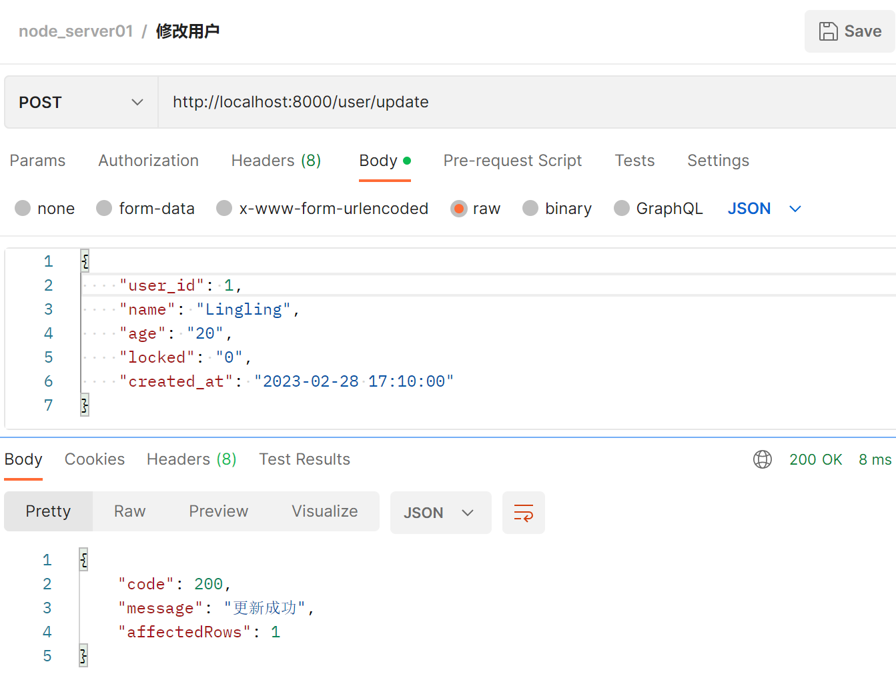

# Node.js创建接口，postman测试接口

## 开发环境说明：

- 要安装`mysql`数据库，选装可视化工具`Navicat for MySQL`。
- 安装`Node.js`。
- 编辑器`VSCode`或`WebStorm`，或其他前端编辑器。

> 接口能被成功访问的条件：打开`mysql`服务，`node`服务（即运行js文件)。

## 一、创建一个js文件，引入开发需要的各个模块

以下几个模块需要使用`npm install 模块名 -S`或`yarn add 模块名`安装

```js
const express = require('express');
const mysql = require('mysql');
const cors = require('cors');               // 跨域
const bodyParser = require('body-parser');  // 解析参数
```

## 二、代码实现

1. 监听端口号：

   ```js
   const app = express();
   
   // 启动项目，端口号为8000,监听接口
   app.listen('8000', () => console.log('服务启动，http://localhost:8000/user/list'));
   ```

2. 连接已经创建好的数据库：

   ```js
   // 数据库信息
   const database = {
       host: 'localhost',
       user: 'root',
       password: '123456',         // 密码
       port: '3306',               // 数据库的端口
       database: 'database_test',  // 数据库名
       connectTimeout: 5000,       // 连接超时
       multipleStatements: false   // 是否允许一个query中包含多条sql语句
   }
   
   // 连接数据库
   const conn = mysql.createConnection(database);
   
   app.use(cors());                                    // 解决跨域
   app.use(bodyParser.json());                         // json请求
   app.use(bodyParser.urlencoded({ extended: false }));// 表单请求
   ```

   数据库user表：

3. 创建接口，实现功能

   - 关于Result类的定义

     ```js
     class Result {
         constructor({ code = 200, msg = '成功', data = {} }) {
             this.code = code;
             this.msg = msg;
             this.data = data;
         }
     }
     ```

   - 查询

     ```js
     // 查询
     // '/user' 接口路径    req 代表发起请求(request)    res代表接收请求(response)
     app.get('/user/list', (req, res) => {
         const sqlStr = 'SELECT * From user';                // 选择user表 根据你自己的表名  用json的格式输出
         conn.query(sqlStr, (err, result) => {
             if (err) {
                 return res.json({ code: 0, message: '获取失败', data: null, err: err });
             }
             if (result.length === 0) {
                 return res.json({ code: 0, message: '数据不存在', affectedRows: 0 });
             }
             return res.json(new Result({ data: result }));  // Result 是一个类方法
         })
     });
     ```

     测试：

   - 添加

     ```js
     // 添加
     app.post('/user/add', (req, res) => {
         const user = req.body;
         const sqlStr = 'insert into user set ?';
         conn.query(sqlStr, user, (err, result) => {
             if (err) {
                 return res.json({ code: 0, message: 'error', affectedRows: 0 });
             }
             if (result.affectedRows === 0) {
                 return res.json({ code: 0, message: "添加失败", affectedRows: 0 });
             }
             res.json(new Result({ data: result }));
         })
     });
     ```
     
     测试：
     
   - 删除，（假删除，改变状态，参数`id=1`）
     
     ```js
     // 根据ID修改 假删除数据
     app.get('/user/del', (req, res) => {
         const id = req.query.id;    // 查询url的id
         const sqlStr = 'update user set locked = 1 where user_id=?';
         conn.query(sqlStr, id, (err, result) => {
             if (err) return res.json({ code: 0, message: 'error', affectedRows: 0 });
             console.log("effectRows:", result.affectedRows); // 1
             if (result.affectedRows === 0) return res.json({ code: 0, message: '删除失败', affectedRows: 0 });
             res.json({ code: 200, message: '删除成功(更新locked)', affectedRows: result.affectedRows });
         })
     });
     ```
     
     测试：
     
   - 修改
     
     ```js
     // 修改
     app.post('/user/update', (req, res) => {
         const sqlStr = 'update user set ? where user_id = ?';
         conn.query(sqlStr, [req.body, req.body.user_id], (err, result) => {
             if (err) return res.json({ code: 0, message: '更新失败', affevtedRows: 0 });
             // 影响行数不等于1
             if (result.affectedRows === 0) return res.json({ code: 1, message: '更新的用户不存在', affectedRows: 0 });
             res.json({ code: 200, message: '更新成功', affectedRows: result.affectedRows });
         })
     });
     ```
     
     测试：

## 三、完整代码

```js
const express = require('express');
const mysql = require('mysql');
const cors = require('cors');               // 跨域
const bodyParser = require('body-parser');  // 解析参数

const app = express();

// 启动项目，端口号为8000,监听接口
app.listen('8000', () => console.log('服务启动，http://localhost:8000/user/list'));

// 数据库信息
const database = {
    host: 'localhost',
    user: 'root',
    password: '123456',         // 密码
    port: '3306',               // 数据库的端口
    database: 'database_test',  // 数据库名
    connectTimeout: 5000,       // 连接超时
    multipleStatements: false   // 是否允许一个query中包含多条sql语句
}

// 连接数据库
const conn = mysql.createConnection(database);

app.use(cors());                                    // 解决跨域
app.use(bodyParser.json());                         // json请求
app.use(bodyParser.urlencoded({ extended: false }));// 表单请求

// 查询
// '/user' 接口路径    req 代表发起请求(request)    res代表接收请求(response)
app.get('/user/list', (req, res) => {
    const sqlStr = 'SELECT * From user';                // 选择user表 根据你自己的表名  用json的格式输出
    conn.query(sqlStr, (err, result) => {
        if (err) {
            return res.json({ code: 0, message: '获取失败', data: null, err: err });
        }
        if (result.length === 0) {
            return res.json({ code: 0, message: '数据不存在', affectedRows: 0 });
        }
        return res.json(new Result({ data: result }));  // Result 是一个类方法
    })
});

// 添加
app.post('/user/add', (req, res) => {
    const user = req.body;
    const sqlStr = 'insert into user set ?';
    conn.query(sqlStr, user, (err, result) => {
        if (err) {
            return res.json({ code: 0, message: 'error', affectedRows: 0 });
        }
        if (result.affectedRows === 0) {
            return res.json({ code: 0, message: "添加失败", affectedRows: 0 });
        }
        res.json(new Result({ data: result }));
    })
});

// 根据ID修改 假删除数据
app.get('/user/del', (req, res) => {
    const id = req.query.id;    // 查询url的id
    const sqlStr = 'update user set locked = 1 where user_id=?';
    conn.query(sqlStr, id, (err, result) => {
        if (err) return res.json({ code: 0, message: 'error', affectedRows: 0 });
        console.log("effectRows:", result.affectedRows); // 1
        if (result.affectedRows === 0) return res.json({ code: 0, message: '删除失败', affectedRows: 0 });
        res.json({ code: 200, message: '删除成功(更新locked)', affectedRows: result.affectedRows });
    })
});


// 修改
app.post('/user/update', (req, res) => {
    const sqlStr = 'update user set ? where user_id = ?';
    conn.query(sqlStr, [req.body, req.body.user_id], (err, result) => {
        if (err) return res.json({ code: 0, message: '更新失败', affevtedRows: 0 });
        // 影响行数不等于1
        if (result.affectedRows === 0) return res.json({ code: 1, message: '更新的用户不存在', affectedRows: 0 });
        res.json({ code: 200, message: '更新成功', affectedRows: result.affectedRows });
    })
});

class Result {
    constructor({ code = 200, msg = '成功', data = {} }) {
        this.code = code;
        this.msg = msg;
        this.data = data;
    }
}
```