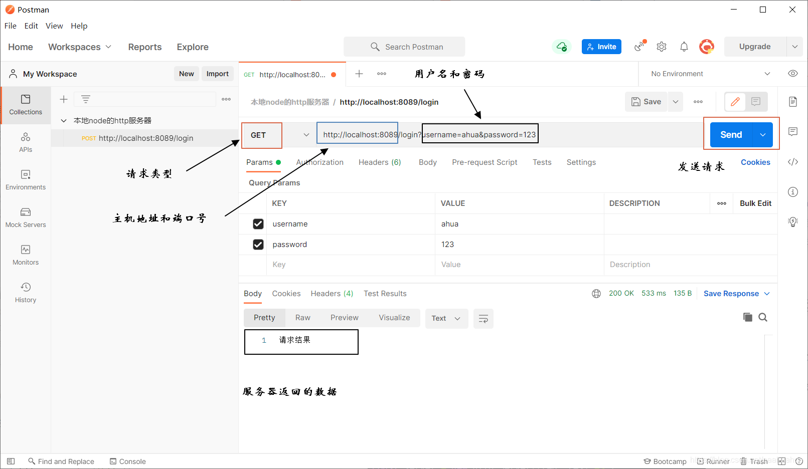
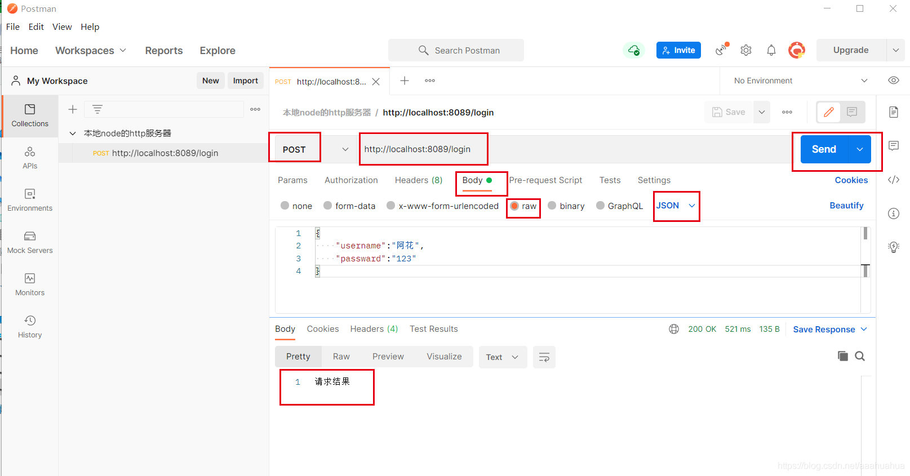

# node.js+postman模拟HTTP服务器与客户端交互

> 当应用程序（客户端）需要某一个资源时，可以向一台服务器通过http请求获取到这个资源。提供资源的服务器就是web服务器（本文用 `node.js` 创建），用postman模拟客户端向服务器发送请求。

## 客户端与服务器交互

### 一、node搭建HTTP服务器

node中使用 http 模块来创建 HTTP 服务器， 每当接收到新的请求时，request 事件会被调用，并提供两个对象：一个请求req（http.IncomingMessage 对象）和一个响应res（http.ServerResponse 对象）。

request 提供了请求的详细信息。 通过它可以访问请求头和请求的数据。（客户端–>服务器）

response 用于构造要返回给客户端的数据（服务器–>客户端）。下面是一个简单的HTTP web服务器示例。

下面就是一个简单的HTTP服务器的例子

```js
//导入http模块
const http = require('http');

// 创建http服务器
const server = http.createServer((req, res) => {
    //设置 statusCode 属性为 200，以表明响应成功
    res.statusCode = 200;
    // res本质上继承了stream.Writable的类
    // 向客户端发送完响应头和正文后告诉服务器本次消息传输结束
    res.end("hollow server");
    // 相当于res.writer("hollow server")+res.end()
})
// 监听服务器,当服务器就绪时，listen 回调函数会被调用
//控制台打印启动成功
server.listen('8089', 'localhost', () => {
    console.log("启动成功:http://localhost:8089");
});
```

这时候你的本地服务器就搭建完毕了，可以去浏览器打开 `localhost:8089` 查看

### 二、HTTP服务器处理get请求
> Postman 是一种常用的接口测试工具，可以发送几乎所有类型的HTTP请求。Postman适用于不同的操作系统，Postman Mac、Windows X32、Windows X64、Linux系统，还支持postman 浏览器扩展程序、postman chrome应用程序等。

#### 1、postman发送get请求
在postman中新建一个request请求，在Enter request url 中填写上面我们用node.js创建的HTTP服务器的主机地址以及用户名和密码 `http://localhost:8089/login?username=ahua&password=123`，请求类型选择GET，点击send，postman就会向服务器发送一个get请求



#### 2、服务器解析

服务器这边接收到客户端（postman）的get请求，对发送过来的数据进行处理

```js
const http = require('http');
// 处理url的模块
const url = require('url');
// 处理query的模块
const qs = require('querystring');
const server = new http.Server((req, res) => {
    // request对象中封装了客户端给我们服务器传递过来的所有信息 
    // 对url进行解析
    const { pathname, query } = url.parse(req.url);
    if (pathname === '/login') {
        // console.log(query)
        // qs的parse方法可以对query进行处理
        // 将字符串类型转换为js对象  username=ahua&password=123  -->  {username: 'ahua',password: 123}
        // console.log(qs.parse(query))
        const { username, password } = qs.parse(query);
        console.log(username, password);
        res.end('请求结果');
    }
    console.log(req.url)
    // 打印请求类型
    console.log(req.method)
    // 请求头
    console.log(req.headers)
})
server.listen('8089', 'localhost', () => {
    console.log("serve启动成功:http://localhost:8089/login")
});
```


### 三、HTTP服务器处理post请求
#### 1、postman发送post请求
上面get请求中将用户名和密码放在地址栏可能不够安全，处理账号密码想稳妥一点，现在将他们放在body里用json文件传给服务器。



#### 2、服务器解析
服务器这边接收到客户端（postman）的post请求，对发送过来的数据进行处理。首先应该判断是否为post请求，然后拿到body中的数据，再对数据进行解析。

```js
const http = require('http');
// 处理url的模块
const url = require('url');
const server = new http.Server((req, res) => {
    // 获取客户端传过来的url中的pathname
    const { pathname } = url.parse(req.url);
    // 判断是否为login
    if (pathname === '/login') {
        // 判断客户端发送的是否为post请求
        if (req.method === 'POST') {
            // 定义客户端传过来数据的默认编码格式
            req.setEncoding('utf-8');
            // req.setEncoding('binary') binary定义二进制编码
            // 拿到body中的数据
            // body中的数据是通过流来写入的
            // 当监听到data事件，获取到输入流，也就是body中相关的内容，可以返回这个data的结果
            req.on('data', (data) => {
                // JSON.parse()把对象中的字符串转成js对象 
                //  {"username":"阿花","passward":"123"}  ---> {username: 'ahua',password: 123}
                const { username, passward } = JSON.parse(data);
                console.log(username, passward);
            })
        }
    }
    res.end('请求结果')
})
server.listen('8089', 'localhost', () => {
    console.log("serve启动成功:http://localhost:8089/login")
})
```

这样就完成了一个简单的服务器交互流程。